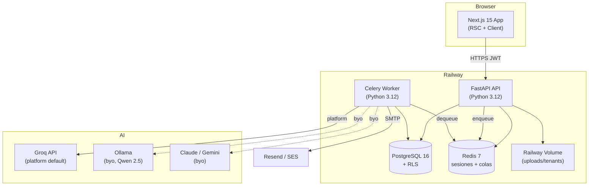
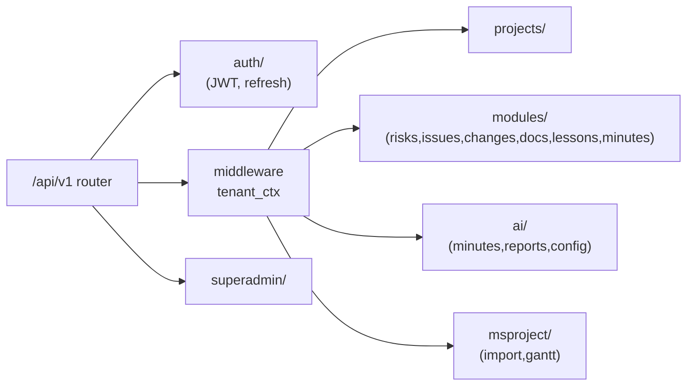
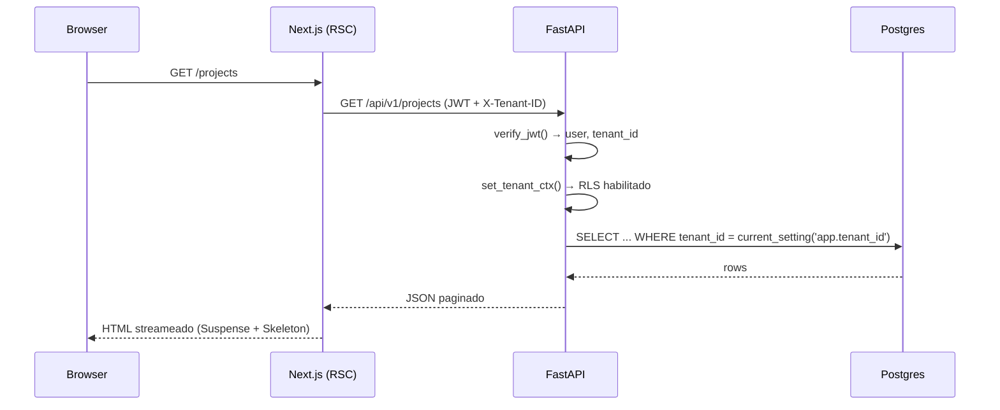
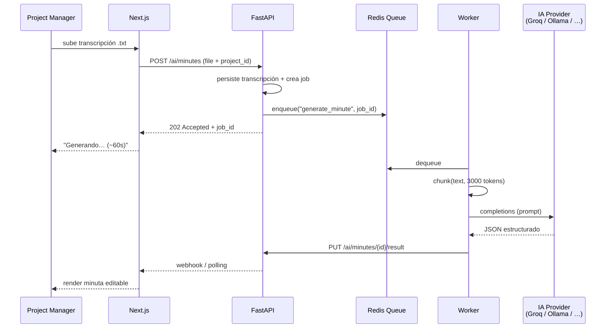
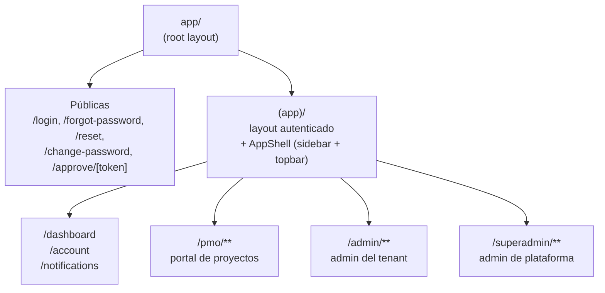

# Arquitectura PMO-aaS

**ID:** `DOC-ARCH`

Índice de la documentación arquitectónica. Cada archivo puede leerse independientemente.

| # | Archivo | Contenido |
|---|---|---|
| 1 | [`stack.md`](./stack.md) | Decisiones de stack por capa, con justificación |
| 2 | [`database.md`](./database.md) | Modelo ER, tablas, índices, migraciones, RLS |
| 3 | [`security-multitenant.md`](./security-multitenant.md) | JWT, tenancy, RBAC, superadmin |
| 4 | [`deployment-railway.md`](./deployment-railway.md) | Infra Railway, variables, CI/CD, dominios |
| 5 | [`api-conventions.md`](./api-conventions.md) | REST, errores, paginación, versionado |
| 6 | [`navigation.md`](./navigation.md) | Árbol de navegación web, páginas, flujos, huérfanas |
| 7 | Este archivo | C4 diagrams (contexto + contenedores) |

---

## C4 Nivel 1 — Contexto

```mermaid
flowchart TB
    PM["Project Manager<br/>(navegador)"]
    ADMIN["Administrador<br/>(navegador)"]
    SUPER["Super Admin<br/>(navegador)"]
    STAKE["Stakeholder<br/>(correo)"]

    PMO["PMO-aaS<br/>Plataforma SaaS multi-tenant"]

    OLLAMA["Ollama Server<br/>(IA local)"]
    CLAUDE["Anthropic Claude<br/>(IA fallback)"]
    SMTP["SMTP / Resend<br/>(correos)"]
    MSP["Archivos MS Project<br/>(.mpp/.xml/.xlsx)"]

    PM --> PMO
    ADMIN --> PMO
    SUPER --> PMO
    PMO --> STAKE
    GROQ["Groq API<br/>(IA modo platform)"]

    PMO -->|modo platform| GROQ
    PMO -.->|modo byo| OLLAMA
    PMO -.->|modo byo (premium)| CLAUDE
    PMO --> SMTP
    MSP --> PMO
```

## C4 Nivel 2 — Contenedores



## C4 Nivel 3 — Componentes del API (vista rápida)



## Flujo de una petición típica



## Flujo de generación de minuta con IA



## Estructura del frontend (Next.js App Router)



> El detalle de cada subárbol, sus páginas, flujos y huérfanas vive en
> [`navigation.md`](./navigation.md).

---

## Decisiones transversales

- **Monorepo** con `pnpm workspaces` + Turborepo para caching de build.
- **Idempotencia** en endpoints de escritura sensibles (`Idempotency-Key` header).
- **Rate limiting** por tenant con `slowapi` (100 req/min por IP, 1000/min por tenant).
- **Migraciones** con Alembic; nunca se destruye data en migraciones (soft drops).
- **Backups** diarios automáticos por Railway + snapshot semanal a S3 compatible.
- **Feature flags** vía tabla `feature_flags` (por tenant). No usamos servicio externo.
