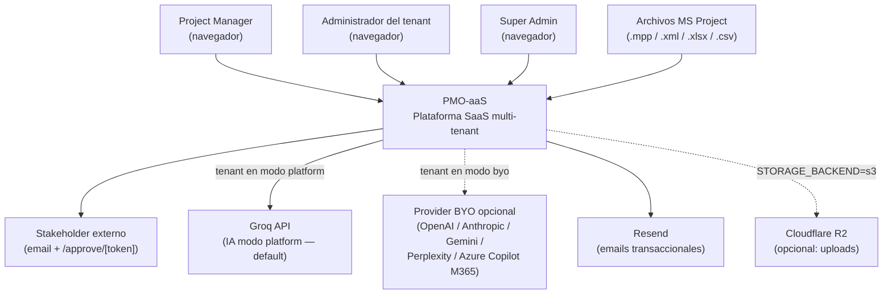
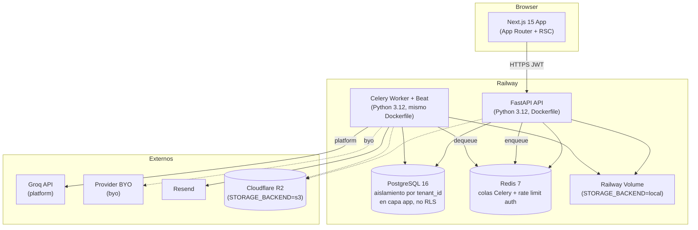
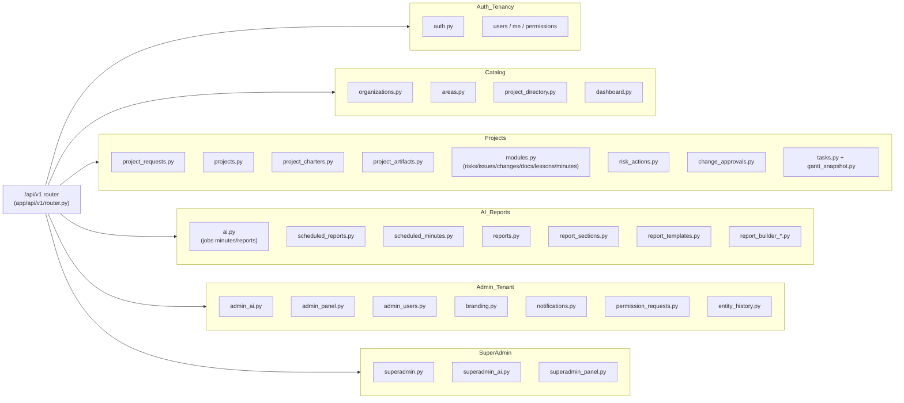
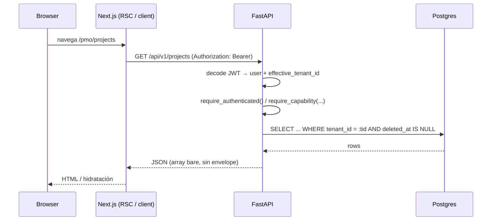
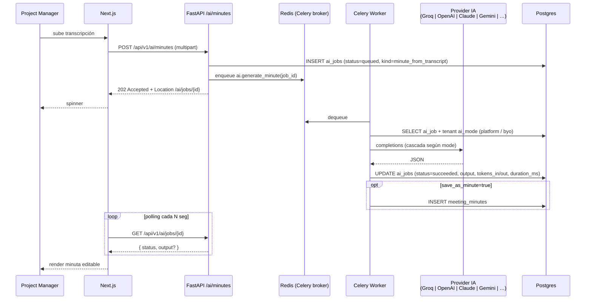
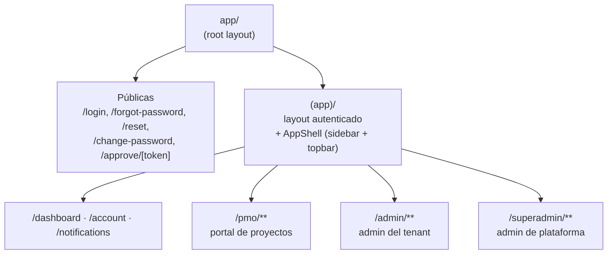

# Arquitectura PMO-aaS

**ID:** `DOC-ARCH`
**Última verificación contra código:** 2026-05-23.

Índice de la documentación arquitectónica. Cada archivo puede leerse independientemente.

| # | Archivo | Contenido |
|---|---|---|
| 1 | [`stack.md`](./stack.md) | Decisiones de stack reales por capa |
| 2 | [`database.md`](./database.md) | 49 tablas, índices, migraciones; **sin RLS hoy** |
| 3 | [`security-multitenant.md`](./security-multitenant.md) | JWT, tenancy app-level, capability-based RBAC |
| 4 | [`deployment-railway.md`](./deployment-railway.md) | 4 servicios Railway, variables, CI/CD |
| 5 | [`api-conventions.md`](./api-conventions.md) | REST, paginación real, catálogo de errores |
| 6 | [`navigation.md`](./navigation.md) | Árbol de páginas, flujos y huérfanas |
| 7 | [`modelo-amenazas.md`](./modelo-amenazas.md) | Fronteras de confianza y catorce amenazas (MCS SEG-06) |
| 8 | Este archivo | Vista C4 (contexto + contenedores + componentes) |

---

## C4 Nivel 1 — Contexto

> **Ollama fue eliminado** (BUG-053). Ignóralo en docs viejos.

---

## C4 Nivel 2 — Contenedores

---

## C4 Nivel 3 — Componentes del API

37 routers en `apps/api/app/api/v1/endpoints/`. Vista por dominio:

> El gating es **por dependencia FastAPI**, no por middleware. Cada endpoint declara `Depends(require_authenticated())`, `Depends(require_capability("…"))` o `Depends(get_superadmin_user)`.

---

## Flujo de una petición típica

> No usamos `SET LOCAL app.tenant_id` ni RLS. El filtro `tenant_id` lo aplica explícitamente cada query.

---

## Flujo de generación de minuta con IA

---

## Estructura del frontend (Next.js App Router)

> El detalle de cada subárbol, sus páginas, flujos y huérfanas vive en [`navigation.md`](./navigation.md).

---

## Decisiones transversales (estado real)

- **Monorepo** con `pnpm workspaces`. **Sin Turborepo** — los scripts corren `pnpm -r` directo.
- **Migraciones Alembic**. Patrón en 2 pasos para `DROP COLUMN` (deprecar uso → drop en migración siguiente). Validadas en CI por `api-migrations-postgres` (upgrade → downgrade → upgrade).
- **Multitenancy app-level** (no RLS). Cada endpoint filtra `tenant_id` explícito. Tests `TC-MT-*` validan aislamiento. Migrar a RLS está como deuda.
- **Backups**: Railway daily de Postgres. Snapshot externo (R2/B2) pendiente formalizar.
- **Rate limit**: solo `/auth/forgot-password` y `/auth/reset` (counter en Redis). El rate limit global por tenant/IP no está implementado.
- **Idempotency-Key**: no implementado (los POST repetidos pueden duplicar). Diferido.
- **Feature flags**: no hay tabla `feature_flags`. Si se introduce, agregar a `database.md` y aquí.

---

## Cosas que NO existen (a pesar de versiones viejas del doc)

| Decía la doc vieja | Realidad |
|---|---|
| RLS en Postgres con `app.tenant_id` | No. Filtrado en app. |
| Roles Postgres `app_user` / `app_admin` con `BYPASSRLS` | No. Un solo rol. |
| Ollama como provider de IA | Eliminado en BUG-053. |
| Servicio Railway `glitchtip` + `sentry-sdk` | No instalado. |
| Header `X-Tenant-ID` | No. Tenant viene del JWT. |
| Header `Idempotency-Key` enforced | No implementado. |
| `slowapi` global por IP/tenant | Solo en endpoints de reset/forgot. |
| NextAuth | No. Auth propia con JWT + cookie. |
| Turborepo | No instalado. |
| Husky / Storybook / Renovate / MkDocs | No instalados. |
| Feature flags table | No existe. |
