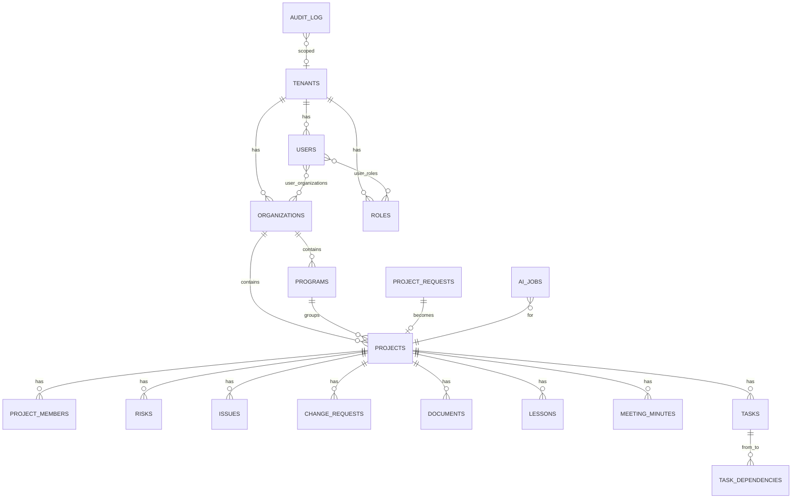

# Modelo de datos — PostgreSQL 16

**ID:** `DOC-ARCH-DB`

---

## Principios

1. **Todas las tablas tenant-scoped tienen `tenant_id UUID NOT NULL`** y RLS habilitado.
2. **UUID v7** como PK (ordenables por tiempo, mejores índices que v4).
3. **`created_at`, `updated_at`, `created_by`, `updated_by`, `deleted_at` (nullable)** en toda tabla relevante.
4. **Soft delete** vía `deleted_at` — los queries filtran `deleted_at IS NULL` por default.
5. **Auditoría** en tabla `audit_log` vía triggers genéricos en tablas sensibles.
6. **Folios** generados por `sequences` por tenant + año: `PRJ-2026-001`.
7. **Timestamps** en UTC (`timestamptz`). Formateo a TZ del tenant en el frontend.

---

## Diagrama ER (resumido)



---

## Tablas principales

### `tenants`

| Columna | Tipo | Notas |
|---|---|---|
| `id` | uuid PK | v7 |
| `slug` | citext UNIQUE | URL-safe, `a-z0-9-` |
| `name` | text | |
| `logo_url` | text | archivo en Railway Volume `/tenants/{slug}/` |
| `is_active` | bool | soft delete |
| `settings` | jsonb | `{ "locale": "es", "currency": "MXN", "ai_mode": "ollama" }` |
| `created_at` | timestamptz | |

### `users`

| Columna | Tipo | Notas |
|---|---|---|
| `id` | uuid PK | |
| `tenant_id` | uuid FK | NULL solo para superadmins globales |
| `username` | citext | UNIQUE con `tenant_id` |
| `email` | citext | UNIQUE con `tenant_id` |
| `password_hash` | text | bcrypt |
| `full_name` | text | |
| `avatar_url` | text | |
| `locale` | text | `es-MX` por default |
| `is_active` | bool | |
| `is_superadmin` | bool | bypass RLS |
| `last_login` | timestamptz | |
| `failed_login_attempts` | int | 0-5 |
| `locked_until` | timestamptz | null si no bloqueado |
| `mfa_secret` | text | post-MVP |

**Índices:** `(tenant_id, email)`, `(tenant_id, username)`, `(is_superadmin) WHERE is_superadmin`.

### `roles` y `permissions`

```sql
CREATE TABLE roles (
    id uuid PRIMARY KEY,
    tenant_id uuid NOT NULL REFERENCES tenants(id),
    name text NOT NULL,
    description text,
    is_system bool DEFAULT false,   -- roles default no borrables
    permissions jsonb NOT NULL,      -- { "projects": ["read","create"], ... }
    UNIQUE(tenant_id, name)
);

CREATE TABLE user_roles (
    user_id uuid REFERENCES users(id),
    role_id uuid REFERENCES roles(id),
    PRIMARY KEY(user_id, role_id)
);
```

Roles sistema por tenant creados en seed: `Administrador`, `PMO Manager`, `Project Manager`, `Viewer`.

### `organizations`, `programs`, `projects`

```sql
CREATE TABLE organizations (
    id uuid PRIMARY KEY,
    tenant_id uuid NOT NULL REFERENCES tenants(id),
    name text NOT NULL,
    reason_social text,
    industry text,
    country text,
    logo_url text,
    is_active bool DEFAULT true,
    created_at timestamptz DEFAULT now(),
    UNIQUE(tenant_id, name)
);

CREATE TABLE programs (
    id uuid PRIMARY KEY,
    tenant_id uuid NOT NULL,
    organization_id uuid NOT NULL REFERENCES organizations(id),
    name text NOT NULL,
    description text,
    strategic_alignment text,
    start_date date,
    end_date date,
    is_active bool DEFAULT true
);

CREATE TABLE projects (
    id uuid PRIMARY KEY,
    tenant_id uuid NOT NULL,
    organization_id uuid NOT NULL REFERENCES organizations(id),
    program_id uuid REFERENCES programs(id),
    folio text NOT NULL,          -- 'PRJ-2026-001'
    name text NOT NULL,
    description text,
    type text,                    -- 'innovation','transformation','operation','bau'
    priority smallint,            -- 1..5
    phase text NOT NULL DEFAULT 'planning',  -- enum
    pm_id uuid REFERENCES users(id),
    sponsor text,
    start_date date,
    end_date date,
    budget numeric(14,2),
    actual_budget numeric(14,2),
    progress smallint DEFAULT 0,  -- 0..100
    health_status text DEFAULT 'green', -- green/yellow/red
    request_id uuid REFERENCES project_requests(id),
    created_at timestamptz DEFAULT now(),
    UNIQUE(tenant_id, folio)
);

CREATE INDEX idx_projects_tenant_phase ON projects(tenant_id, phase) WHERE deleted_at IS NULL;
CREATE INDEX idx_projects_pm ON projects(pm_id);
```

### `project_requests`

```sql
CREATE TABLE project_requests (
    id uuid PRIMARY KEY,
    tenant_id uuid NOT NULL,
    folio text NOT NULL,            -- 'SOL-2026-001'
    title text NOT NULL,
    description text,
    objective text,
    organization_id uuid REFERENCES organizations(id),
    business_unit text,
    department text,
    sponsor text,
    benefits text,
    budget numeric(14,2),
    scope text,
    requested_by uuid REFERENCES users(id),
    requested_at timestamptz DEFAULT now(),
    status text DEFAULT 'in_review',  -- in_review/approved/rejected/needs_info
    reviewed_by uuid REFERENCES users(id),
    reviewed_at timestamptz,
    review_comment text,
    attachments jsonb DEFAULT '[]',   -- [{filename, url, size, mime}]
    UNIQUE(tenant_id, folio)
);
```

### Módulos (`risks`, `issues`, `change_requests`, `documents`, `lessons`, `meeting_minutes`)

Patrón común para todos:

```sql
-- ejemplo: risks
CREATE TABLE risks (
    id uuid PRIMARY KEY,
    tenant_id uuid NOT NULL,
    project_id uuid NOT NULL REFERENCES projects(id),
    folio text NOT NULL,                  -- 'RIS-2026-001'
    title text NOT NULL,
    description text,
    category text,
    probability smallint,                 -- 1..5
    impact smallint,                      -- 1..5
    severity smallint GENERATED ALWAYS AS (probability * impact) STORED,
    mitigation_strategy text,
    owner_id uuid REFERENCES users(id),
    identified_at date,
    due_date date,
    status text DEFAULT 'identified',
    created_by uuid REFERENCES users(id),
    created_at timestamptz DEFAULT now(),
    updated_at timestamptz DEFAULT now(),
    deleted_at timestamptz,
    UNIQUE(tenant_id, folio)
);
CREATE INDEX idx_risks_proj_status ON risks(project_id, status);
```

Mismo molde para:
- `issues` (+ `type` AID, `due_date`, `resolution`)
- `change_requests` (+ `type` scope/time/cost/resource, `approved_by`, `approved_at`)
- `documents` (+ `file_url`, `version`, `mime_type`, `size_bytes`, `category`)
- `lessons` (+ `category` success/improvement/error, `phase`, `recommendation`)
- `meeting_minutes` (+ `meeting_date`, `participants jsonb`, `agreements jsonb`, `next_meeting_date`)

### `tasks` (MS Project + manual)

```sql
CREATE TABLE tasks (
    id uuid PRIMARY KEY,
    tenant_id uuid NOT NULL,
    project_id uuid NOT NULL REFERENCES projects(id),
    wbs text,                        -- '1.2.3'
    parent_id uuid REFERENCES tasks(id),
    name text NOT NULL,
    description text,
    start_date date,
    end_date date,
    duration_days int,
    progress smallint DEFAULT 0,
    is_milestone bool DEFAULT false,
    owner_id uuid REFERENCES users(id),
    priority smallint,
    status text DEFAULT 'not_started',
    source text DEFAULT 'manual',    -- 'manual' | 'msproject'
    external_id text,                -- id en el .mpp original
    imported_at timestamptz
);

CREATE TABLE task_dependencies (
    id uuid PRIMARY KEY,
    predecessor_id uuid NOT NULL REFERENCES tasks(id),
    successor_id uuid NOT NULL REFERENCES tasks(id),
    type text NOT NULL DEFAULT 'FS', -- FS/SS/FF/SF
    lag_days int DEFAULT 0,
    UNIQUE(predecessor_id, successor_id)
);
```

### `ai_jobs`

```sql
CREATE TABLE ai_jobs (
    id uuid PRIMARY KEY,
    tenant_id uuid NOT NULL,
    project_id uuid REFERENCES projects(id),
    kind text NOT NULL,              -- 'minute_from_transcript' | 'progress_report'
    status text DEFAULT 'queued',    -- queued/running/succeeded/failed
    input jsonb,                     -- metadata + rutas a archivos
    output jsonb,                    -- resultado estructurado
    model_used text,
    tokens_in int,
    tokens_out int,
    duration_ms int,
    error text,
    requested_by uuid REFERENCES users(id),
    created_at timestamptz DEFAULT now(),
    completed_at timestamptz
);
```

### `audit_log`

```sql
CREATE TABLE audit_log (
    id bigserial PRIMARY KEY,
    tenant_id uuid,                   -- NULL para eventos platform-wide
    user_id uuid,
    action text NOT NULL,             -- 'login_success','project.create',...
    module text,                      -- 'auth','projects','risks',...
    entity_type text,
    entity_id uuid,
    details jsonb,
    ip_address inet,
    user_agent text,
    occurred_at timestamptz DEFAULT now()
);
CREATE INDEX idx_audit_tenant_time ON audit_log(tenant_id, occurred_at DESC);
CREATE INDEX idx_audit_user_time ON audit_log(user_id, occurred_at DESC);
```

---

## Row-Level Security (RLS)

Para cada tabla tenant-scoped:

```sql
ALTER TABLE projects ENABLE ROW LEVEL SECURITY;

CREATE POLICY tenant_isolation ON projects
    USING (tenant_id = current_setting('app.tenant_id')::uuid);

-- Superadmin bypass: no crear policy, el rol postgres del pool API
-- es 'app_user' con RLS forzado. Un rol 'app_superadmin' tiene BYPASSRLS.
```

En cada request, antes de cualquier query:

```python
async def set_tenant_ctx(conn, tenant_id: UUID):
    await conn.execute(f"SET LOCAL app.tenant_id = '{tenant_id}'")
```

**Tests bloqueantes:** los `TC-MT-*` verifican que un user de tenant A *NUNCA* pueda leer/escribir de B (ver [`../testing/multi-tenant-isolation.md`](../testing/multi-tenant-isolation.md)).

---

## Migraciones

- Tool: **Alembic**. Convención: `alembic/versions/YYYYMMDDHHMM_slug.py`.
- Un PR = una migración (máximo). Migraciones grandes se dividen.
- **Prohibido** `DROP COLUMN` directo. Flujo en 2 pasos:
  1. PR N: marcar columna como deprecated en código, dejar de escribir.
  2. PR N+1 (tras release estable): `ALTER TABLE … DROP COLUMN`.
- `alembic downgrade` debe funcionar siempre.
- Seeds: `alembic/seeds/` con fixtures de roles sistema, tenant demo, superadmin inicial.

---

## Backups & retención

- **Railway Postgres**: backup diario automático (7 días retención plan Pro).
- **Snapshot semanal** → volcado a S3 compatible (Backblaze B2) con `pg_dump`.
- **Retención**: 30 días diarios + 12 meses mensuales.
- **DR test** cada trimestre: restaurar snapshot en env aislado y correr E2E.

---

## Índices clave (cheat-sheet)

```sql
-- Dashboard KPIs
CREATE INDEX idx_projects_tenant_phase_health ON projects(tenant_id, phase, health_status) WHERE deleted_at IS NULL;
CREATE INDEX idx_risks_tenant_severity ON risks(tenant_id, severity DESC) WHERE status != 'closed';
CREATE INDEX idx_issues_tenant_status ON issues(tenant_id, status) WHERE status IN ('open','in_progress');

-- Búsqueda fuzzy
CREATE INDEX idx_projects_name_trgm ON projects USING gin (name gin_trgm_ops);

-- Auditoría
CREATE INDEX idx_audit_action_time ON audit_log(action, occurred_at DESC);
```
