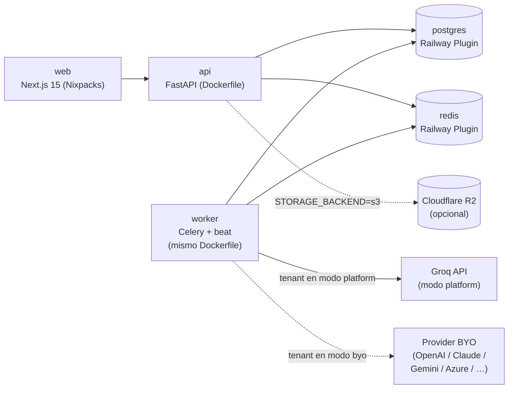

# Despliegue en Railway

**ID:** `DOC-ARCH-DEPLOY`
**Última verificación contra código:** 2026-05-23.

---

## 1. Servicios Railway

El proyecto se despliega como **4 servicios** dentro de un mismo **Project** de Railway:



| Servicio | Root | Builder | Notas |
|---|---|---|---|
| `web` | `apps/web` | Nixpacks (Node 20) | `npm install && npm run build` |
| `api` | `apps/api` | **Dockerfile** (compartido con worker) | Incluye JRE 21 + MPXJ para import de `.mpp`; WeasyPrint para PDF |
| `worker` | `apps/api` | **Dockerfile** (mismo) | Sobrescribe `CMD` con celery + beat embebido |
| `postgres` | Plugin | — | PostgreSQL 16 |
| `redis` | Plugin | — | Redis 7 |

> **No hay** servicio `glitchtip` (se descartó la observabilidad APM en MVP). **No hay** servicio `ollama` (BUG-053 eliminó Ollama). El sidecar Tailscale del worker se retiró en ENH-023.

> **Desarrollo local:** ver `docs/setup-dev.md` (o el equivalente vigente; el archivo histórico está en `docs/archive/setup-dev.md` si no existe en raíz). Hoy basta `pnpm install` + `docker compose` opcional para Postgres/Redis.

---

## 2. Infra como código

### Raíz — `railway.json`

```json
{
  "$schema": "https://railway.app/railway.schema.json",
  "build": { "builder": "NIXPACKS" },
  "deploy": {
    "restartPolicyType": "ON_FAILURE",
    "restartPolicyMaxRetries": 10
  }
}
```

> Es **el config default del project**; cada servicio puede sobreescribirlo con su `railway.toml`.

### `apps/api/railway.toml`

```toml
[build]
builder = "DOCKERFILE"
dockerfilePath = "Dockerfile"

[deploy]
healthcheckPath = "/health"
healthcheckTimeout = 60
restartPolicyType = "ON_FAILURE"
restartPolicyMaxRetries = 10
```

El `CMD` default del Dockerfile aplica para `api`:

```dockerfile
CMD ["sh", "-c", "alembic upgrade head && uvicorn app.main:app --host 0.0.0.0 --port ${PORT:-8000} --workers 2"]
```

(Las migraciones corren al arranque del contenedor `api`.)

### `apps/api/worker.railway.toml`

```toml
[build]
builder = "DOCKERFILE"
dockerfilePath = "Dockerfile"

[deploy]
startCommand = "celery -A app.workers.celery_app worker --beat --loglevel=info --concurrency=2"
restartPolicyType = "ON_FAILURE"
restartPolicyMaxRetries = 10
```

> **`--beat` embebido (BUG-036).** El worker arranca también el scheduler de Celery Beat para ejecutar tareas periódicas (`scheduled_reports.send_due_reports`, `scheduled_minutes.send_due_minutes`). Hoy el worker corre con **1 replica**; si se escala >1 replica hay que mover `beat` a un servicio dedicado para evitar duplicar disparos.

**Tasks reales (`apps/api/app/workers/tasks/`):**

| Módulo | Tarea principal | Trigger |
|---|---|---|
| `ai.py` | `ai.generate_minute`, `ai.draft_report` | Encolada desde `/ai/minutes` y `/ai/projects/{id}/reports/draft`. Resuelve provider según modo del tenant (platform → Groq; byo → openai / claude / gemini / perplexity / azure / custom). |
| `notifications.py` | Envío de emails Resend | Encolada desde audit hooks. |
| `scheduled_minutes.py` | Generación de minutas programadas | Beat. |
| `scheduled_reports.py` | Envío de reportes programados | Beat. |

### `apps/web/railway.toml`

```toml
[build]
builder = "NIXPACKS"
buildCommand = "npm install && npm run build"

[deploy]
startCommand = "npm start"
healthcheckPath = "/api/health"
healthcheckTimeout = 30
restartPolicyType = "ON_FAILURE"
restartPolicyMaxRetries = 10
```

> Usa **npm**, no pnpm, dentro del contenedor de web (los workspaces se aplanan al directorio del servicio en el build).

---

## 3. Variables de entorno

### Compartidas / plugins

| Variable | Fuente | Uso |
|---|---|---|
| `DATABASE_URL` | Plugin postgres | API + Worker |
| `REDIS_URL` | Plugin redis | API + Worker |
| `PYTHON_ENV` | `production` / `staging` / `development` | API + Worker |
| `LOG_LEVEL` | `INFO` (default) | API + Worker |
| `LOG_FORMAT` | `json` (default) | API + Worker |

### API + Worker (`apps/api/app/core/config.py`)

| Variable | Default | Notas |
|---|---|---|
| `JWT_SECRET` | dev placeholder | **Rotar en prod** |
| `JWT_REFRESH_SECRET` | dev placeholder | **Rotar en prod** |
| `JWT_ALGORITHM` | `HS256` | |
| `ACCESS_TOKEN_TTL_SEC` | `3600` | 1 h |
| `REFRESH_TOKEN_TTL_SEC` | `2592000` | 30 d |
| `BCRYPT_ROUNDS` | `12` | |
| `MAX_FAILED_LOGIN_ATTEMPTS` | `5` | |
| `ACCOUNT_LOCK_MINUTES` | `15` | |
| `ALLOWED_ORIGINS` | `http://localhost:3000` | CORS, coma-separado |
| `AI_MODE` | `platform` | `platform` / `byo` / `disabled` |
| `GROQ_API_KEY` | — | Requerido si `AI_MODE=platform` |
| `GROQ_MODEL` | `llama-3.3-70b-versatile` | Override por tenant via `/superadmin/ai` |
| `GEMINI_API_KEY` | — | Tenant BYO en modo `byo` (también puede vivir cifrado por tenant) |
| `GEMINI_MODEL` | `gemini-1.5-flash` | |
| `ANTHROPIC_API_KEY` | — | Idem |
| `ANTHROPIC_MODEL` | `claude-sonnet-4-6` | |
| `AI_SECRETS_FERNET_KEY` | dev placeholder | Cifra API keys de providers BYO antes de persistir en DB |
| `STORAGE_BACKEND` | `local` | `local` (Railway Volume) o `s3` (Cloudflare R2 / B2 / AWS S3 / MinIO) |
| `STORAGE_PATH` | `/tmp/pmo-uploads` | Solo cuando `STORAGE_BACKEND=local` |
| `S3_ENDPOINT_URL` | — | Ej. `https://<account>.r2.cloudflarestorage.com` |
| `S3_BUCKET` | — | |
| `S3_REGION` | `auto` | `auto` para R2; región concreta para B2/AWS |
| `S3_ACCESS_KEY_ID` | — | |
| `S3_SECRET_ACCESS_KEY` | — | |
| `RESEND_API_KEY` | — | Emails |
| `RESEND_FROM` | — | Ej. `"PMO·aaS <no-reply@pmo-aas.com>"` |
| `APP_BASE_URL` | `https://app.pmo-aas.com` | CTA y unsubscribe links en emails |
| `SEED_ON_STARTUP` | `True` | Roles sistema + tenant demo al arrancar |
| `VERSION` | `0.1.0` | Surface en `/health` |

### Web (Next.js)

| Variable | Ejemplo |
|---|---|
| `NEXT_PUBLIC_API_URL` | `https://api.pmoaas.com` |

> **No usamos NextAuth.** El frontend habla directo con `/api/v1/auth/*` del backend. Las variables `NEXTAUTH_URL` / `NEXTAUTH_SECRET` de versiones viejas del doc **no existen**.

> **GlitchTip / Sentry**: no integrado hoy. Si se reintroduce, agregar `NEXT_PUBLIC_SENTRY_DSN` (web) y `SENTRY_DSN_API` (api/worker).

---

## 4. Storage de archivos

Dos modos según `STORAGE_BACKEND` (ver §3 y `database.md`):

- **`local` (default dev/staging):** disco persistente. Railway Volume montado en `STORAGE_PATH`. Estructura: `STORAGE_PATH/tenants/{tenant_slug}/{entity}/{id}.ext`.
- **`s3` (prod recomendado):** Cloudflare R2 (default), Backblaze B2, AWS S3 o MinIO. Cliente boto3 (`apps/api/app/services/document_storage.py`).

Backup del volume local: depende del plan Railway. Si se usa R2, los backups los gestiona Cloudflare.

---

## 5. CI/CD

### GitHub Actions — `.github/workflows/ci.yml`

Disparado en `push: [main]` y `pull_request`. Estructura real (resumida):

```yaml
jobs:
  changes:                       # paths-filter detecta api / web / workflows
  lint:                          # ruff (solo si cambió api)
  api-tests-smoke:               # pytest -n auto -m "not heavy" (solo api)
  api-migrations-postgres:       # alembic upgrade → downgrade → upgrade contra Postgres efímero
  api-tests-heavy:               # pytest -m "heavy" (solo en push a main)
```

- **`changes`** usa `dorny/paths-filter@v3` para decidir qué jobs corren (PR de solo-frontend salta jobs api).
- **Ruff** con reglas `E,F,I,N,UP,B,A,C4,RUF` (ver `apps/api/pyproject.toml`).
- **Migraciones** validan reversibilidad upgrade → downgrade → upgrade contra Postgres real (ENH-044, caza regresiones tipo BUG-039 — SQLite acepta cosas que Postgres no).
- **No hay** jobs Playwright ni Schemathesis en CI hoy (diferidos).
- **Concurrency:** runs previos del mismo PR se cancelan al pushear; en `main` no se cancela.

### Railway auto-deploy

- `main` → producción (auto a menos que se proteja la branch con review manual).
- Branches `claude/**` → **no disparan CI** (se evita doble-run; el PR corre por el evento `pull_request`).

---

## 6. Dominios

| Entorno | Frontend | API |
|---|---|---|
| Producción | `app.pmoaas.com` (ajustar según DNS real) | `api.pmoaas.com` |

DNS gestionado en Cloudflare; TLS por Railway (Let's Encrypt).

> Si tu setup actual usa subdominios distintos (ej. `pmo-aas.com`), actualizar esta tabla con los reales.

---

## 7. Migraciones en deploy

- Alembic corre **al arranque del contenedor `api`** (`CMD ["sh", "-c", "alembic upgrade head && uvicorn …"]`).
- El servicio `worker` **no** corre migraciones — para evitar carreras si se redeploya en paralelo.
- Rollback de migración: deploy en hotfix con `alembic downgrade -1` ejecutado manualmente vía one-off:

```bash
railway run --service api alembic downgrade -1
```

- Migraciones de larga duración: ejecutar manualmente fuera del deploy con un one-off para no bloquear el rolling.

---

## 8. Runbooks operativos

### Restart

Railway UI → servicio → "Restart". Rolling automático si hay >1 replica.

### Logs

```bash
railway logs --service api --tail
railway logs --service worker --tail
```

### One-off scripts

```bash
railway run --service api python -m scripts.<nombre>
```

### Recuperar Postgres

```bash
railway run --service api pg_restore -d $DATABASE_URL backup.dump
```

### Ping a Groq

Desde el panel superadmin: `POST /superadmin/ai/groq/ping` valida que la key cargada en `platform_ai_settings` (o `GROQ_API_KEY`) responda.

---

## 9. Healthchecks reales

### API `/health` (`apps/api/app/main.py:50`)

```python
@app.get("/health", tags=["meta"])
async def health():
    return {"status": "ok", "version": settings.VERSION, "env": settings.PYTHON_ENV}
```

> El healthcheck actual **no** consulta DB ni Redis. Si quieres "liveness + readiness" diferenciado, abrir issue de hardening.

### Web `/api/health` (`apps/web/app/api/health/route.ts`)

```ts
export const dynamic = "force-dynamic";
export async function GET() {
  const apiUrl = process.env.NEXT_PUBLIC_API_URL;
  let apiOk = null;
  if (apiUrl) {
    try {
      const r = await fetch(`${apiUrl}/health`, { cache: "no-store", signal: AbortSignal.timeout(3000) });
      apiOk = r.ok;
    } catch { apiOk = false; }
  }
  return Response.json({ ok: true, web: true, api_ok: apiOk, api_url_configured: Boolean(apiUrl), time: new Date().toISOString() });
}
```

> Devuelve `ok: true` siempre que el handler corra (no aborta con 503 si la API falla). Si se quiere fallar el healthcheck cuando la API esté caída, cambiar el `status` retornado.

UptimeRobot u otro monitor externo: pendiente de wiring formal.

---

## 10. Coste por entorno (estimado)

| Entorno | USD/mes |
|---|---:|
| Staging (single replica) | ~25 |
| Producción (1× web, 1× api, 1× worker) | ~60 |
| Plugins (Postgres + Redis) | ~25 |
| Groq API (modo platform, tier free / pay-as-you-go) | 0–30 |
| Cloudflare R2 (10 GB, free tier) | 0 |
| Resend (3k emails free) | 0–20 |
| **Total** | **~$110–160** |

Los providers BYO (OpenAI, Anthropic, Gemini, Azure/Copilot M365, Perplexity) los paga cada tenant con su propia API key — no entran en el coste de plataforma.

---

## 11. Notas históricas (para contexto)

- **ENH-023 (2026-04-23):** retirado el sidecar Tailscale del worker (DEC-017 eliminó la dependencia de Ollama-via-tailnet).
- **BUG-053 (2026-05-08):** eliminado completamente `OllamaProvider`. Toda la cascada legacy `ollama → gemini → claude` desaparece.
- **US-066 (2026-05):** introducido backend de storage S3-compatible (Cloudflare R2) además de Railway Volume.
- **BUG-036 (2026-04-25):** Celery Beat embebido en el worker con `--beat` para no requerir un servicio Railway adicional.
- **US-069 (2026-04-24):** JRE 21 + MPXJ embebidos en el Dockerfile para parser nativo de `.mpp`.
