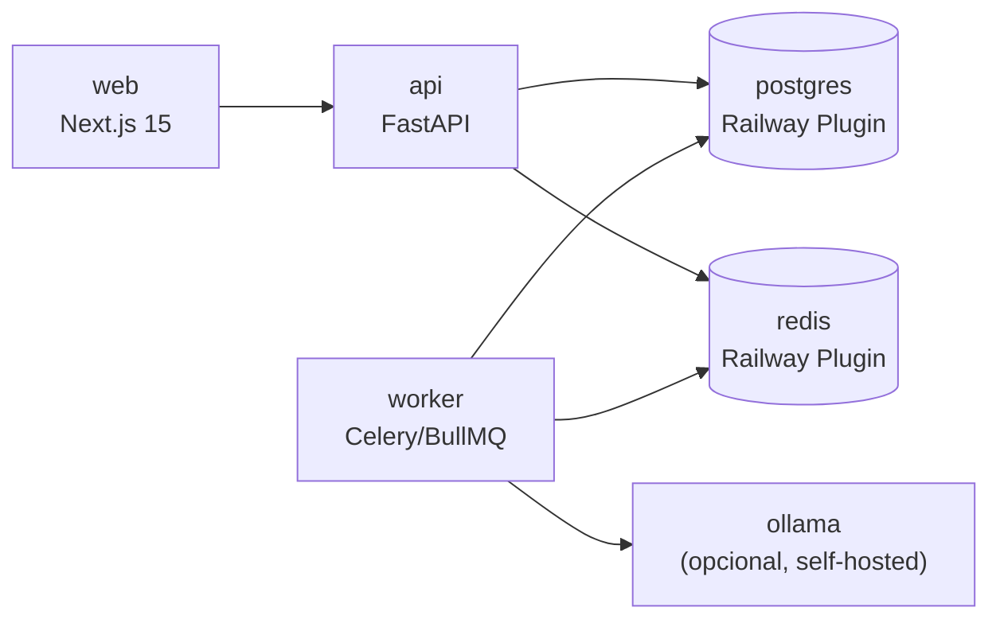

# Despliegue en Railway

**ID:** `DOC-ARCH-DEPLOY`

---

## 1. Servicios Railway

El proyecto se despliega como **6 servicios** dentro de un mismo **Project** de Railway:



| Servicio | Root | Runtime | Reemplazo al auto-deploy |
|---|---|---|---|
| `web` | `apps/web` | Nixpacks (Node 20) | Sí, rolling |
| `api` | `apps/api` | Nixpacks (Python 3.12) | Sí, rolling |
| `worker` | `apps/api` (start command diferente) | Nixpacks (Python 3.12) | Sí |
| `postgres` | Plugin | PostgreSQL 16 | No (persistente) |
| `redis` | Plugin | Redis 7 | No |
| `glitchtip` | Docker | GlitchTip (Sentry-compatible OSS) | Manual |
| `ollama` | Docker o externo | GPU si disponible — ver abajo | Manual |

> **Desarrollo local:** no requiere Docker en Windows. Ver
> [`../setup-dev.md`](../setup-dev.md) — rutas A (nativo), B (Railway dev
> services) o C (Docker en macOS/Linux).

---

## 2. `railway.json` (infra como código)

En la raíz del monorepo:

```json
{
  "$schema": "https://railway.app/railway.schema.json",
  "build": { "builder": "NIXPACKS" },
  "deploy": {
    "startCommand": "pnpm start",
    "healthcheckPath": "/api/health",
    "healthcheckTimeout": 100,
    "restartPolicyType": "ON_FAILURE",
    "restartPolicyMaxRetries": 10
  }
}
```

Cada servicio tiene además su propio archivo (o config UI):

### `apps/api/railway.toml`

```toml
[build]
builder = "NIXPACKS"
buildCommand = "pip install -r requirements.txt && alembic upgrade head"

[deploy]
startCommand = "uvicorn app.main:app --host 0.0.0.0 --port $PORT --workers 2"
healthcheckPath = "/health"
healthcheckTimeout = 30
numReplicas = 2
```

### `apps/api/worker.railway.toml` (mismo root, diferente start)

```toml
[deploy]
startCommand = "celery -A app.worker worker --loglevel=info --concurrency=4"
healthcheckPath = ""   # worker no expone HTTP
numReplicas = 1
```

**Tasks procesadas por el worker (US-051 + US-057):**

- `ai.generate_minute` — dispatchada por `POST /ai/minutes`. Resuelve
  el provider según el modo del tenant (`platform` → Groq, `byo` →
  OpenAI/Claude/Gemini/Perplexity) y persiste el resultado en
  `ai_jobs`. Si `save_as_minute=true`, crea también la fila en
  `meeting_minutes`.
- `ai.draft_report` — dispatchada por `POST /ai/projects/{id}/reports/draft`.
  Análoga, persiste en `reports`. Sólo disponible en modo `byo`
  (DEC-017 limitó `platform` a minutas).

El worker corre Celery directo. Hasta ENH-023 (2026-04-23) tenía un
sidecar Tailscale (`start-worker.sh` + `TS_AUTHKEY`) para alcanzar
Ollama local vía tailnet; DEC-017 movió la IA a Groq hosteado y el
sidecar se retiró. La UI consume el resultado vía polling a
`GET /ai/jobs/{id}` (ver hook `lib/hooks/use-ai-job-polling.ts` en el
frontend).

### `apps/web/railway.toml`

```toml
[build]
builder = "NIXPACKS"
buildCommand = "pnpm install --frozen-lockfile && pnpm turbo build --filter=web"

[deploy]
startCommand = "pnpm --filter web start -p $PORT"
healthcheckPath = "/api/health"
numReplicas = 2
```

---

## 3. Variables de entorno

### Comunes (shared, definidas como "Reference variables")

| Variable | Fuente | Uso |
|---|---|---|
| `DATABASE_URL` | Plugin postgres | API + Worker |
| `REDIS_URL` | Plugin redis | API + Worker |
| `GLITCHTIP_DSN_API` | GlitchTip service | API (Sentry-SDK compatible) |
| `GLITCHTIP_DSN_WEB` | GlitchTip service | Web |
| `NODE_ENV` / `PYTHON_ENV` | `production` | — |

### API / Worker

| Variable | Ejemplo | Descripción |
|---|---|---|
| `JWT_SECRET` | `<rotate cada 90d>` | Firma de tokens |
| `JWT_REFRESH_SECRET` | `<rotate>` | Firma de refresh |
| `ACCESS_TOKEN_TTL_SEC` | `3600` | 1 h |
| `REFRESH_TOKEN_TTL_SEC` | `2592000` | 30 d |
| `BCRYPT_ROUNDS` | `12` | |
| `AI_MODE` | `ollama` / `gemini` / `claude` / `disabled` | prioridad: ollama → gemini → claude |
| `OLLAMA_BASE_URL` | `https://ollama.pmoaas.com:11434` | externo con Cloudflare Tunnel preferido |
| `OLLAMA_MODEL` | `qwen2.5:7b-instruct-q4_K_M` | |
| `GEMINI_API_KEY` | `AIza…` | Free tier 2.º fallback |
| `GEMINI_MODEL` | `gemini-1.5-flash` | 1M tokens/día gratis |
| `ANTHROPIC_API_KEY` | `sk-ant-…` | Fallback 3.º (premium) |
| `ANTHROPIC_MODEL` | `claude-sonnet-4-6` | |
| `RESEND_API_KEY` | `re_…` | Emails |
| `STORAGE_PATH` | `/data/uploads` | Railway Volume |
| `ALLOWED_ORIGINS` | `https://app.pmoaas.com` | CORS |

### Web (Next.js)

| Variable | Ejemplo |
|---|---|
| `NEXT_PUBLIC_API_URL` | `https://api.pmoaas.com` |
| `NEXT_PUBLIC_GLITCHTIP_DSN` | `https://…@glitchtip.pmoaas.com/2` |
| `NEXTAUTH_URL` | `https://app.pmoaas.com` |
| `NEXTAUTH_SECRET` | `<rotate>` |

---

## 4. Volúmenes y storage

- **Volume** `pmo-uploads` montado en `/data/uploads` en `api` y `worker`.
- Estructura: `/data/uploads/tenants/{tenant_slug}/{entity}/{id}.ext`
- Backup del volume: snapshot diario por Railway + sync semanal a Backblaze B2.

**Alternativa preferida post-MVP:** migrar a **S3-compatible** (Backblaze, R2, o Railway S3 si se lanza) para simplificar réplicas y horizontal scaling.

---

## 5. CI/CD

### GitHub Actions

`.github/workflows/ci.yml`:

```yaml
name: CI
on: [pull_request, push]

jobs:
  lint-test:
    runs-on: ubuntu-latest
    services:
      postgres:
        image: postgres:16
        env: { POSTGRES_PASSWORD: test }
        ports: [5432:5432]
      redis:
        image: redis:7
        ports: [6379:6379]
    steps:
      - uses: actions/checkout@v4
      - uses: pnpm/action-setup@v4
      - uses: actions/setup-node@v4
        with: { node-version: 20, cache: pnpm }
      - uses: actions/setup-python@v5
        with: { python-version: '3.12' }
      - run: pnpm install --frozen-lockfile
      - run: pnpm turbo lint test build
      - run: cd apps/api && pip install -r requirements.txt && pytest
      - run: pnpm exec playwright install --with-deps
      - run: pnpm test:e2e
```

### Railway auto-deploy

- `main` → production (con aprobación manual en Railway UI).
- `staging` → staging environment (auto).
- Feature branches → preview environments (opcional, con `railway.preview.json`).

---

## 6. Dominios

| Entorno | Frontend | API |
|---|---|---|
| Production | `app.pmoaas.com` | `api.pmoaas.com` |
| Staging | `staging.pmoaas.com` | `api-staging.pmoaas.com` |
| Preview PR | `pr-{n}-app.up.railway.app` | `pr-{n}-api.up.railway.app` |

DNS en Cloudflare, TLS gestionado por Railway (Let's Encrypt).

---

## 7. Migraciones en deploy

- **Alembic** corre en `buildCommand` del servicio `api`.
- **Rollback**: si el release falla, el deploy previo sigue activo. Para revertir migración: `alembic downgrade -1` en release de hotfix.
- **Migraciones largas**: no usar estrategia de build command. Usar Railway **one-off job** ejecutado manualmente antes del release:

```bash
railway run --service api alembic upgrade head
```

---

## 8. Runbooks operativos

### Restart rolling

Railway UI → servicio → "Restart" (hace rolling si `numReplicas > 1`).

### Consultar logs

```bash
railway logs --service api --tail
railway logs --service worker --tail
```

### Ejecutar script one-off

```bash
railway run --service api python scripts/seed_superadmin.py
```

### Recuperar Postgres

```bash
railway run --service api pg_restore -d $DATABASE_URL backup.dump
```

### Toggle de feature flag

```sql
UPDATE feature_flags SET enabled = true WHERE tenant_id = 'X' AND key = 'ai_minutes';
```

---

## 9. Healthchecks

### API `/health`

```python
@router.get("/health")
async def health(db: Session = Depends(get_db), redis = Depends(get_redis)):
    try:
        await db.execute(text("SELECT 1"))
        await redis.ping()
        return {"status": "ok", "version": settings.VERSION, "time": datetime.utcnow()}
    except Exception as e:
        raise HTTPException(503, {"status": "degraded", "error": str(e)})
```

### Web `/api/health`

```ts
export async function GET() {
  const apiOk = await fetch(`${process.env.API_URL}/health`).then(r => r.ok).catch(() => false);
  return Response.json({ ok: apiOk, web: true, time: new Date().toISOString() },
    { status: apiOk ? 200 : 503 });
}
```

Monitoreo externo con **UptimeRobot** cada 60 s, alertas → Slack.

---

## 10. Coste por entorno (estimado)

| Entorno | USD/mes |
|---|---:|
| Staging (single replica) | 30 |
| Production (2× api, 1× worker, 2× web) | 90 |
| Plugins (Postgres + Redis) | 25 |
| GlitchTip container (0.5 vCPU / 512MB) | 5 |
| Ollama — ver sección 11 | 0-80 |
| **Total** | **~$150-225** |

---

## 11. Hosting del modelo local (Ollama)

Detalle completo en [`../ai/local-model-setup.md`](../ai/local-model-setup.md).
Resumen de opciones y cuándo usar cada una:

| Opción | Costo/mes | Latencia | Cuándo usar |
|---|---:|---|---|
| **Home-host** (tu Mac Studio / PC gamer) | $0 | 20-60 tok/s | MVP / un solo tenant / cero costo cloud |
| Cloudflare Tunnel al home-host | $0 | +30-80ms | Segura exposición del home-host sin abrir puertos |
| Railway GPU (rolling) | ~$40-80 | ~40 tok/s | Cuando RW lo habilite; paridad total |
| VPS Hetzner GEX44 (L4 24GB) | €250 | 50-100 tok/s | Varios tenants, GPU dedicada |
| OVH Advance-2 (A4000) | €220 | 40-80 tok/s | Alternativa europea |
| **Gemini 1.5 Flash** (sin hostear nada) | **$0** free tier | ~200ms API | 2.º fallback, cuando Ollama no está o está lento |

### Estrategia recomendada para MVP personal

1. **Desarrollo:** Ollama nativo en tu máquina local (ver `setup-dev.md`).
2. **Staging / demos:** **Gemini 1.5 Flash** gratis — no hosteamos nada, solo
   API key. El PMO completo funciona con su free tier (15 RPM, 1M tokens/día).
3. **Producción temprana:** decide con los primeros tenants reales:
   - Tenant quiere privacidad absoluta → Ollama home-host + Cloudflare Tunnel.
   - Tenant no quiere IA → `AI_MODE=disabled`.
   - Tenant quiere máxima calidad → Claude Sonnet con su propia API key.

Esto implica **$0 de costo de IA** hasta que tengas un tenant pagando.
