<!-- GENERADO POR scripts/generar_er.py — NO EDITAR A MANO.
     Se deriva de `Base.metadata`, el mismo origen del que Alembic saca las
     migraciones. Cualquier edición aquí la borra la siguiente regeneración.
     Para cambiar el diagrama, cambiá el modelo. -->

# Diagrama entidad-relación — generado

**No se edita a mano** (MCS DOC-03). Lo produce `scripts/generar_er.py` desde
`Base.metadata`, y `tests/test_doc03_er_generado.py` falla si queda desfasado.

La descripción en prosa de cada tabla vive en
[`database.md`](database.md): eso no está en el modelo y no se puede derivar.

**57 tablas · 162 relaciones declaradas por clave foránea.**

```mermaid
erDiagram
    AREAS |o--o{ ACTORS : area_id
    USERS |o--o{ ACTORS : created_by
    ACTORS |o--o{ ACTORS : manager_actor_id
    ORGANIZATIONS |o--o{ ACTORS : organization_id
    TEAMS |o--o{ ACTORS : team_id
    TENANTS ||--o{ ACTORS : tenant_id
    USERS |o--o{ ACTORS : user_id
    USERS ||--o{ ADMIN_OTP_CODES : user_id
    USERS |o--o{ AI_JOBS : requested_by
    USERS |o--o{ AI_REPORT_TEMPLATES : created_by
    PROJECTS ||--o{ AI_REPORT_TEMPLATES : project_id
    TENANTS ||--o{ AI_REPORT_TEMPLATES : tenant_id
    ACTORS ||--o{ APPROVAL_TOKENS : actor_id
    CHANGE_REQUESTS ||--o{ APPROVAL_TOKENS : change_id
    AREAS ||--o{ AREA_ASSIGNMENTS : area_id
    USERS |o--o{ AREA_ASSIGNMENTS : created_by
    ORGANIZATIONS |o--o{ AREA_ASSIGNMENTS : organization_id
    PROGRAMS |o--o{ AREA_ASSIGNMENTS : program_id
    PROJECTS |o--o{ AREA_ASSIGNMENTS : project_id
    TENANTS ||--o{ AREA_ASSIGNMENTS : tenant_id
    USERS |o--o{ AREAS : created_by
    ACTORS |o--o{ AREAS : lead_actor_id
    ORGANIZATIONS |o--o{ AREAS : organization_id
    TENANTS ||--o{ AREAS : tenant_id
    TENANTS ||--o{ ASSISTANT_CONVERSATIONS : tenant_id
    USERS ||--o{ ASSISTANT_CONVERSATIONS : user_id
    ASSISTANT_CONVERSATIONS ||--o{ ASSISTANT_MESSAGES : conversation_id
    USERS |o--o{ BUSINESS_UNITS : created_by
    ORGANIZATIONS ||--o{ BUSINESS_UNITS : organization_id
    TENANTS ||--o{ BUSINESS_UNITS : tenant_id
    ACTORS ||--o{ CHANGE_APPROVERS : actor_id
    CHANGE_REQUESTS ||--o{ CHANGE_APPROVERS : change_id
    USERS |o--o{ CHANGE_REQUESTS : approved_by
    USERS |o--o{ CHANGE_REQUESTS : created_by
    PROJECTS ||--o{ CHANGE_REQUESTS : project_id
    USERS |o--o{ CHANGE_REQUESTS : requested_by
    BUSINESS_UNITS ||--o{ DEPARTMENTS : business_unit_id
    USERS |o--o{ DEPARTMENTS : created_by
    TENANTS ||--o{ DEPARTMENTS : tenant_id
    USERS |o--o{ DOCUMENTS : created_by
    PROJECTS ||--o{ DOCUMENTS : project_id
    USERS |o--o{ DOCUMENTS : uploaded_by
    TENANTS ||--o{ FOLIO_SEQUENCES : tenant_id
    AREAS |o--o{ ISSUES : area_id
    USERS |o--o{ ISSUES : created_by
    ACTORS |o--o{ ISSUES : on_hold_actor_id
    AREAS |o--o{ ISSUES : on_hold_area_id
    ACTORS |o--o{ ISSUES : owner_actor_id
    USERS |o--o{ ISSUES : owner_id
    PROJECTS ||--o{ ISSUES : project_id
    USERS |o--o{ LESSONS : created_by
    ACTORS |o--o{ LESSONS : owner_actor_id
    PROJECTS ||--o{ LESSONS : project_id
    USERS |o--o{ MEETING_MINUTES : created_by
    PROJECTS ||--o{ MEETING_MINUTES : project_id
    TENANTS ||--o{ METRIC_SNAPSHOTS : tenant_id
    TENANTS ||--o{ NOTIFICATIONS : tenant_id
    USERS ||--o{ NOTIFICATIONS : user_id
    USERS |o--o{ ORGANIZATION_USER_EXCLUSIONS : created_by_user_id
    ORGANIZATIONS ||--o{ ORGANIZATION_USER_EXCLUSIONS : organization_id
    USERS ||--o{ ORGANIZATION_USER_EXCLUSIONS : user_id
    TENANTS ||--o{ ORGANIZATIONS : tenant_id
    USERS ||--o{ PASSWORD_RESET_TOKENS : user_id
    USERS |o--o{ PERMISSION_CHANGE_REQUESTS : decided_by_superadmin_id
    USERS ||--o{ PERMISSION_CHANGE_REQUESTS : requested_by_user_id
    USERS ||--o{ PERMISSION_CHANGE_REQUESTS : target_user_id
    TENANTS ||--o{ PERMISSION_CHANGE_REQUESTS : tenant_id
    DEPARTMENTS |o--o{ PROGRAMS : department_id
    ORGANIZATIONS ||--o{ PROGRAMS : organization_id
    TENANTS ||--o{ PROGRAMS : tenant_id
    PROJECTS ||--o| PROJECT_AI_CONTEXTS : project_id
    TENANTS ||--o{ PROJECT_AI_CONTEXTS : tenant_id
    USERS |o--o{ PROJECT_AI_CONTEXTS : updated_by
    USERS |o--o{ PROJECT_ARTIFACTS : created_by
    PROJECTS ||--o{ PROJECT_ARTIFACTS : project_id
    TENANTS ||--o{ PROJECT_ARTIFACTS : tenant_id
    BUSINESS_UNITS |o--o{ PROJECT_CHARTERS : business_unit_id
    USERS |o--o{ PROJECT_CHARTERS : created_by
    DEPARTMENTS |o--o{ PROJECT_CHARTERS : department_id
    ORGANIZATIONS |o--o{ PROJECT_CHARTERS : organization_id
    USERS |o--o{ PROJECT_CHARTERS : pm_id
    PROJECTS ||--o| PROJECT_CHARTERS : project_id
    PROJECT_REQUESTS |o--o{ PROJECT_CHARTERS : request_id
    TENANTS ||--o{ PROJECT_CHARTERS : tenant_id
    USERS |o--o{ PROJECT_HEALTH_EVALUATIONS : created_by
    PROJECTS ||--o{ PROJECT_HEALTH_EVALUATIONS : project_id
    TENANTS ||--o{ PROJECT_HEALTH_EVALUATIONS : tenant_id
    PROJECTS ||--o{ PROJECT_MEMBERS : project_id
    USERS ||--o{ PROJECT_MEMBERS : user_id
    ACTORS ||--o{ PROJECT_PARTICIPATIONS : actor_id
    USERS |o--o{ PROJECT_PARTICIPATIONS : created_by
    AREAS |o--o{ PROJECT_PARTICIPATIONS : functional_area_id
    TEAMS |o--o{ PROJECT_PARTICIPATIONS : operational_team_id
    PROJECTS ||--o{ PROJECT_PARTICIPATIONS : project_id
    PROJECT_ROLES |o--o{ PROJECT_PARTICIPATIONS : project_role_id
    TENANTS ||--o{ PROJECT_PARTICIPATIONS : tenant_id
    BUSINESS_UNITS |o--o{ PROJECT_REQUESTS : business_unit_id
    DEPARTMENTS |o--o{ PROJECT_REQUESTS : department_id
    ORGANIZATIONS ||--o{ PROJECT_REQUESTS : organization_id
    USERS ||--o{ PROJECT_REQUESTS : requested_by
    USERS |o--o{ PROJECT_REQUESTS : reviewed_by
    TENANTS ||--o{ PROJECT_REQUESTS : tenant_id
    TENANTS ||--o{ PROJECT_ROLES : tenant_id
    BUSINESS_UNITS |o--o{ PROJECTS : business_unit_id
    DEPARTMENTS |o--o{ PROJECTS : department_id
    ORGANIZATIONS ||--o{ PROJECTS : organization_id
    USERS |o--o{ PROJECTS : pm_id
    PROGRAMS |o--o{ PROJECTS : program_id
    TENANTS ||--o{ PROJECTS : tenant_id
    USERS ||--o{ REFRESH_TOKENS : user_id
    USERS |o--o{ REPORT_BUILDER_TEMPLATES : owner_id
    PROJECTS |o--o{ REPORT_BUILDER_TEMPLATES : project_id
    TENANTS |o--o{ REPORT_BUILDER_TEMPLATES : tenant_id
    USERS |o--o{ REPORT_HISTORY : generated_by_user_id
    PROJECTS ||--o{ REPORT_HISTORY : project_id
    SCHEDULED_REPORTS |o--o{ REPORT_HISTORY : scheduled_report_id
    REPORTS |o--o{ REPORT_HISTORY : source_report_id
    TENANTS ||--o{ REPORT_HISTORY : tenant_id
    USERS |o--o{ REPORT_TEMPLATES : created_by
    TENANTS ||--o{ REPORT_TEMPLATES : tenant_id
    USERS |o--o{ REPORTS : created_by
    ACTORS ||--o{ RISK_ACTION_ASSIGNEES : actor_id
    RISK_ACTIONS ||--o{ RISK_ACTION_ASSIGNEES : risk_action_id
    USERS |o--o{ RISK_ACTIONS : created_by
    RISKS ||--o{ RISK_ACTIONS : risk_id
    AREAS |o--o{ RISKS : area_id
    USERS |o--o{ RISKS : created_by
    ACTORS |o--o{ RISKS : on_hold_actor_id
    AREAS |o--o{ RISKS : on_hold_area_id
    ACTORS |o--o{ RISKS : owner_actor_id
    USERS |o--o{ RISKS : owner_id
    PROJECTS ||--o{ RISKS : project_id
    TENANTS ||--o{ ROLES : tenant_id
    USERS |o--o{ SCHEDULED_MINUTES : created_by
    PROJECTS ||--o{ SCHEDULED_MINUTES : project_id
    TENANTS ||--o{ SCHEDULED_MINUTES : tenant_id
    USERS |o--o{ SCHEDULED_REPORTS : created_by
    PROJECTS ||--o{ SCHEDULED_REPORTS : project_id
    REPORT_BUILDER_TEMPLATES |o--o{ SCHEDULED_REPORTS : report_builder_template_id
    TENANTS ||--o{ SCHEDULED_REPORTS : tenant_id
    USERS |o--o{ STAKEHOLDERS : created_by
    ORGANIZATIONS |o--o{ STAKEHOLDERS : organization_id
    TENANTS ||--o{ STAKEHOLDERS : tenant_id
    TASKS ||--o{ TASK_DEPENDENCIES : predecessor_id
    TASKS ||--o{ TASK_DEPENDENCIES : successor_id
    AREAS |o--o{ TASKS : area_id
    ACTORS |o--o{ TASKS : assignee_actor_id
    USERS |o--o{ TASKS : owner_id
    TASKS |o--o{ TASKS : parent_id
    PROJECTS ||--o{ TASKS : project_id
    TASKS |o--o{ TASKS : related_milestone_id
    AREAS ||--o{ TEAMS : area_id
    USERS |o--o{ TEAMS : created_by
    TENANTS ||--o{ TEAMS : tenant_id
    TENANTS ||--o{ TENANT_ROLE_PERMISSION_OVERRIDES : tenant_id
    USERS |o--o{ TENANT_ROLE_PERMISSION_OVERRIDES : updated_by_user_id
    ROLES ||--o{ USER_ROLES : role_id
    USERS ||--o{ USER_ROLES : user_id
    USERS |o--o{ USER_SCOPE_ASSIGNMENTS : created_by_user_id
    TENANTS ||--o{ USER_SCOPE_ASSIGNMENTS : tenant_id
    USERS ||--o{ USER_SCOPE_ASSIGNMENTS : user_id
    TENANTS |o--o{ USERS : tenant_id
    AUDIT_LOG { }
    PLATFORM_AI_SETTINGS { }
    REPORT_SECTIONS { }
```

