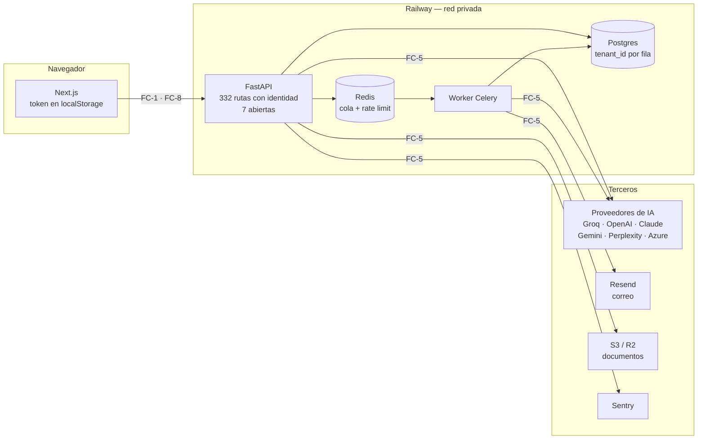

# Modelo de amenazas

**ID:** `DOC-ARCH-AMENAZAS`
**Responsable:** owner (xguilxr)
**Estado:** vigente
**Revisado:** 2026-08-05 · **Periodicidad:** 12 meses o ante cambio significativo
**Cierra:** MCS **SEG-06** — «DEBE existir un modelo de amenazas derivado de la
arquitectura, revisado ante cambios significativos». Acción **B5** del plan de
conformidad.

**Inventario que el CI hace cumplir:** [`amenazas.yaml`](amenazas.yaml).
**Ratchet:** `apps/api/tests/test_seg06_modelo_amenazas.py`.

---

## 0. Método, y una advertencia sobre él

El marco (`MCS-CORE.md §5.14`) enuncia SEG-06 como requisito. **No trae ningún
procedimiento** para construir un modelo de amenazas. `SEG-06` aparece una sola
vez en todo `marcos/`, en la tabla de requisitos. La skill `modelado-amenazas`
enruta a §5.14 esperando encontrar allí un procedimiento que no existe.

Así que el método de este documento **lo elegí yo, no lo prescribe el marco**.
Conviene leerlo sabiendo eso. Descompone por flujos de datos y por fronteras de
confianza numeradas. Sobre cada frontera van las categorías de STRIDE que
apliquen. Cada amenaza lleva control actual, evidencia comprobable, riesgo
residual y estado.

Dos reglas que me impuse al escribirlo:

- **Nada se da por controlado sin evidencia que se pueda abrir.** Si el control
  es una prueba, va la ruta del fichero; si es un comportamiento, va comprobado.
- **Lo no verificado se marca como no verificado** y no como conforme.

## 1. Arquitectura de la que deriva

La descomposición de abajo **no sustituye** a los diagramas C4 de contexto y
contenedores, que ya existen en [`README.md`](README.md) §C4. Esta vista es otra
cosa: la misma arquitectura mirada **por dónde se cruza una frontera de
confianza**. Es lo que un modelo de amenazas necesita, y lo que un diagrama C4
no dice.

> **Discrepancia con la auditoría.** El informe MCS deja `ARQ-01` en PARCIAL con
> la evidencia «no se encontraron diagramas de contexto ni de contenedores».
> Eso **no es exacto**: `docs/architecture/README.md` los tiene, en mermaid, y
> su propio índice los anuncia en la fila 7. Lo que le falta a ARQ-01 habrá que
> volver a mirarlo, porque la razón escrita no se sostiene.



### Fronteras de confianza

| # | Frontera | Qué la cruza |
|---|---|---|
| **FC-1** | Internet → API | Peticiones sin identidad (7 rutas) |
| **FC-2** | Usuario autenticado → datos de **su** inquilino | Todo endpoint de negocio; el cambio de inquilino activo (US-214) |
| **FC-3** | Administrador de inquilino → **nuestra** infraestructura | Configuración BYO, `base_url` |
| **FC-4** | Superadministrador → todos los inquilinos | `join-as-admin`, paneles de plataforma |
| **FC-5** | Plataforma → terceros | Datos de proyecto que salen |
| **FC-6** | Contenido de terceros → el modelo | Minutas, hojas de cálculo, memoria |
| **FC-7** | Salida del modelo → el producto | Acciones, RAID, mapeo de columnas |
| **FC-8** | Navegador → almacenamiento del token | Sesión |

### Qué se protege

| Activo | Por qué importa |
|---|---|
| Datos de proyecto de cada inquilino | Es el producto, y es de un cliente que no es el de al lado |
| Credenciales y tokens de sesión | Dan acceso a lo anterior |
| Claves de IA de cada inquilino (cifradas con Fernet) | Su gasto y su cuenta con el proveedor |
| La red privada de Railway | Postgres y Redis no están expuestos a internet, y no deben estarlo |
| El registro de auditoría | Es lo único que dice quién hizo qué |

---

## 2. Amenazas

Resumen. El detalle de cada una, abajo.

| ID | Frontera | Amenaza | Estado |
|---|---|---|---|
| AM-01 | FC-3 | Peticiones a nuestra red desde `base_url` del inquilino | **CERRADA** |
| AM-02 | FC-2 | Fuga entre inquilinos por un filtro que falta | **CONTROLADA** |
| AM-03 | FC-6 | Instrucciones inyectadas en contenido subido | **CONTROLADA** |
| AM-04 | FC-7 | La salida del modelo cruza al producto | **CONTROLADA** |
| AM-05 | FC-5 | Datos del proyecto que salen a terceros | **ACEPTADA** |
| AM-06 | FC-4 | El superadministrador entra a un inquilino | **PARCIAL** |
| AM-07 | FC-1 | Enlace de aprobación en la URL | **ACEPTADA** |
| AM-08 | FC-2 | Manipulación del registro de auditoría | **CONTROLADA** |
| AM-09 | FC-1 | Relleno de credenciales | **CONTROLADA** |
| AM-10 | FC-1 | Bloqueo de cuenta ajena como denegación de servicio | **CONTROLADA** |
| AM-11 | FC-1 | Restablecimiento de contraseña | **CONTROLADA** |
| AM-12 | FC-5 | Tipografías remotas al renderizar PDF | **CERRADA** |
| AM-13 | FC-8 | Robo del token desde el navegador | **PARCIAL** |
| AM-14 | — | Escritura directa a producción | **CERRADA** |
| AM-15 | FC-2 | Acceso a un proyecto ajeno DENTRO del mismo inquilino | **CONTROLADA** |
| AM-16 | FC-2 | La membresía en un inquilino se autoriza desde el token, no desde la base | **CONTROLADA** |

### AM-01 — Peticiones a nuestra red desde la `base_url` del inquilino

**FC-3 · STRIDE: divulgación, elevación · Estado: CERRADA (2026-08-04)**

El modo BYO deja que un administrador de inquilino fije `base_url` para `custom`
y `azure`. Se validaba como `str | None` con `max_length=500`, y
`POST /api/v1/admin/ai/provider/test` —capability `ai.configure`, o sea
administrador de **cualquier** inquilino— la usaba para hacer una petición desde
dentro de la red privada devolviendo estado, 120 caracteres del cuerpo y la
latencia.

Comprobado contra servidores locales antes de corregirlo:

```
http://127.0.0.1:<abierto>  →  "HTTP 418: {cuerpo del servicio interno}"
http://127.0.0.1:1          →  "All connection attempts failed"
http://no-existe.interno    →  "getaddrinfo failed"
```

Las tres se distinguen, así que servía para barrer puertos de la red privada,
averiguar qué nombres internos existen y leer un trozo de lo que contestaran.

**Control:** `app/core/url_externa.py` rechaza por forma (solo `https`, ni IP en
rangos no enrutables, ni nombres reservados, ni sufijos `.internal`/`.local`) y
resuelve el nombre para rechazar el que apunte adentro. Se aplica en las tres
puertas: guardar configuración, probar conexión y ejecutar. Los destinos
rechazados son ahora indistinguibles entre sí.

**Evidencia:** `tests/test_seg06_am01_ssrf_base_url.py` (44 casos). Verificado
por mutación: quitar la comprobación de forma tira 31, los rangos privados 6,
los sufijos 5, el esquema 2, la puerta de ejecución 1.

**Residual:** la reasignación de DNS. Entre la comprobación y la petición hay dos
resoluciones distintas; un servidor autoritativo hostil puede contestar público
a la primera y privado a la segunda. Cerrarlo exige fijar la IP validada en el
transporte.

### AM-02 — Fuga entre inquilinos por un filtro que falta

**FC-2 · STRIDE: divulgación · Estado: CONTROLADA**

El aislamiento es de capa de aplicación: cada consulta filtra por `tenant_id`.
Sin RLS en Postgres (decisión registrada en `security-multitenant.md`). Un
`WHERE` que se olvide rompe el aislamiento.

**Control:** suite dedicada de B1, verificada por mutación — quitar un filtro la
hace fallar en lectura, modificación y borrado.
**Evidencia:** `tests/test_seg08_aislamiento_tenants.py`.
**Residual:** la suite cubre los recursos que enumera. Un recurso nuevo sin caso
propio no está cubierto, y ningún trinquete lo detecta hoy. **Acción:** extender
el patrón del trinquete de B2 (fallar si aparece un recurso sin caso).

### AM-15 — Acceso a un proyecto ajeno dentro del mismo inquilino

**FC-2 · STRIDE: divulgación · Estado: CONTROLADA**

Hermana de AM-02 y la que no estaba: AM-02 mira la frontera **entre**
inquilinos y esta la de **dentro**. El producto tiene dos capas de
autorización —capacidades por rol y alcance por asignación
(`user_scope_assignments`)— y la segunda se aplicaba solo al listado de
proyectos. Un PM asignado al proyecto A veía únicamente A en la lista y podía
abrir el detalle de B y **todos** sus módulos —riesgos, incidencias,
documentos, minutas, tareas, informes, acta de constitución, contexto de IA—
con solo tener el identificador, que sale de un enlace compartido o de la barra
de direcciones de un compañero.

La causa no fue una decisión: `_get_project` estaba **copiado en nueve
sitios**, con dos órdenes de argumentos y dos copias sin filtrar `deleted_at`.
Se actualizó una.

**Control:** una sola comprobación, `core/autorizacion.proyecto_autorizado`, que
resuelve existencia, inquilino y alcance juntos y **no se pueden llamar por
separado**. Devuelve 404 y no 403: un 403 confirma que el proyecto existe, y eso
ya sirve para enumerar la cartera contando identificadores.
**Evidencia:** `tests/test_seg04_autorizacion_objeto.py`, 18 casos, verificada
por mutación. Incluye el trinquete que impide escribir el décimo resolvedor.
**Residual:** cubre la autorización de **alcance**, o sea si el objeto es
alcanzable. Quién puede escribir qué **dentro** de un proyecto al que sí se
tiene acceso lo responde el modelo de capacidades, que es más grueso: cualquier
usuario autenticado del inquilino puede casi todo (DEC-024).

### AM-16 — La membresía en un inquilino se autoriza desde el token, no desde la base

**FC-2 · STRIDE: elevación de privilegio · Estado: CONTROLADA (US-214)**

Con membresía multi-inquilino, una persona pertenece a varios y cambia entre
ellos. El JWT lleva `tenant_ids` y `active_tenant_id`, y **hasta US-214 el cambio
se autorizaba contra el claim**: `switch_tenant` comprobaba
`body.tenant_id in cu.tenant_ids`, donde `cu.tenant_ids` sale de
`payload.get("tenant_ids")`.

Mientras cada usuario tenía exactamente un inquilino, la lista era de un elemento
y el defecto no tenía consecuencia. En cuanto tiene dos, aparece: **revocar una
membresía no surte efecto hasta que el token caduca**. El token de acceso vive una
hora (`ACCESS_TOKEN_TTL_SEC = 3600`), así que alguien a quien se le quitó el
acceso a un cliente sigue entrando a sus datos hasta sesenta minutos después — y
puede renovar la sesión con el token de refresco, que vive treinta días, si la
renovación reemite los claims sin volver a mirar la tabla.

El caso concreto que esto protege: un consultor externo trabaja para dos clientes
del mismo inquilino de plataforma, termina con uno, y el administrador le quita la
membresía. Con la autorización en el claim, sigue viendo la cartera del cliente
que ya no es suyo.

**Control (US-214).** Dos comprobaciones, y las dos van contra la tabla
`user_tenant_memberships`, nunca contra el claim:

1. `POST /auth/switch-tenant` resuelve la membresía en la base antes de emitir el
   token nuevo. Un claim heredado de una membresía revocada no autoriza nada.
2. `get_current_user` comprueba en **cada petición** que `active_tenant_id` sigue
   siendo una membresía viva del usuario. Sin esto, el punto 1 solo cubre el
   momento del cambio y el token ya emitido sigue valiendo la hora entera.

El precio de la segunda es una consulta por petición. Es el precio de que
revocar signifique revocar: sin ella, la ventana de una hora existe por diseño y
no hay control que la cierre. La consulta va por clave primaria compuesta e
indexada.

**Por qué la membresía la concede un superadministrador y no un administrador de
inquilino.** El inquilino es la frontera de aislamiento del producto (FC-2). Un
administrador que pudiera añadir a alguien a otro inquilino podría concederse a
sí mismo acceso a los datos de otro cliente, que es exactamente lo que la
frontera existe para impedir. Conceder membresía es, por definición, una
operación de FC-4.

**Evidencia:** `tests/test_us214_multi_tenant.py` — incluye el caso de
revocación: se quita la membresía y la siguiente petición con el **mismo** token
falla, sin esperar la caducidad.
**Residual:** el `tenant_ids` del claim se sigue usando para pintar el selector.
Un claim manipulado no da acceso —el activo se comprueba contra la tabla— pero
podría **mostrar** en el desplegable un inquilino que no es del usuario;
seleccionarlo falla. Es un defecto cosmético con el token firmado, y deja de
serlo si algún día la firma se rompe.

### AM-03 — Instrucciones inyectadas en contenido subido

**FC-6 · STRIDE: manipulación · Estado: CONTROLADA**

Minutas, hojas de cálculo y la memoria del proyecto van al modelo. Un texto que
diga «ignora las instrucciones anteriores» tenía la misma autoridad que el
prompt de la plataforma.

**Control:** B2 — neutralización de delimitadores, envoltorio con procedencia y
regla de precedencia en el mensaje de sistema, en los diez puntos de entrada.
**Evidencia:** `tests/test_ia11_inyeccion_prompt.py`, con dos trinquetes contra
la caducidad.
**Residual:** un modelo puede desobedecer y ninguna prueba unitaria puede
afirmar lo contrario. Lo que contiene el daño es AM-04.

### AM-04 — La salida del modelo cruza al producto

**FC-7 · STRIDE: manipulación, elevación · Estado: CONTROLADA**

Si el modelo obedece una inyección, lo que importa es qué sale por el otro lado:
acciones del copiloto, items de RAID, mapeo de columnas del importador.

**Control:** conjunto de evaluación de B3 — 45 casos de salida de modelo rota
contra el código real, umbral eliminatorio en seguridad, job `evaluacion-ia`.
**Evidencia:** `apps/api/evaluacion/`, `tests/test_ia0709_evaluacion.py`.
**Residual:** el informe ejecutivo no tiene superficie evaluada todavía. La
exfiltración del prompt de sistema no está contenida. Queda acotada al mismo
usuario del mismo inquilino. Pero un prompt no es un secreto, y no lo tratamos
como tal.

### AM-05 — Datos del proyecto que salen a terceros

**FC-5 · STRIDE: divulgación · Estado: ACEPTADA**

Transcripciones, nombres de proyecto, títulos de riesgo y RAID viajan al
proveedor de IA; los correos a Resend; los documentos a S3/R2.

**Control:** el destino está acotado a hosts públicos por HTTPS (AM-01), y el
inquilino elige su proveedor conscientemente en modo BYO.
**Residual aceptado:** que el inquilino mande sus datos al proveedor que quiera
**es el propósito de BYO**, no un fallo. Lo que no es aceptable es que ese
destino sea nuestra red, y eso lo cierra AM-01.
**No verificado:** que los proveedores figuren como subencargados en los
acuerdos de tratamiento (MCS IA-15, nivel N3, fuera del objetivo actual).

### AM-06 — El superadministrador entra a un inquilino

**FC-4 · STRIDE: repudio, divulgación · Estado: PARCIAL**

`POST /superadmin/tenants/{id}/join-as-admin` emite un token con
`active_tenant_id`, y a partir de ahí el superadministrador ve los datos de ese
inquilino. Es una capacidad necesaria para dar soporte, y también la vía más
directa a los datos de un cliente.

**Control:** la acción queda en el registro de auditoría.
**Residual:** el registro es tan fiable como AM-08, que está sin control. Y no
hay aviso al inquilino de que alguien entró. **Acción:** notificar al
administrador del inquilino cuando se use `join-as-admin`.

### AM-07 — Enlace de aprobación en la URL

**FC-1 · STRIDE: suplantación · Estado: ACEPTADA**

Los aprobadores de un cambio reciben un enlace con un JWT en la ruta. Las URL se
filtran: cabecera `Referer`, registros de servidores intermedios, historial del
navegador, correos reenviados.

**Control:** el token va firmado (HS256), con `scope` comprobado. Se busca por
hash en base de datos —así que es revocable—. Tiene caducidad y es de un solo
uso. Autoriza exactamente una decisión sobre un cambio.
**Evidencia:** `app/api/v1/endpoints/change_approvals.py::_resolve_token`.
**Residual aceptado:** quien obtenga la URL antes de que se use puede aprobar
ese cambio. El alcance es un cambio concreto, no la cuenta.

### AM-08 — Manipulación del registro de auditoría

**FC-2 · STRIDE: repudio · Estado: CONTROLADA (2026-08-05)**

`audit_log` era una tabla ordinaria: nada impedía un `UPDATE`, un `DELETE` o un
`TRUNCATE` desde la aplicación o desde una conexión con sus credenciales.

**Por qué importa aquí y no solo en SEG-07:** AM-06 se apoya en este registro
como único control. Un control que se apoya en otro que no existe no es un
control.

**Control:** la migración `0097` instala disparadores `BEFORE UPDATE OR DELETE`
y `BEFORE TRUNCATE` que rechazan la operación, más `REVOKE ... FROM PUBLIC`.
En la capa de la aplicación, `app/models/audit.py` lanza en la línea que lo
intenta.

**Por qué no bastaba el `REVOKE` que esta ficha proponía.** Decía «barato y no
requiere código», y lo primero es cierto. Lo segundo también. Aun así, no
alcanza. En Railway, la aplicación se conecta con el rol **dueño** de las tablas.
En PostgreSQL, el dueño conserva sus privilegios haga lo que haga el `REVOKE`.
Comprobado contra Postgres 16 antes de escribir esto. Con `REVOKE UPDATE, DELETE`
aplicado al dueño, el `UPDATE` pasa igual. Con el disparador puesto, no pasa ni
siendo superusuario. Habría sido un control declarado que no actúa, que es peor
que ninguno porque cierra la ficha.

**Residual, y no es menor:** quien administra la base puede quitar el
disparador. Esto defiende contra la aplicación, contra un fallo que permita
ejecutar SQL con sus credenciales y contra el borrado accidental; no contra un
DBA. Cerrar eso pide encadenamiento por hash o envío a un almacén externo, y es
una decisión propia —con coste propio— que no se toma aquí.

**Segundo residual:** el guardián del ORM no ve las sentencias masivas
(`session.execute(delete(AuditLog))`). En PostgreSQL las para el disparador; en
SQLite —desarrollo local y suite— no las para nada. Está escrito en el código y
comprobado a propósito en `tests/test_am08_auditoria_solo_anexa.py`.

### AM-09 — Relleno de credenciales

**FC-1 · STRIDE: suplantación · Estado: CONTROLADA (2026-08-05)**

El bloqueo por usuario (`MAX_FAILED_LOGIN_ATTEMPTS` → `locked_until`) detiene a
quien adivina la contraseña de **una** cuenta. No hace nada contra el rociado:
una contraseña probada contra miles de cuentas desde una IP no toca el umbral de
ninguna.

**Control:** `POST /auth/login` cuenta los **fallos** por IP —30 por hora,
`_LOGIN_MAX_FAILS_PER_HOUR_IP`— y devuelve 429 al superarlos. Más el bloqueo por
usuario, `bcrypt` y la política de complejidad.

Tres decisiones que hacen falta para leer el control:

- **Fallos, no intentos.** Con `check_and_increment` en la puerta se contarían
  también los aciertos. Una oficina detrás de un NAT —decenas de personas
  compartiendo IP— se quedaría fuera sin haber hecho nada. Por eso el limitador
  tiene `excede()`, que consulta sin sumar.
- **Sin `reset` al acertar.** Sería lo natural y abriría un desvío: quien tiene
  una credencial válida limpiaría el contador entre tandas.
- **La IP sale de `_client_ip`**, no del socket. Detrás del proxy de Railway el
  socket es siempre el mismo y contar por él bloquearía a todo el mundo con el
  primer atacante. A cambio se confía en `X-Forwarded-For`, que solo es fiable
  porque nada llega al contenedor sin pasar por el proxy.

**Residual:** el rociado lento —menos de 30 fallos por hora y por IP, o
repartido entre muchas IP— sigue siendo posible. Cerrarlo pide detección por
patrón, no un contador. **AM-10** (el bloqueo por cuenta como denegación de
servicio) sigue sin control y no la toca este cambio.

**Trinquete:** `tests/test_am09_login_limite_por_ip.py`, verificado por
mutación: sin la comprobación de entrada, caen 2 casos.

### AM-10 — Bloqueo de cuenta ajena como denegación de servicio

**FC-1 · STRIDE: denegación de servicio · Estado: CONTROLADA (2026-08-05)**

El reverso de AM-09: quien conociera un nombre de usuario podía fallar cinco
veces y dejar esa cuenta bloqueada un cuarto de hora. Con una lista de usuarios,
al inquilino entero.

**Control: retardo creciente en vez de bloqueo duro.** Pasado el umbral, cada
intento espera el doble que el anterior, con tope. **La cuenta nunca queda
fuera** —y ese matiz es la amenaza entera—. Quien tecleó mal espera segundos.
Quien sufre un ataque espera, como mucho, `LOGIN_BACKOFF_MAX_SECONDS`. El
`ACCOUNT_LOCK_MINUTES` de quince minutos desapareció.

**Contra la adivinación protege igual o mejor:** con el tope por defecto son
doce intentos por hora y por cuenta. El rociado —muchas cuentas desde una IP— lo
corta AM-09. Las dos se complementan: una mira la cuenta, la otra la IP.

`locked_until` se conserva como columna pero cambia de significado: pasa de
«bloqueada hasta» a «no antes de». El registro de auditoría lo refleja con una
acción nueva, `login_backoff`, en vez de `account_locked`.

**Residual:** un atacante que sostenga el ataque mantiene a la víctima en el
tope. Es una molestia acotada, no una expulsión, y cada intento suyo consume
además su cuota de AM-09.

**Trinquete:** `tests/test_am10_retardo_creciente.py`. Los dos casos que fijan
el control son estos: **el tope existe** —sin él, el retardo creciente es el
bloqueo duro con otro nombre—. El ataque a una cuenta no alcanza a otra.

### AM-11 — Restablecimiento de contraseña

**FC-1 · STRIDE: suplantación · Estado: CONTROLADA**

**Control:** límite por IP en `/auth/forgot-password` y `/auth/reset-password`.
Respuesta 204 constante para no revelar qué correos existen. Al restablecer se
invalidan **todos** los tokens de refresco del usuario.
**Residual:** el límite es **fail-open** por decisión explícita —si Redis muere,
`check_and_increment` devuelve `True`— y está documentado en `rate_limit.py`. Es
defendible (no dejar a nadie sin poder entrar), pero significa que una caída de
Redis quita el límite sin que nadie se entere. **Acción:** alertar cuando el
cliente de Redis sea `None`, para que fail-open sea visible y no silencioso.

### AM-12 — Tipografías remotas al renderizar PDF

**FC-5 · STRIDE: denegación de servicio · Estado: CERRADA (2026-08-05)**

El renderizador de informes referenciaba `fonts.googleapis.com` y
`fonts.gstatic.com` para traer DM Sans. Generar un PDF dependía de una
petición a Google en tiempo de render.

**Control:** no hay tipografía remota. ENH-202 dejó todos los entregables en
Helvetica, y la imagen instala `fonts-urw-base35` (Nimbus Sans), así que la
fuente ya está dentro del contenedor. Los dos `<link>` se retiraron de
`html_report_renderer.py` y de `reports.py`.

**Lo que apareció al cerrarla, y es lo que importa:** el enlace remoto **no
estaba funcionando**. `templates/pdf/base.html` pedía DM Sans, y la imagen solo
instalaba `fonts-dejavu-core`. WeasyPrint no ejecuta el `<link>` de la misma
forma que un navegador. Por eso, los PDF llevaban meses saliendo en DejaVu Sans
—ni la fuente de marca ni Helvetica—. La amenaza era real igualmente (la
petición salía desde el HTML servido en línea). Pero el coste que se le
atribuía, «el render se degrada», ya se estaba pagando en silencio.

**Trinquete:** `tests/test_enh202_helvetica_en_exports.py` falla si vuelve a
aparecer un `fonts.googleapis.com` o si una plantilla pide una fuente que la
imagen no instala.

### AM-13 — Robo del token desde el navegador

**FC-8 · STRIDE: suplantación · Estado: PARCIAL**

El token de acceso vive en `localStorage`, alcanzable por cualquier JavaScript
de la página. Un XSS lo lleva entero.

**Control:** el token de **refresco** sí va en cookie `HttpOnly` con `secure` en
producción. Es la parte que más dura (30 días frente a 1 hora). Cabeceras de
seguridad —CSP, `X-Frame-Options`, `X-Content-Type-Options`, HSTS— desde la
Tanda A. React escapa por omisión.
**Residual:** sin pruebas de frontend, la ausencia de XSS no está verificada por
nada automático. **No verificado**, y así queda anotado.

### AM-14 — Escritura directa a producción

**FC-4 · STRIDE: manipulación · Estado: CERRADA (2026-08-04)**

`main` no estaba protegida: cualquiera con acceso al repositorio empujaba
directo a la rama de la que sale producción. La regla vivía solo en prosa en
`CLAUDE.md` §8.

**Control:** el owner protegió `main` con los ocho checks requeridos. Del lado
del asistente lo refuerza `scripts/guard_irreversible.py`, que **deniega** el
empuje a `main` como acción irreversible (MCA AUT-01).

**Se reflejó tarde.** La acción se completó el 2026-08-04 y esta ficha siguió
diciendo SIN CONTROL hasta el 2026-08-05. Es el defecto que el propio método de
este documento intenta evitar —«nada se da por controlado sin evidencia»—. Y es
su reverso: nada se deja por controlar cuando ya lo está.

**Residual:** un check requerido que se **salta** no bloquea el merge. Verificado
con el PR #576, de solo-docs: `MERGEABLE`/`CLEAN` con cinco jobs en *skipping*.
Por eso los controles que deben valer siempre —`contexto-permanente`,
`contraste-wcag`— corren sin filtro de rutas.

---

## 3. Cómo se revisa

SEG-06 pide «revisado ante cambios significativos». Un documento no puede
cumplir esa mitad, así que la cumple una prueba:
`apps/api/tests/test_seg06_modelo_amenazas.py` recalcula desde el código dos
cosas y falla si aparece algo que [`amenazas.yaml`](amenazas.yaml) no declara:

| Qué vigila | Por qué es «significativo» |
|---|---|
| Rutas que no exigen identidad | Es el cambio más grande posible en FC-1 |
| Destinos externos en `app/` | Un egreso nuevo saca datos de nuestra infraestructura |

**No** se vigila una huella del código entero: un gate que se pone rojo con cada
edición se desactiva en dos días. Y entonces no vigila nada.

Cuando la prueba falle, la respuesta correcta **no es añadir la línea que falta
al YAML**. Es leer este documento, decidir qué amenaza introduce el cambio, y
entonces declararla.

Además, se relee entero ante un cambio: del modelo de tenancy, del mecanismo de
autenticación, o de proveedor de infraestructura. También al pasar la puerta de
lanzamiento («publicación al mundo con usuarios externos» en `conformidad.yaml`).

La ventana de 12 meses se **avisa**, no se falla: que pase el tiempo no hace el
código menos seguro hoy; superficie nueva sin evaluar, sí.

## 4. Lo que este modelo no cubre

- **No es una evaluación ASVS.** SEG-01 y SEG-09 siguen sin evaluar.
- **No hay prueba de intrusión** (SEG-12, N4).
- **No cubre la infraestructura de Railway ni de HostGator** más allá de la
  frontera de red: no se auditó su configuración.
- **No hay plan de respuesta a incidentes** (SEG-11) ni política de divulgación
  responsable (SEG-05, `SECURITY.md` no existe). Los dos son puntos de la puerta
  de lanzamiento y ninguno se resuelve con este documento.
- **`landing/` queda fuera**: se despliega a mano a HostGator y no comparte
  código con la aplicación.
