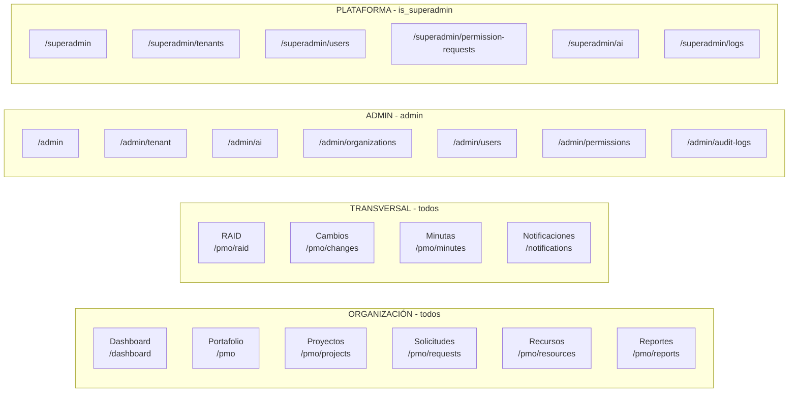
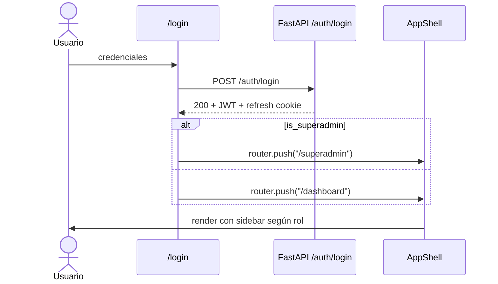
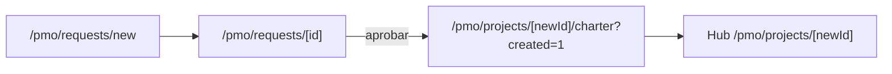
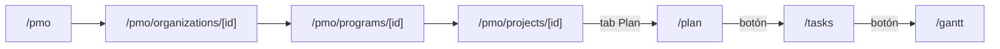
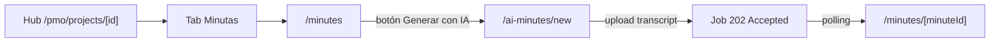
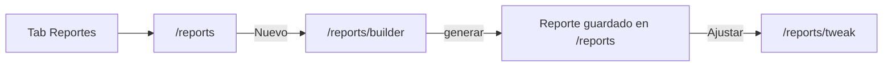
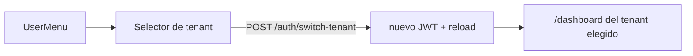

# Navegación de la web app

**ID:** `DOC-ARCH-NAV`
**Fecha:** 2026-05-23
**Scope:** `apps/web` (Next.js 15, App Router)

Este documento describe el árbol de rutas y el propósito de cada
página. También cubre las superficies de navegación (sidebar, tabs,
breadcrumbs), los flujos típicos y las páginas huérfanas detectadas
(sin entrada por UI).

---

## 1. Árbol de navegación

```mermaid
flowchart TB
    classDef public fill:#fef3c7,stroke:#d97706,color:#000
    classDef app fill:#dbeafe,stroke:#2563eb,color:#000
    classDef admin fill:#fee2e2,stroke:#dc2626,color:#000
    classDef super fill:#ede9fe,stroke:#7c3aed,color:#000
    classDef orphan fill:#f3f4f6,stroke:#9ca3af,color:#6b7280,stroke-dasharray:5 3

    ROOT["/ (root)"]:::public

    subgraph Públicas
        LOGIN["/login"]:::public
        FORGOT["/forgot-password"]:::public
        RESET["/reset"]:::public
        CHPW["/change-password"]:::public
        APPROVE["/approve/[token]"]:::public
    end

    subgraph "(app) — autenticado"
        DASH["/dashboard"]:::app
        ACCT["/account"]:::app
        NOTIF["/notifications"]:::app

        subgraph PMO ["/pmo — portal PM"]
            PMO_HOME["/pmo"]:::app
            ORG["/pmo/organizations/[id]"]:::app
            ORG_REP["/pmo/organizations/[id]/reports"]:::app
            PRG_DET["/pmo/programs/[id]"]:::app
            PRG_REP["/pmo/programs/[id]/reports"]:::app
            PRJ_LIST["/pmo/projects"]:::app
            PRJ_NEW["/pmo/projects/new"]:::app
            PRJ["/pmo/projects/[id]<br/>(hub + tabs)"]:::app
            REQ["/pmo/requests"]:::app
            RAID_X["/pmo/raid (cross-project)"]:::app
            CHG_X["/pmo/changes (cross-project)"]:::app
            MIN_X["/pmo/minutes (cross-project)"]:::app
            REP["/pmo/reports"]:::app
            REP_PF["/pmo/reports/portfolio<br/>(admin only)"]:::app
            RES_X["/pmo/resources (cross-project)"]:::app
        end

        subgraph PRJ_TABS ["/pmo/projects/[id]/* — tabs"]
            T_CHART["/charter"]:::app
            T_PLAN["/plan"]:::app
            T_TASKS["/tasks"]:::app
            T_GANTT["/gantt"]:::app
            T_AREAS["/areas"]:::app
            T_DOCS["/documents"]:::app
            T_RAID["/raid"]:::app
            T_CHG["/changes"]:::app
            T_MIN["/minutes"]:::app
            T_AIMIN["/ai-minutes/new"]:::app
            T_LESS["/lessons"]:::app
            T_REP["/reports"]:::app
            T_REP_B["/reports/builder"]:::app
            T_REP_T["/reports/tweak"]:::app
            T_EDIT["/edit"]:::app
            T_DOCS_LEG["/documents/legacy<br/>(huérfana — solo desde docs)"]:::orphan
        end

        subgraph ADMIN ["/admin — admin tenant"]
            ADM_HOME["/admin"]:::admin
            ADM_TEN["/admin/tenant"]:::admin
            ADM_AI["/admin/ai"]:::admin
            ADM_ORG["/admin/organizations"]:::admin
            ADM_USR["/admin/users"]:::admin
            ADM_PERM["/admin/permissions"]:::admin
            ADM_AREAS["/admin/areas"]:::admin
            ADM_AUDIT["/admin/audit-logs"]:::admin
        end

        subgraph SUPER ["/superadmin — plataforma"]
            SA_HOME["/superadmin"]:::super
            SA_TEN["/superadmin/tenants"]:::super
            SA_USR["/superadmin/users"]:::super
            SA_AI["/superadmin/ai"]:::super
            SA_LOG["/superadmin/logs"]:::super
            SA_ME["/superadmin/me"]:::super
            SA_HEALTH["/superadmin/health (huérfana)"]:::orphan
            SA_PRQ["/superadmin/permission-requests"]:::super
        end
    end

    ROOT --> LOGIN
    LOGIN --> DASH
    PRJ --> T_CHART
    PRJ --> T_PLAN
    PRJ --> T_TASKS
    PRJ --> T_GANTT
    PRJ --> T_AREAS
    PRJ --> T_DOCS
    PRJ --> T_RAID
    PRJ --> T_CHG
    PRJ --> T_MIN
    PRJ --> T_LESS
    PRJ --> T_REP
    PRJ_LIST --> PRJ
    ORG --> PRG_DET
    ORG --> PRJ
```



---

## 2. Superficies de navegación

La app expone cinco superficies de navegación. Todas viven en
`apps/web/components/`:

| Superficie | Archivo | Visibilidad |
|---|---|---|
| **Topbar + Logo del tenant** | `app-shell.tsx` (componente `BrandMark`) | Siempre que hay sesión. Logo PNG grande en zona izquierda (`w-[200px]` × `h-11`), tamaño fijo independiente del estado de sidebar. A la derecha aparece siempre "PMO-aaS". Fallback (sin logo): nombre del tenant + "PMO-aaS". |
| **Switcher de organización** | `switcher-de-organizacion.tsx` | Topbar, junto al logo. Oculto para el superadmin que no entró a un inquilino. Desde `lg:`; en móvil el filtro se hereda igual, solo no se ve el control. |
| **Sidebar principal** | `app-shell.tsx` | Siempre que hay sesión. Items admin/superadmin se ocultan por rol. |
| **Menú de usuario** | `user-menu.tsx` | Top-right. Cuenta, idioma, tema, logout. |
| **Notificaciones** | `notification-bell.tsx` | Top-right. Lleva a `/notifications`. |
| **Tabs de proyecto** | `project-tabs-bar.tsx` (montado por `project-layout-client.tsx`) | Sticky dentro de `/pmo/projects/[id]/*`. |

### 2.0 El contexto de organización (US-205)

La organización activa es **una sola** y vive en `organizacion-activa.tsx`, un
proveedor montado en `app/(app)/layout.tsx`. Antes de US-205 cada pantalla
cargaba su lista de organizaciones y pintaba su `<Select>`: elegir una en el
tablero y pasar a la lista de proyectos volvía a «todas».

El contexto expone dos valores y la diferencia importa:

| Valor | Qué es | Quién lo usa |
|---|---|---|
| `activa` | Lo **elegido**, que puede ser «todas». Se persiste en `localStorage` con la clave `pmoaas:org-activa:<tenant>` | La persistencia |
| `efectiva` | Lo que va **a la consulta** en la ruta actual. Igual a `activa`, salvo «todas» en una ruta que no agrega, donde vale la primera organización | El switcher y `useOrgFiltro()` |

Separarlos es lo que evita las dos formas del mismo fallo: guardar solo lo
efectivo destruiría el «todas» del tablero al pasar por cualquier lista, y usar
solo lo elegido dejaría a una lista consultando «todas» mientras el header
muestra una organización concreta.

`RUTAS_QUE_AGREGAN` declara dónde «todas» es válido. Agregan por filtro
(`/dashboard`, que suma cuando no manda `organization_id`) o por construcción
(`/pmo` y `/admin/organizations`, que enumeran organizaciones y no tienen filtro
que aplicar).

> **No es una frontera de seguridad.** El identificador viaja como
> `organization_id` en la consulta, igual que cuando lo mandaba cada página; lo
> que impide ver otra organización es el filtrado por `tenant_id` y visibilidad
> de la API. El claim `active_organization_id` en el JWT es US-214.

Las pantallas que **leen** del contexto: `/dashboard`, `/pmo/projects`,
`/pmo/requests`, `/pmo/reports`, `/admin/areas` y las cuatro vistas cross vía
`tenant-cross-filters.tsx`. Los formularios (`project-form`, `program-modal`,
`request-form`) conservan su `<Select>` porque ahí la organización es un
**campo** de lo que se crea, no un filtro; lo que toman del contexto es la lista
y el valor por default.

### 2.1 Sidebar principal (rutas expuestas)

US-204 lo parte en grupos con rótulo (`GRUPOS_NAV` en `app-shell.tsx`). El
criterio del corte es de quién es la pregunta: **Organización** son las vistas
que se leen por organización; **Transversal**, las que cruzan proyectos o son de
quien las recibe.



> El rótulo del grupo se oculta con el sidebar colapsado (`RotuloDeGrupo`
> devuelve `null`): con 48 px de ancho el texto no cabe y el separador visual lo
> dan los propios iconos.
>
> **El árbol de organizaciones se retiró en US-205.** `org-tree-nav.tsx` hacía
> drill-down org → portafolio ⊃ programa → proyecto dentro del sidebar. La
> organización pasó al header y el drill-down por portafolio y programa vive en
> los filtros de cada vista, que es donde se puede combinar con los demás.

### 2.2 Tabs de proyecto

Los tabs viven en `project-tabs-bar.tsx`. Se renderizan
automáticamente en cualquier subruta de `/pmo/projects/[id]/*`:

`Resumen · Plan · RAID · Recursos · Artefactos · Minutas · Reportes · Cambios · Lecciones`

> US-204 renombró dos tabs sin mover sus rutas: «Áreas/Recursos» → **Recursos**
> (`/areas`) y «Documentos» → **Artefactos** (`/documents`). El renombre es de
> vocabulario, no de estructura: cambiar la ruta rompería los enlaces guardados
> y los reportes que ya la citan, y el mockup pide la palabra, no la URL.

> Las páginas `/tasks`, `/gantt`, `/ai-minutes/new`,
> `/reports/builder`, `/reports/tweak`, `/charter`, `/edit` y
> `/ai-context` no tienen tab dedicado. Se alcanzan desde botones
> in-page o desde otras tabs (ej. `Plan → Tasks → Gantt`,
> `Reportes → Builder → Tweak`, hub → link "Memoria IA").

### 2.3 Landing del admin (`/admin`)

`/admin/page.tsx` actúa como hub con 7 paneles que duplican los items
del sidebar admin + un panel adicional para Áreas:

```
[Tenant] [IA] [Organizations] [Users] [Areas] [Permissions] [Audit]
```

---

## 3. Inventario de páginas

Total: **75 páginas** (`page.tsx`) — 73 post-cleanup 2026-05-23 + `/pmo/resources` (US-183, 2026-07-08) + `/pmo/projects/[id]/ai-context` (US-185, 2026-07-08). Antes del cleanup eran 78. Se borraron 5 muertos: `/admin/stakeholders`, `/admin/settings`, `/admin/supervision`, `/admin/organizations/[id]/panel`, `/pmo/programs` (listado plano).

### 3.1 Rutas públicas (5)

| URL | Propósito |
|---|---|
| `/login` | Autenticación. Link a `/forgot-password`. |
| `/forgot-password` | Solicita reset por email. |
| `/reset` | Aplica un token de reset y fija nueva contraseña. |
| `/change-password` | Cambio de contraseña obligatorio (primer login / expiración). |
| `/approve/[token]` | Aprobación por enlace público (project requests). |

### 3.2 Rutas de sesión — cross-tenant (3)

| URL | Propósito |
|---|---|
| `/dashboard` | KPIs, salud de portafolio, gráficas Plan vs Real. |
| `/account` | Perfil, password, preferencias de notificación. |
| `/notifications` | Centro de notificaciones (filtros por tipo). |

### 3.3 `/pmo/**` — portal de proyectos (35)

**Navegación / listados**

| URL | Propósito |
|---|---|
| `/pmo` | Landing con tarjetas de organizaciones. |
| `/pmo/organizations/[id]` | Detalle de organización: programas + proyectos + reportes. |
| `/pmo/organizations/[id]/reports` | Reportes scope organización. |
| `/pmo/programs/[id]` | Detalle de programa. |
| `/pmo/programs/[id]/reports` | Reportes scope programa. |
| `/pmo/projects` | Listado de proyectos (filtros: fase, salud, búsqueda). |
| `/pmo/projects/new` | Crear proyecto. |
| `/pmo/projects/[id]` | Hub del proyecto: header, KPIs, links a módulos. Sub-tabs internos: `Resumen` · `Equipo` · `Avance` · `Presupuesto` · `Actividad` · `Stakeholders` (este último solo si el charter tiene sponsor / líder de negocio / líder técnico). |
| `/pmo/requests` | Listado de solicitudes de proyecto. |
| `/pmo/requests/new` | Nueva solicitud. |
| `/pmo/requests/[id]` | Detalle de solicitud + aprobación → crea proyecto. |
| `/pmo/raid` | RAID consolidado cross-project. |
| `/pmo/raid/[type]/[raidId]` | Detalle de item RAID (risk/issue/action/decision). |
| `/pmo/changes` | Cambios cross-project. |
| `/pmo/minutes` | Minutas cross-project. |
| `/pmo/reports` | Reportes operativos. |
| `/pmo/reports/portfolio` | Constructor de reporte portfolio (admin). |
| `/pmo/resources` | US-183: capacidad/saturación de recursos — vista Personas, Roles, Áreas y Equipos, Conflictos (sobreasignación con recomendación). Filtro de ventana (Hoy/Semana/3 semanas/Mes). |

**Subrutas del proyecto** (montadas con `ProjectTabsBar`)

| URL `/pmo/projects/[id]/...` | Propósito | Acceso |
|---|---|---|
| `/ai-context` | US-185: Memoria IA — contexto persistente (`context_md`, `instructions_md`, `auto_summary_md`) inyectado en toda generación IA (minutas/reportes) del proyecto. | Link "Memoria IA" en hub, junto a las tarjetas RAID |
| `/charter` | Project charter editable + descarga. | Hub, documents, post-creación |
| `/edit` | Edita metadata del proyecto. | Botón "Editar" en hub |
| `/plan` | Plan de alto nivel. | Tab "Plan" |
| `/tasks` | Tareas + importación MS Project. | Botones desde Plan |
| `/gantt` | Gantt detallado. | Botones desde Plan/Tasks |
| `/areas` | Áreas / equipos del proyecto. | Tab "Recursos" |
| `/documents` | Biblioteca documental. | Tab "Artefactos" |
| `/documents/legacy` | Vista heredada. | Botón "Vista clásica" en documents |
| `/raid` | RAID del proyecto (tabs internos R/A/I/D). | Tab "RAID" |
| `/raid/[raidId]` | Detalle de item RAID. | Click en row de `/raid` |
| `/changes` | Cambios del proyecto. | Tab "Cambios" |
| `/changes/[changeId]` | Detalle de cambio. | Click en row |
| `/minutes` | Minutas del proyecto. | Tab "Minutas" |
| `/minutes/[minuteId]` | Detalle de minuta. | Click en row |
| `/ai-minutes/new` | Subir transcripción → generación IA. | Botón en `/minutes` |
| `/lessons` | Lecciones aprendidas. | Tab "Lecciones" |
| `/lessons/[lessonId]` | Detalle de lección. | Click en row |
| `/reports` | Reportes del proyecto. | Tab "Reportes" |
| `/reports/builder` | Wizard de reporte. | Botón en `/reports` |
| `/reports/tweak` | Ajustes finos del último reporte. | Botón en `/reports` |

### 3.4 `/admin/**` — admin del tenant (13)

| URL | Propósito | Acceso |
|---|---|---|
| `/admin` | Landing con 7 paneles. | Sidebar admin |
| `/admin/tenant` | Branding, dominio, config, stats (consolidó `/admin/settings` y `/admin/supervision` via tabs). | Sidebar + panel |
| `/admin/ai` | Provider de IA (modo `byo`). | Sidebar + panel |
| `/admin/organizations` | CRUD organizaciones. | Sidebar + panel |
| `/admin/organizations/new` | Nueva organización. | Botón |
| `/admin/organizations/[id]` | Panel de la org: portafolios, programas, proyectos y usuarios con rol. | Click en row |
| `/admin/organizations/[id]/edit` | Editar organización + jerarquía Portafolio ⊃ Programa (`org-hierarchy-section.tsx`). | Botón en detalle |
| `/admin/users` | CRUD usuarios. | Sidebar + panel |
| `/admin/users/new` | Nuevo usuario. | Botón |
| `/admin/users/[id]` | Detalle usuario, roles, reset pwd. | Click en row |
| `/admin/permissions` | Matriz roles × permisos. | Sidebar + panel |
| `/admin/areas` | Directorio de áreas/equipos/actores. | Panel del landing |
| `/admin/audit-logs` | Bitácora con filtros + export CSV. | Sidebar + panel |

### 3.5 `/superadmin/**` — plataforma (12)

| URL | Propósito | Acceso |
|---|---|---|
| `/superadmin` | Overview plataforma. | Sidebar superadmin |
| `/superadmin/tenants` | Listado tenants. | Sidebar |
| `/superadmin/tenants/new` | Provisión de tenant. | Botón |
| `/superadmin/tenants/[id]` | Detalle tenant. | Click en row |
| `/superadmin/tenants/[id]/users` | Usuarios del tenant. | Botón en detalle |
| `/superadmin/tenants/[id]/permissions` | Permisos del tenant. | Botón en detalle |
| `/superadmin/users` | Lista global de usuarios. | Sidebar |
| `/superadmin/permission-requests` | Aprobación / rechazo de tickets `permission_change_requests` (US-082; auto-crea overrides en `tenant_role_permission_overrides`). | Sidebar |
| `/superadmin/ai` | Config IA plataforma (Groq). | Sidebar |
| `/superadmin/logs` | Logs plataforma. | Sidebar |
| `/superadmin/me` | Perfil del superadmin. | UserMenu |

---

## 4. Flujos de navegación típicos

### 4.1 Login → Dashboard / Superadmin home



### 4.2 Crear proyecto desde solicitud



### 4.3 Drill-down portafolio → tarea



Alternativa: el sidebar tiene `OrgTreeNav` que permite saltar de `/dashboard` directamente a cualquier `/pmo/projects/[id]` sin pasar por la landing.

### 4.4 Generación de minuta con IA



### 4.5 Reporte ejecutivo



### 4.6 Cambio de tenant (multi-tenant user)



---

## 5. Reglas de visibilidad por rol

| Item | Visible para |
|---|---|
| `TOP_NAV` (Dashboard, Proyectos, Requests, RAID, Cambios, Minutas, Reportes, Recursos) | Cualquier usuario autenticado |
| `Reportes → Portfolio` | Admin (flag `adminOnly`) |
| `ADMIN_NAV` + `/admin/**` | Admin del tenant (rol con permisos admin) |
| `SUPERADMIN_NAV` + `/superadmin/**` | `is_superadmin === true` |
| `OrgTreeNav` (org → portafolio ⊃ programa → proyecto, con los cajones «Sin programa» y «Sin clasificar») | Cualquier usuario; el backend filtra por `tenant_id` y por exclusiones en `organization_user_exclusions` lo que el usuario puede ver. |

La decisión la toma `app-shell.tsx` usando el hook
`useMyPermissions()` (devuelve `roleType: "admin" | "user"`) + el flag
`user.is_superadmin`. El gate es **capability-based** (DEC-024 / US-076):
admin tiene 5 capabilities cerradas (`tenant.manage`, `ai.configure`,
`users.manage`, `organizations.delete`, `audit.read`). Ver
[`security-multitenant.md`](./security-multitenant.md#3-autorización--modelo-capability-based-dec-024--us-076).

---

## 6. Páginas huérfanas y rutas legacy

> **Verificado y limpiado** (2026-05-23). Cleanup ejecutado en este
> mismo commit: ver decisiones del owner abajo.

### 6.1 Decisiones aplicadas (cleanup 2026-05-23)

| Página | Decisión | Acción ejecutada |
|---|---|---|
| `/admin/stakeholders` (catálogo standalone) | Innecesario como página propia. Solo informativo. | **Borrado** (`page.tsx` + `lib/api/stakeholders.ts`). Reemplazado por sub-tab "Stakeholders" en `/pmo/projects/[id]` (Resumen del proyecto). Lista solo los que vienen del charter (sponsor / líder de negocio / líder técnico); si no hay, el tab se oculta. |
| `/superadmin/permission-requests` | Necesario — sin él, US-082 está rota. | **Wire-up** agregado a `SUPERADMIN_NAV` en `app-shell.tsx` (entre Usuarios y IA). |
| `/superadmin/health` | Dejar como está. | Sin cambios. **No era huérfana**: el archivo es un redirect client-side a `/superadmin` (US-026: Health se consolidó en Visión General). Solo subsiste para bookmarks viejos. |
| `/pmo/programs` (listado plano) | Drill-down vía OrgTreeNav cubre el caso. | **Borrado** (`page.tsx`). El detalle `/pmo/programs/[id]` queda intacto. |

### 6.2 Rutas legacy redirigidas en `next.config.js`

Estas URLs tienen un redirect 301 en `apps/web/next.config.js`. El redirect
**permanece** (cubre bookmarks y deep-links de emails). Los `page.tsx`
muertos que el redirect cubría se **borraron** en este commit:

| URL legacy | Redirect a | `page.tsx` borrado |
|---|---|---|
| `/admin/supervision` | `/admin/tenant?tab=stats` | ✅ (US-036) |
| `/admin/settings` | `/admin/tenant?tab=config` | ✅ (US-036) |
| `/admin/organizations/[id]/panel` | `/admin/organizations/[id]` | ✅ (BUG-019) |

El resto de las legacy URLs (`/admin/projects/**`, `/admin/programs/**`,
`/admin/raid/**`, `/admin/requests/**`, `/admin/changes`,
`/admin/minutes`, `/admin/reports`, `/admin/roles/**`) **nunca tuvieron
`page.tsx`**. Eran rutas que se movieron a `/pmo/*` (US-075 / DEC-022),
o que se consolidaron en `/admin/permissions` (roles). El redirect es la
única definición que existe.

### 6.3 Páginas con acceso indirecto único

No son huérfanas. Su único punto de entrada es no-obvio:

| Página | Único punto de entrada |
|---|---|
| `/pmo/projects/[id]/documents/legacy` | Botón "Vista clásica" en `/documents`. |
| `/pmo/projects/[id]/reports/tweak` | Botón "Ajustar" en `/reports` (cuando hay un reporte generado). |
| `/pmo/projects/[id]/charter` | Tras crear proyecto (`router.replace` desde `project-form`), desde `/documents` y desde el flujo de aprobación de request. **No tiene tab propio**. |
| `/pmo/projects/[id]/edit` | Botón "Editar" en el header del hub del proyecto. |
| `/superadmin/me` | Solo desde `UserMenu` cuando el usuario es superadmin. |
| `/superadmin/health` | Redirect client-side; nadie lo visita "en vivo". |

### 6.4 Estado actual

- **0 huérfanas reales** post-cleanup.
- **6 páginas con acceso indirecto único** documentadas arriba (alcanzables pero difíciles de descubrir).
- Cleanup del `page.tsx` muerto: ejecutado en el commit de este cambio.

---

## 7. Convenciones

- **Route groups:** `(app)` agrupa rutas autenticadas sin afectar la
  URL pública. Su layout monta `AppShell` (sidebar + topbar + user
  menu + notification bell).
- **Dynamic segments:** `[id]` para UUIDs, `[token]` para tokens
  públicos, `[type]/[raidId]` para discriminar RAID por tipo.
- **Loading states:** cada subárbol grande tiene `loading.tsx` y
  `error.tsx` (ver `apps/web/app/(app)/pmo/projects/[id]/`).
- **Back navigation:** componente `BackLink` con `fallbackHref` para
  cuando el historial está vacío (deep links desde email).
- **Prefetch:** desactivado en tabs (`prefetch={false}`) para no
  generar carga innecesaria al hover.

---

**Última actualización:** 2026-05-23 (Sprint 26).
**Owner:** Claude Code.
