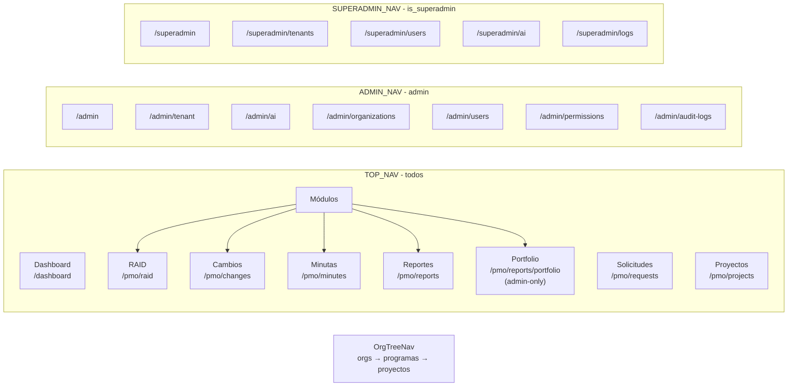
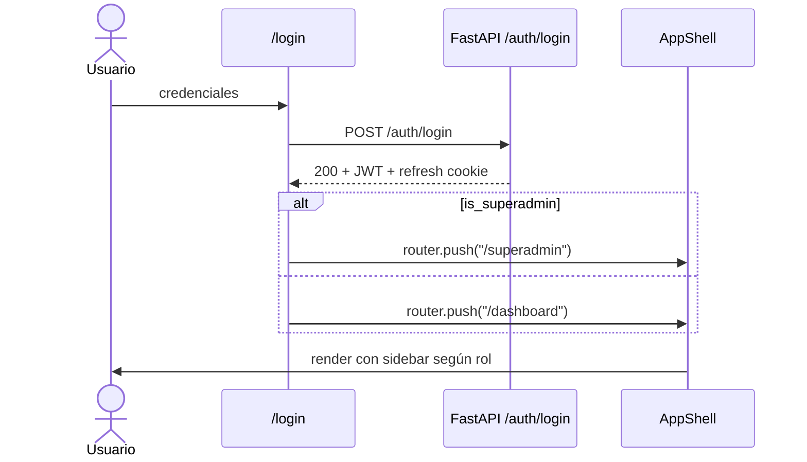
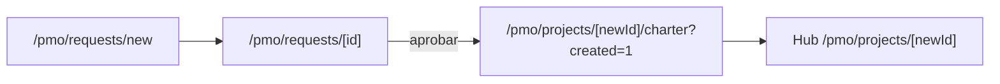
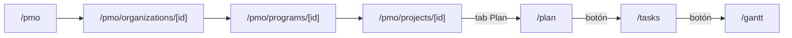
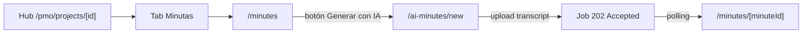
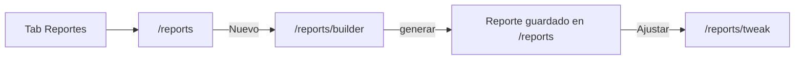
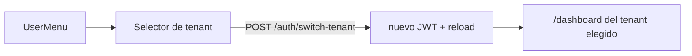

# Navegación de la web app

**ID:** `DOC-ARCH-NAV`
**Fecha:** 2026-05-23
**Scope:** `apps/web` (Next.js 15, App Router)

Este documento describe la estructura de navegación de la aplicación
web: árbol de rutas, propósito de cada página, superficies de
navegación (sidebar, tabs, breadcrumbs), flujos típicos y páginas
huérfanas detectadas (sin entrada por UI).

---

## 1. Árbol de navegación

```mermaid
flowchart TB
    classDef public fill:#fef3c7,stroke:#d97706,color:#000
    classDef app fill:#dbeafe,stroke:#2563eb,color:#000
    classDef admin fill:#fee2e2,stroke:#dc2626,color:#000
    classDef super fill:#ede9fe,stroke:#7c3aed,color:#000
    classDef orphan fill:#f3f4f6,stroke:#9ca3af,color:#6b7280,stroke-dasharray:5 3

    ROOT["/ (root)"]:::public

    subgraph Públicas
        LOGIN["/login"]:::public
        FORGOT["/forgot-password"]:::public
        RESET["/reset"]:::public
        CHPW["/change-password"]:::public
        APPROVE["/approve/[token]"]:::public
    end

    subgraph "(app) — autenticado"
        DASH["/dashboard"]:::app
        ACCT["/account"]:::app
        NOTIF["/notifications"]:::app

        subgraph PMO ["/pmo — portal PM"]
            PMO_HOME["/pmo"]:::app
            ORG["/pmo/organizations/[id]"]:::app
            ORG_REP["/pmo/organizations/[id]/reports"]:::app
            PRG_DET["/pmo/programs/[id]"]:::app
            PRG_REP["/pmo/programs/[id]/reports"]:::app
            PRG_LIST["/pmo/programs (huérfana)"]:::orphan
            PRJ_LIST["/pmo/projects"]:::app
            PRJ_NEW["/pmo/projects/new"]:::app
            PRJ["/pmo/projects/[id]<br/>(hub + tabs)"]:::app
            REQ["/pmo/requests"]:::app
            RAID_X["/pmo/raid (cross-project)"]:::app
            CHG_X["/pmo/changes (cross-project)"]:::app
            MIN_X["/pmo/minutes (cross-project)"]:::app
            REP["/pmo/reports"]:::app
            REP_PF["/pmo/reports/portfolio<br/>(admin only)"]:::app
        end

        subgraph PRJ_TABS ["/pmo/projects/[id]/* — tabs"]
            T_CHART["/charter"]:::app
            T_PLAN["/plan"]:::app
            T_TASKS["/tasks"]:::app
            T_GANTT["/gantt"]:::app
            T_AREAS["/areas"]:::app
            T_DOCS["/documents"]:::app
            T_RAID["/raid"]:::app
            T_CHG["/changes"]:::app
            T_MIN["/minutes"]:::app
            T_AIMIN["/ai-minutes/new"]:::app
            T_LESS["/lessons"]:::app
            T_REP["/reports"]:::app
            T_REP_B["/reports/builder"]:::app
            T_REP_T["/reports/tweak"]:::app
            T_EDIT["/edit"]:::app
            T_DOCS_LEG["/documents/legacy<br/>(huérfana — solo desde docs)"]:::orphan
        end

        subgraph ADMIN ["/admin — admin tenant"]
            ADM_HOME["/admin"]:::admin
            ADM_TEN["/admin/tenant"]:::admin
            ADM_AI["/admin/ai"]:::admin
            ADM_ORG["/admin/organizations"]:::admin
            ADM_USR["/admin/users"]:::admin
            ADM_PERM["/admin/permissions"]:::admin
            ADM_AREAS["/admin/areas"]:::admin
            ADM_AUDIT["/admin/audit-logs"]:::admin
            ADM_SET["/admin/settings (huérfana)"]:::orphan
            ADM_SUP["/admin/supervision (huérfana)"]:::orphan
            ADM_STK["/admin/stakeholders (huérfana)"]:::orphan
        end

        subgraph SUPER ["/superadmin — plataforma"]
            SA_HOME["/superadmin"]:::super
            SA_TEN["/superadmin/tenants"]:::super
            SA_USR["/superadmin/users"]:::super
            SA_AI["/superadmin/ai"]:::super
            SA_LOG["/superadmin/logs"]:::super
            SA_ME["/superadmin/me"]:::super
            SA_HEALTH["/superadmin/health (huérfana)"]:::orphan
            SA_PRQ["/superadmin/permission-requests (huérfana)"]:::orphan
        end
    end

    ROOT --> LOGIN
    LOGIN --> DASH
    PRJ --> T_CHART
    PRJ --> T_PLAN
    PRJ --> T_TASKS
    PRJ --> T_GANTT
    PRJ --> T_AREAS
    PRJ --> T_DOCS
    PRJ --> T_RAID
    PRJ --> T_CHG
    PRJ --> T_MIN
    PRJ --> T_LESS
    PRJ --> T_REP
    PRJ_LIST --> PRJ
    ORG --> PRG_DET
    ORG --> PRJ
```



---

## 2. Superficies de navegación

La app expone cinco superficies de navegación. Todas viven en
`apps/web/components/`:

| Superficie | Archivo | Visibilidad |
|---|---|---|
| **Sidebar principal** | `app-shell.tsx` | Siempre que hay sesión. Items admin/superadmin se ocultan por rol. |
| **Árbol de organizaciones** | `org-tree-nav.tsx` | Dentro del sidebar. Lazy-loads orgs → programas → proyectos. |
| **Menú de usuario** | `user-menu.tsx` | Top-right. Cuenta, idioma, tema, logout. |
| **Notificaciones** | `notification-bell.tsx` | Top-right. Lleva a `/notifications`. |
| **Tabs de proyecto** | `project-tabs-bar.tsx` (montado por `project-layout-client.tsx`) | Sticky dentro de `/pmo/projects/[id]/*`. |

### 2.1 Sidebar principal (rutas expuestas)



### 2.2 Tabs de proyecto

Los tabs viven en `project-tabs-bar.tsx` y se renderizan
automáticamente en cualquier subruta de `/pmo/projects/[id]/*`:

`Resumen · Plan · RAID · Áreas · Documentos · Lecciones · Minutas · Reportes · Cambios`

> **Nota:** las páginas `/tasks`, `/gantt`, `/ai-minutes/new`,
> `/reports/builder`, `/reports/tweak`, `/charter` y `/edit` no tienen
> tab dedicado: se alcanzan desde botones in-page o desde otras tabs
> (ej. `Plan → Tasks → Gantt`, `Reportes → Builder → Tweak`).

### 2.3 Landing del admin (`/admin`)

`/admin/page.tsx` actúa como hub con 7 paneles que duplican los items
del sidebar admin + un panel adicional para Áreas:

```
[Tenant] [IA] [Organizations] [Users] [Areas] [Permissions] [Audit]
```

---

## 3. Inventario de páginas

Total: **78 páginas** (78 archivos `page.tsx`).

### 3.1 Rutas públicas (5)

| URL | Propósito |
|---|---|
| `/login` | Autenticación. Link a `/forgot-password`. |
| `/forgot-password` | Solicita reset por email. |
| `/reset` | Aplica un token de reset y fija nueva contraseña. |
| `/change-password` | Cambio de contraseña obligatorio (primer login / expiración). |
| `/approve/[token]` | Aprobación por enlace público (project requests). |

### 3.2 Rutas de sesión — cross-tenant (3)

| URL | Propósito |
|---|---|
| `/dashboard` | KPIs, salud de portafolio, gráficas Plan vs Real. |
| `/account` | Perfil, password, preferencias de notificación. |
| `/notifications` | Centro de notificaciones (filtros por tipo). |

### 3.3 `/pmo/**` — portal de proyectos (35)

**Navegación / listados**

| URL | Propósito |
|---|---|
| `/pmo` | Landing con tarjetas de organizaciones. |
| `/pmo/organizations/[id]` | Detalle de organización: programas + proyectos + reportes. |
| `/pmo/organizations/[id]/reports` | Reportes scope organización. |
| `/pmo/programs/[id]` | Detalle de programa. |
| `/pmo/programs/[id]/reports` | Reportes scope programa. |
| `/pmo/projects` | Listado de proyectos (filtros: fase, salud, búsqueda). |
| `/pmo/projects/new` | Crear proyecto. |
| `/pmo/projects/[id]` | Hub del proyecto: header, KPIs, links a módulos. |
| `/pmo/requests` | Listado de solicitudes de proyecto. |
| `/pmo/requests/new` | Nueva solicitud. |
| `/pmo/requests/[id]` | Detalle de solicitud + aprobación → crea proyecto. |
| `/pmo/raid` | RAID consolidado cross-project. |
| `/pmo/raid/[type]/[raidId]` | Detalle de item RAID (risk/issue/action/decision). |
| `/pmo/changes` | Cambios cross-project. |
| `/pmo/minutes` | Minutas cross-project. |
| `/pmo/reports` | Reportes operativos. |
| `/pmo/reports/portfolio` | Constructor de reporte portfolio (admin). |

**Subrutas del proyecto** (montadas con `ProjectTabsBar`)

| URL `/pmo/projects/[id]/...` | Propósito | Acceso |
|---|---|---|
| `/charter` | Project charter editable + descarga. | Hub, documents, post-creación |
| `/edit` | Edita metadata del proyecto. | Botón "Editar" en hub |
| `/plan` | Plan de alto nivel. | Tab "Plan" |
| `/tasks` | Tareas + importación MS Project. | Botones desde Plan |
| `/gantt` | Gantt detallado. | Botones desde Plan/Tasks |
| `/areas` | Áreas / equipos del proyecto. | Tab "Áreas" |
| `/documents` | Biblioteca documental. | Tab "Documentos" |
| `/documents/legacy` | Vista heredada. | Botón "Vista clásica" en documents |
| `/raid` | RAID del proyecto (tabs internos R/A/I/D). | Tab "RAID" |
| `/raid/[raidId]` | Detalle de item RAID. | Click en row de `/raid` |
| `/changes` | Cambios del proyecto. | Tab "Cambios" |
| `/changes/[changeId]` | Detalle de cambio. | Click en row |
| `/minutes` | Minutas del proyecto. | Tab "Minutas" |
| `/minutes/[minuteId]` | Detalle de minuta. | Click en row |
| `/ai-minutes/new` | Subir transcripción → generación IA. | Botón en `/minutes` |
| `/lessons` | Lecciones aprendidas. | Tab "Lecciones" |
| `/lessons/[lessonId]` | Detalle de lección. | Click en row |
| `/reports` | Reportes del proyecto. | Tab "Reportes" |
| `/reports/builder` | Wizard de reporte. | Botón en `/reports` |
| `/reports/tweak` | Ajustes finos del último reporte. | Botón en `/reports` |

### 3.4 `/admin/**` — admin del tenant (15)

| URL | Propósito | Acceso |
|---|---|---|
| `/admin` | Landing con 7 paneles. | Sidebar admin |
| `/admin/tenant` | Branding, dominio, config, stats. | Sidebar + panel |
| `/admin/ai` | Provider de IA (modo `byo`). | Sidebar + panel |
| `/admin/organizations` | CRUD organizaciones. | Sidebar + panel |
| `/admin/organizations/new` | Nueva organización. | Botón |
| `/admin/organizations/[id]` | Detalle org (BUs, departamentos). | Click en row |
| `/admin/organizations/[id]/edit` | Editar organización. | Botón en detalle |
| `/admin/organizations/[id]/panel` | Redirect legacy → `/admin/organizations/[id]`. | — |
| `/admin/users` | CRUD usuarios. | Sidebar + panel |
| `/admin/users/new` | Nuevo usuario. | Botón |
| `/admin/users/[id]` | Detalle usuario, roles, reset pwd. | Click en row |
| `/admin/permissions` | Matriz roles × permisos. | Sidebar + panel |
| `/admin/areas` | Directorio de áreas/equipos/actores. | Panel del landing |
| `/admin/audit-logs` | Bitácora con filtros + export CSV. | Sidebar + panel |

### 3.5 `/superadmin/**` — plataforma (12)

| URL | Propósito | Acceso |
|---|---|---|
| `/superadmin` | Overview plataforma. | Sidebar superadmin |
| `/superadmin/tenants` | Listado tenants. | Sidebar |
| `/superadmin/tenants/new` | Provisión de tenant. | Botón |
| `/superadmin/tenants/[id]` | Detalle tenant. | Click en row |
| `/superadmin/tenants/[id]/users` | Usuarios del tenant. | Botón en detalle |
| `/superadmin/tenants/[id]/permissions` | Permisos del tenant. | Botón en detalle |
| `/superadmin/users` | Lista global de usuarios. | Sidebar |
| `/superadmin/ai` | Config IA plataforma (Groq). | Sidebar |
| `/superadmin/logs` | Logs plataforma. | Sidebar |
| `/superadmin/me` | Perfil del superadmin. | UserMenu |

---

## 4. Flujos de navegación típicos

### 4.1 Login → Dashboard / Superadmin home



### 4.2 Crear proyecto desde solicitud



### 4.3 Drill-down portafolio → tarea



Alternativa: el sidebar tiene `OrgTreeNav` que permite saltar de `/dashboard` directamente a cualquier `/pmo/projects/[id]` sin pasar por la landing.

### 4.4 Generación de minuta con IA



### 4.5 Reporte ejecutivo



### 4.6 Cambio de tenant (multi-tenant user)



---

## 5. Reglas de visibilidad por rol

| Item | Visible para |
|---|---|
| `TOP_NAV` (Dashboard, Proyectos, Requests, RAID, Cambios, Minutas, Reportes) | Cualquier usuario autenticado |
| `Reportes → Portfolio` | Admin (flag `adminOnly`) |
| `ADMIN_NAV` + `/admin/**` | Admin del tenant (rol con permisos admin) |
| `SUPERADMIN_NAV` + `/superadmin/**` | `is_superadmin === true` |
| `OrgTreeNav` (orgs/programas/proyectos) | Cualquier usuario; el backend filtra por `tenant_id` y por exclusiones en `organization_user_exclusions` lo que el usuario puede ver. |

La decisión la toma `app-shell.tsx` usando el hook
`useMyPermissions()` (devuelve `roleType: "admin" | "user"`) + el flag
`user.is_superadmin`. El gate es **capability-based** (DEC-024 / US-076):
admin tiene 5 capabilities cerradas (`tenant.manage`, `ai.configure`,
`users.manage`, `organizations.delete`, `audit.read`). Ver
[`security-multitenant.md`](./security-multitenant.md#3-autorización--modelo-capability-based-dec-024--us-076).

---

## 6. Páginas huérfanas y rutas legacy

> **Verificado** (2026-05-23) con grep sobre `apps/web/{app,components}`
> de `href=` y `router.push(` contra cada ruta, y revisando los
> `redirects()` de `apps/web/next.config.js`.

### 6.1 Rutas legacy redirigidas en `next.config.js`

Estas URLs tienen un `page.tsx` en el repo **pero nunca se renderiza**:
Next.js intercepta antes con un 301 al destino real. Son **código
muerto** salvo que se necesite el redirect para bookmarks viejos.

| URL legacy | Redirect a | ¿Eliminar el `page.tsx`? |
|---|---|---|
| `/admin/supervision` | `/admin/tenant?tab=stats` | Sí (US-036). El redirect ya cubre el caso. |
| `/admin/settings` | `/admin/tenant?tab=config` | Sí (US-036). |
| `/admin/projects/**` | `/pmo/projects/**` | Sí (US-075 / DEC-022). |
| `/admin/programs/**` | `/pmo/programs/**` | Sí. |
| `/admin/raid/**`, `/admin/requests/**`, `/admin/changes`, `/admin/minutes`, `/admin/reports` | `/pmo/...` | Sí (US-075). |
| `/admin/roles/**` | `/admin/permissions` | Sí. |
| `/admin/organizations/[id]/panel` | `/admin/organizations/[id]` | Sí (BUG-019). |

> Recomendación: abrir un issue tipo cleanup para borrar los
> `page.tsx` correspondientes. El redirect en `next.config.js` debe
> mantenerse (cubre bookmarks y emails).

### 6.2 Huérfanas reales (sin redirect y sin link entrante)

| Página | Diagnóstico | Recomendación |
|---|---|---|
| `/admin/stakeholders` | Sin entrada en sidebar, panel del landing ni `href=` en código. | Aclarar propósito: directorio de stakeholders cross-project. Si vive, exponer como panel en `/admin` o sub-item de `/admin/areas`. Si no, borrar. |
| `/superadmin/permission-requests` | Sin link entrante. Probablemente para validar `permission_change_requests`. | Agregar a `SUPERADMIN_NAV` o como sub-item de `/superadmin/users`. |
| `/superadmin/health` | Sin link entrante. Página de utilidad útil. | Linkear desde `/superadmin` (overview) o en el footer del AppShell para superadmin. |
| `/pmo/programs` (listado) | Solo se enlaza el detalle `/pmo/programs/[id]` (desde `OrgTreeNav`, `/pmo/organizations/[id]`, y la redirect legacy `/admin/programs`). El listado plano no se alcanza por nav. | Decidir: exponerlo en TOP_NAV bajo Proyectos, o eliminar el archivo. |

### 6.3 Páginas con acceso indirecto único

No son huérfanas, pero su único punto de entrada es no-obvio:

| Página | Único punto de entrada |
|---|---|
| `/pmo/projects/[id]/documents/legacy` | Botón "Vista clásica" en `/documents`. |
| `/pmo/projects/[id]/reports/tweak` | Botón "Ajustar" en `/reports` (cuando hay un reporte generado). |
| `/pmo/projects/[id]/charter` | Tras crear proyecto (`router.replace` desde `project-form`), desde `/documents` y desde el flujo de aprobación de request. **No tiene tab propio**. |
| `/pmo/projects/[id]/edit` | Botón "Editar" en el header del hub del proyecto. |
| `/superadmin/me` | Solo desde `UserMenu` cuando el usuario es superadmin. |

### 6.4 Resumen

- **8 rutas legacy** con `page.tsx` muerto (resueltas por redirects en `next.config.js`). Cleanup recomendado.
- **4 páginas huérfanas reales** que necesitan decisión (wire-up o eliminar).
- **5 páginas con acceso indirecto único** (alcanzables pero difíciles de descubrir).

Acción sugerida: abrir issue `ENH-XXX — cleanup de rutas legacy y wire-up de huérfanas` y resolver caso por caso.

---

## 7. Convenciones

- **Route groups:** `(app)` agrupa rutas autenticadas sin afectar la
  URL pública. Su layout monta `AppShell` (sidebar + topbar + user
  menu + notification bell).
- **Dynamic segments:** `[id]` para UUIDs, `[token]` para tokens
  públicos, `[type]/[raidId]` para discriminar RAID por tipo.
- **Loading states:** cada subárbol grande tiene `loading.tsx` y
  `error.tsx` (ver `apps/web/app/(app)/pmo/projects/[id]/`).
- **Back navigation:** componente `BackLink` con `fallbackHref` para
  cuando el historial está vacío (deep links desde email).
- **Prefetch:** desactivado en tabs (`prefetch={false}`) para no
  generar carga innecesaria al hover.

---

**Última actualización:** 2026-05-23 (Sprint 26).
**Owner:** Claude Code.
