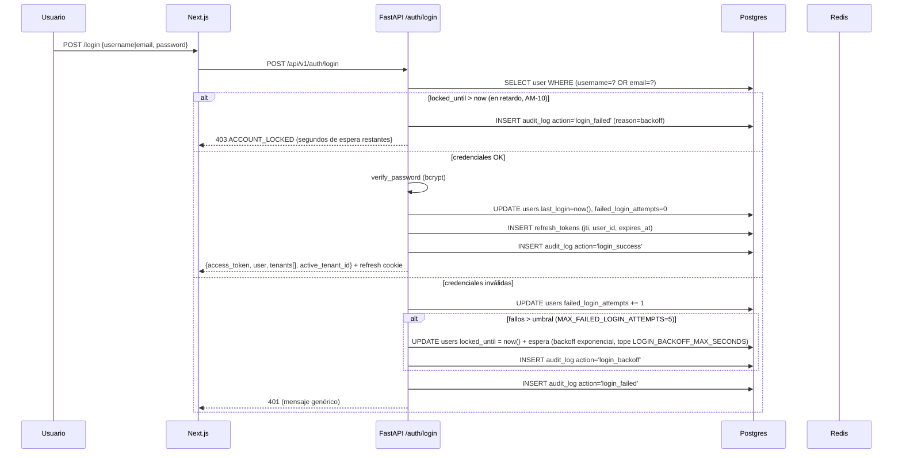

# Seguridad y Multi-Tenant

**ID:** `DOC-ARCH-SEC`
**Última verificación contra código:** 2026-08-29.

---

## 1. Modelo de tenancy real

**Estrategia:** `shared database, shared schema, application-level isolation`.

- 1 base de datos Postgres para todos los tenants.
- Cada tabla tenant-scoped tiene `tenant_id` (`String(36)` UUID, indexado, `NOT NULL` salvo `users` para superadmins y `audit_log` para eventos platform-wide).
- **El aislamiento se aplica en la capa de aplicación**: cada endpoint declara `Depends(get_current_tenant_id)` y filtra `WHERE tenant_id = :tid` en cada query.
- **Sin RLS** en Postgres (ver `database.md` §"Lo que NO usamos"). Una migración a RLS está como deuda en `DECISIONS.md`.

**Descartadas:**
- *Schema-per-tenant* — coste de migraciones × N tenants.
- *DB-per-tenant* — coste de infra y backups.
- *RLS Postgres* en MVP — costo de implementación. Queda como deuda priorizable.

> **Las amenazas y sus controles viven en [`modelo-amenazas.md`](./modelo-amenazas.md).**
> Este documento describe cómo funciona el aislamiento. Aquél describe qué lo rompe y qué lo
> sostiene. El riesgo de abajo es AM-02.

> **Riesgo conocido:** un bug que omita el filtro `tenant_id` rompería el aislamiento. Mitigación: (a) los tests `TC-MT-*` validan el aislamiento end-to-end por endpoint. (b) code review obligatorio en toda ruta nueva.

---

## 2. Autenticación

### 2.1 Flujo de login



Rate limiting de `/forgot-password` y `/reset` vía Redis (`services/rate_limit.py`): counter por ventana fija con fail-open si Redis cae.

### 2.2 Tokens

- **Access token** — JWT HS256, TTL `ACCESS_TOKEN_TTL_SEC` (default **3600 s = 1 h**).
  Claims:
  ```json
  {
    "sub": "user-uuid",
    "tenant_ids": ["tid-1", "tid-2"],
    "active_tenant_id": "tid-1",
    "is_superadmin": false,
    "iat": 1713456000,
    "exp": 1713459600
  }
  ```
  > Los roles NO viajan en el JWT. Se consultan vía `/auth/me/permissions` o se materializan en `CurrentUser` en cada request desde DB.

- **Refresh token** — JWT HS256, TTL `REFRESH_TOKEN_TTL_SEC` (default **2_592_000 s = 30 días**).
  - Cookie `HttpOnly; Secure; SameSite=Strict`.
  - **Persistido en tabla `refresh_tokens`** (`id`, `user_id`, `jti`, `expires_at`, `revoked: bool`).
  - Rotación: cada refresh emite un nuevo par y marca el anterior `revoked=true`. No usamos Redis para la blacklist. Está en Postgres.

### 2.3 Cambio de tenant activo

Un usuario puede pertenecer a varios tenants (típico: consultor PMO externo).
Desde **US-214 / AM-16** la autorización va contra la tabla de membresías
`user_tenant_memberships` (`apps/api/app/models/user_tenant_membership.py`),
**no** contra el claim `tenant_ids` del JWT — el claim solo pinta el
desplegable. Se verifica en dos puntos, ambos vía `tiene_membresia()`
(`services/membresia.py`):

- **En cada request autenticado**: `deps.py` (~líneas 215-219) comprueba la
  membresía contra el `active_tenant_id` del token. Si se revocó, el request
  falla con `403 TENANT_MEMBERSHIP_REVOKED` aunque el token siga vigente —
  antes de US-214 seguía siendo válido hasta que expirara (hasta 1 h).
- **Al cambiar de tenant**: `switch_tenant` (`auth.py` ~líneas 625-674) exige
  membresía viva antes de reemitir el access token; los `tenant_ids` del nuevo
  token se rearman desde la tabla, no se copian del token anterior.

El superadministrador queda fuera de esta comprobación: su acceso a un tenant
viene de `join-as-admin` (§4), no de una membresía.

Endpoint real:

```http
POST /api/v1/auth/switch-tenant
Authorization: Bearer <access>
Body: { "tenant_id": "uuid" }
→ 200 { ...nuevo access con active_tenant_id actualizado }
```

### 2.4 Retardo creciente por intentos (AM-10, 2026-08-05)

El bloqueo duro (5 fallos → `locked_until = now() + 15 min`) se **retiró**:
permitía a quien conociera un username dejar esa cuenta inutilizable un cuarto
de hora, y con una lista de usuarios, al inquilino entero. Hoy es un
**retardo creciente sin bloqueo duro**, en `auth.py::espera_tras_fallos`:

- Hasta `MAX_FAILED_LOGIN_ATTEMPTS` (5) fallos, sin espera.
- Pasado el umbral, cada intento espera el doble que el anterior —
  `LOGIN_BACKOFF_BASE_SECONDS × 2^exceso` (base 2 s)—, con tope
  `LOGIN_BACKOFF_MAX_SECONDS` (300 s = 5 min). `locked_until` se conserva como
  columna pero pasa a significar "no antes de", no "bloqueada hasta".
- La cuenta **nunca queda inaccesible**: quien tecleó mal espera segundos;
  quien sufre el ataque espera, como mucho, el tope.
- Login exitoso resetea `failed_login_attempts` a 0.
- Mensaje genérico "Credenciales inválidas" (no revela si el user existe).

Detalle de la amenaza en [`modelo-amenazas.md`](./modelo-amenazas.md) §AM-10.

### 2.5 Política de contraseñas (real — `core/security.py`)

```python
PASSWORD_POLICY_MIN_LEN = 8
# Requiere:
#   - len >= 8
#   - 1 mayúscula
#   - 1 dígito
#   - 1 símbolo (de un set fijo)
```

- Hash: `bcrypt` con `BCRYPT_ROUNDS = 12` (`passlib.context.CryptContext`).
- **No** se valida lowercase requerido.
- **No** hay blocklist de "20 contraseñas más comunes" (estaba en la versión vieja del doc, nunca se implementó).
- **No** se valida "no reutilizar contraseña actual" automáticamente.

> Si quieres subir a min 12 + blocklist + reuse check, abre un issue de hardening. La política actual cumple lo mínimo, pero es relajada para un SaaS PMO.

### 2.6 Reset de contraseña

- Endpoint `POST /api/v1/auth/forgot-password` → envía email con token único (tabla `password_reset_tokens`).
- TTL del token: 30 min.
- Endpoint `POST /api/v1/auth/reset` → consume token, valida policy, hash + persist.
- Rate-limitado por IP vía `check_and_increment` (Redis).

---

## 3. Autorización — modelo capability-based (DEC-024 / US-076)

La matriz `(rol × módulo × acción)` del diseño original fue **eliminada** (DEC-024). Hoy el modelo es:

- **2 role types posibles**: `admin` o `user`.
- El admin tiene **un set cerrado de 5 capabilities**:
  - `tenant.manage` — branding, settings, config del tenant.
  - `ai.configure` — providers y modos de IA del tenant.
  - `users.manage` — alta, edición, reset, desactivación, rol, asignación a orgs.
  - `organizations.delete` — solo eliminar organizaciones (otras ops sobre orgs son de cualquier user).
  - `audit.read` — leer audit log del tenant.
- **Todo lo demás** (proyectos, tareas, riesgos, issues, change_requests, documentos, minutas, lecciones, áreas, dashboard, generación IA, project_requests, charters, reports, scheduled reports, importación de planes) → cualquier user autenticado del tenant.

> El rol `viewer` fue **eliminado** (migración 0028). Cualquier registro residual se normaliza a `user`.

### Cómo se chequea

```python
# apps/api/app/core/permissions.py
ADMIN_CAPABILITIES = frozenset({
    "tenant.manage", "ai.configure", "users.manage",
    "organizations.delete", "audit.read",
})

# En endpoints
@router.post("/admin/users", dependencies=[Depends(require_capability("users.manage"))])
async def create_user(...): ...

# En el frontend
GET /api/v1/auth/me/permissions → ["ai.configure","audit.read",...]  # 5 entries si admin, 0 si user
```

### Overrides por tenant (DEC-021 / US-073)

Un superadmin puede conceder o revocar capabilities específicas a roles dentro de un tenant. Se almacena en `tenant_role_permission_overrides` con `capability` en columna `module` y `"grant"` en `action` (back-compat con el shape original de la tabla).

---

## 4. Super Admin

- Flag `users.is_superadmin = true` (y típicamente `tenant_id IS NULL` para superadmins globales).
- Rutas bajo `/api/v1/superadmin/*` (3 routers: `superadmin.py`, `superadmin_ai.py`, `superadmin_panel.py`) protegidas con `Depends(get_superadmin_user)`.
- Toda acción de superadmin se registra en `audit_log` con `tenant_id=NULL` o el `tenant_id` operado.

### Operaciones reales (no exhaustivo)

- `POST /superadmin/provision` — crea tenant + admin inicial.
- `POST /superadmin/tenants/{id}/join-as-admin` — el superadmin se autoasigna admin del tenant para operar como admin regular.
- `DELETE /superadmin/tenants/{id}` — soft delete (`is_active=false`).
- `DELETE /superadmin/tenants/{id}/permanent?confirm_slug=X` — hard delete con confirmación exacta del slug.
- `POST /superadmin/tenants/{id}/freeze` y `/unfreeze` — pausa operativa.
- `POST /superadmin/users/{id}/toggle-active`.
- `GET /superadmin/me` — perfil propio.
- `GET /superadmin/dashboard` y `/superadmin/health` — overview y health checks.
- `GET /superadmin/logs/platform` — logs platform-wide (audit cross-tenant).
- IA: `GET/PUT /superadmin/ai/defaults`, `/tenants-status`, `/groq-usage`, `POST /superadmin/ai/groq/ping`.

### Invariantes (chequeados en código)

- Toda acción de superadmin se audita.
- Acciones del superadmin sobre sí mismo van con `action="superadmin.self_update"` (auditabilidad explícita).
- Hard delete de tenant requiere confirmación textual del slug.

> **Pendiente verificar en código** si se aplican: "no desactivarse a sí mismo" y "no borrar el último superadmin". Si no se aplican, abre un issue de hardening.

> **NO existen** (a pesar de versiones viejas del doc):
> - `POST /superadmin/users/{id}/anonymize` (derecho al olvido) — sin endpoint.
> - `POST /superadmin/tenants/{id}/export` (export GDPR) — sin endpoint.
> Quedan como deuda si surge requerimiento legal.

---

## 5. Aislamiento — tests no-negociables

Los `TC-MT-*` viven en `tests/` (backend) y se ejecutan en CI. Detalle en [`../testing/multi-tenant-isolation.md`](../testing/multi-tenant-isolation.md).

**Suites de referencia reales:** `apps/api/tests/test_seg08_aislamiento_tenants.py`
(aislamiento general orgs/proyectos — evidencia de AM-02 en `modelo-amenazas.md`)
y `apps/api/tests/test_us214_multi_tenant.py` (membresía y switch de tenant —
evidencia de AM-16).

| ID | Qué verifica | Dónde |
|---|---|---|
| TC-MT-001 | Tenant A no puede leer proyectos de B (GET 404/403) | `tests/test_ep002_orgs.py` |
| TC-MT-002 | No lee risks / issues / changes / docs / lessons / minutes de B | sin referencia literal `TC-MT-002` hoy |
| TC-MT-003 | No puede editar/borrar recursos de B | sin referencia literal `TC-MT-003` hoy |
| TC-MT-004 | No accede a reports / scheduled reports de B | sin referencia literal `TC-MT-004` hoy |
| TC-MT-005 | Admin de A no resetea password de user en B | `tests/test_ep001_auth.py` |
| TC-MT-006 | Audit log filtra estrictamente por `tenant_id` | `tests/test_ep007_admin.py` |
| TC-MT-007 | Uploads van al prefijo correcto del tenant (local volume o R2) | sin referencia literal `TC-MT-007` hoy |
| TC-MT-008 | Jobs de IA no procesan archivos de otro tenant | sin referencia literal `TC-MT-008` hoy |

> Las filas sin referencia literal no tienen un test etiquetado `TC-MT-XXX`
> localizable por grep en `apps/api/tests/` al 2026-08-29; puede que el
> escenario esté cubierto bajo otro nombre (p. ej. dentro de `test_seg08_*`) o
> que falte. Confirmarlo es decisión del owner — no se borraron filas.

> Sin RLS en DB, estos tests son la única red de protección. **Cualquier endpoint nuevo debe acompañarse de su TC-MT correspondiente.**

---

## 6. Cabeceras de seguridad

Estado real:

- `apps/web/next.config.js` **no define `async headers()`** — solo `redirects`. No hay CSP, HSTS, X-Frame-Options, ni Permissions-Policy configurados a nivel framework.
- Hay `poweredByHeader: false` (oculta `X-Powered-By: Next.js`).
- Railway añade headers básicos por su edge. **CSP estricto y HSTS quedan por configurar** para hardening real.

**Pendiente:** agrega `headers()` en `next.config.js` con CSP mínimo, HSTS, `X-Content-Type-Options`, `X-Frame-Options: DENY`, `Referrer-Policy`, `Permissions-Policy`. Abre un issue de hardening.

---

## 7. Protección contra abuso — estado real

| Protección | Estado | Notas |
|---|---|---|
| Rate limit en `/auth/forgot-password` y `/auth/reset` | **Activo** | Counter por IP en Redis, ventana fija. Fail-open si Redis cae. |
| Rate limit global por IP / tenant (100/1000 req/min) | **NO implementado** | `slowapi` está en `requirements.txt` pero no está wired up. |
| Bruteforce login (retardo creciente, sin bloqueo duro — AM-10) | **Activo** | `auth.py::espera_tras_fallos`; tope `LOGIN_BACKOFF_MAX_SECONDS` (300 s). Ya no hay `locked_until = +15 min`; ver §2.4. |
| Tamaño máximo uploads | Configurado en endpoint (no global) | Revisar por endpoint en `app/api/v1/endpoints/`. |
| Whitelist MIME en uploads | Por endpoint | `documents`, `project_artifacts` validan en su lugar. |
| Antivirus (ClamAV) | **No instalado** | Sigue como post-MVP. |
| Validación Pydantic estricta | **Activo** | Schemas en `app/schemas/`, rechazan `extra` cuando se configura. |
| Sin `f"SELECT … {var}"` (anti-SQLi) | **Activo** | Solo SQLAlchemy ORM + params. |
| Sanitización HTML de IA antes de render | **Manual** | El backend devuelve HTML; el frontend debe escapar o sanitizar al renderizar `dangerouslySetInnerHTML`. No usamos DOMPurify como dependencia formal. Revisar caso por caso. |

---

## 8. Secretos y variables

- Variables sensibles viven en Railway Variables. No en repo.
- Secretos cifrados en DB: las API keys de providers BYO se cifran con **Fernet** (`services/ai_secrets.py`). La key Fernet vive en env.
- Rotación de `JWT_SECRET`, `JWT_REFRESH_SECRET`, `DB_PASSWORD` — sin proceso formal aún. **Pendiente** documentar runbook.

---

## 9. Compliance y privacidad — estado actual

- **Audit log** (`audit_log`) con `ip_address` y `user_agent` para forense. Retención: **no hay política formal de purga** — los registros crecen indefinidamente. Si se necesita, abre un issue para el job de purga o archivado.
- **Datos personales mínimos**: email, username, full_name, avatar opcional.
- **Derecho al olvido**: sin endpoint dedicado (ver §4).
- **Export de datos del tenant**: sin endpoint dedicado.

Si entran requerimientos GDPR/LFPDPPP, hay trabajo pendiente.

---

## 10. Checklist por PR (recomendado, no enforced)

- [ ] Toda ruta nueva tiene `Depends(get_current_user)` / `get_current_tenant_id` / `get_superadmin_user` según corresponda.
- [ ] Cada query incluye filtro `tenant_id` (no se omite por descuido).
- [ ] Test `TC-MT-*` añadido si el endpoint lee/escribe datos tenant-scoped.
- [ ] Pydantic schema validando input; rechaza `extra` cuando aplica.
- [ ] Sin secretos hardcodeados.
- [ ] Logs no incluyen contraseñas, tokens ni API keys (incluso truncados).
- [ ] Errores devuelven código estable (`{code, detail}`) — no stacktrace.
- [ ] Si el endpoint requiere capability admin: usar `require_capability(...)`.
