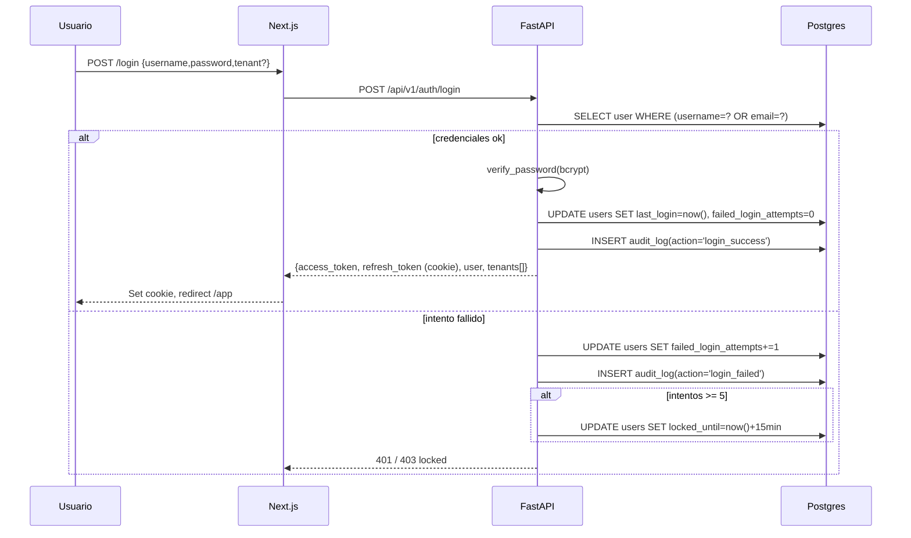

# Seguridad y Multi-Tenant

**ID:** `DOC-ARCH-SEC`

---

## 1. Modelo de tenancy

**Estrategia elegida:** `shared database, shared schema, row-level security (RLS)`.

- 1 base de datos Postgres para todos los tenants.
- Cada tabla con `tenant_id uuid NOT NULL` (excepto globales: `tenants`, `users` de superadmin, `audit_log` con `NULL`).
- RLS habilitado en todas las tablas tenant-scoped.
- El API usa 2 roles Postgres:
  - `app_user` (con RLS forzado) → para tráfico normal.
  - `app_admin` (con `BYPASSRLS`) → sólo para jobs de superadmin y migraciones.

**Descartada:** schema-per-tenant (coste de migraciones) y DB-per-tenant (coste de infra).

---

## 2. Flujo de autenticación



### Tokens

- **Access token (JWT HS256, TTL 1 h)**
  ```json
  {
    "sub": "user-uuid",
    "tenant_ids": ["tenant-uuid-1", "tenant-uuid-2"],
    "active_tenant_id": "tenant-uuid-1",
    "is_superadmin": false,
    "roles": ["Project Manager"],
    "iat": 1713456000,
    "exp": 1713459600
  }
  ```
- **Refresh token (JWT HS256, TTL 30 días)** → sólo en cookie `HttpOnly; Secure; SameSite=Strict; Path=/api/v1/auth/refresh`.
- **Rotación**: cada refresh emite nuevo par (access + refresh). El viejo refresh se marca `revoked` (Redis set).

### Cambio de tenant activo

Un usuario puede pertenecer a varios tenants (típico: consultor PMO externo).

```http
POST /api/v1/auth/switch-tenant
Authorization: Bearer <access>
Body: { "tenant_id": "uuid" }
→ 200 { "access_token": "new-jwt-with-active_tenant_id-updated" }
```

### Bloqueo por intentos

- Después de **5 intentos fallidos consecutivos**, `locked_until = now() + 15 min`.
- Ventana de conteo: reinicia a 0 tras un login exitoso.
- Mensaje genérico "Credenciales inválidas" (no revela si user existe).

### Política de contraseñas

- Mínimo 12 caracteres (aumentado desde 8 del proyecto legacy).
- Al menos 1 mayúscula, 1 número, 1 símbolo.
- No reutilizar la contraseña actual.
- Bloqueo de 20 contraseñas más comunes (`common-passwords.txt`).
- Hash: `bcrypt` con `rounds=12`.

---

## 3. RBAC — Roles y permisos

### Modelo

```
User ── N:M ── Role ── 1:N ── Permission grants (en JSONB)
```

Ejemplo de `roles.permissions`:

```json
{
  "projects":       ["read","create","update","delete"],
  "risks":          ["read","create","update"],
  "issues":         ["read","create","update"],
  "change_requests":["read","create","approve"],
  "documents":      ["read","upload"],
  "lessons":        ["read","create"],
  "minutes":        ["read","create"],
  "admin.users":    [],
  "admin.roles":    [],
  "ai.generate":    ["minute","report"]
}
```

### Helpers del API

```python
# apps/api/app/core/permissions.py
def require_permission(module: str, action: str):
    async def _dep(user: User = Depends(get_current_user)):
        if not user.has_permission(module, action):
            raise HTTPException(403, "forbidden")
        return user
    return _dep

# uso en ruta
@router.post("/projects", dependencies=[Depends(require_permission("projects","create"))])
async def create_project(...): ...
```

### Roles por defecto (seed)

| Rol | Permisos resumidos |
|---|---|
| Administrador | Todo dentro de su tenant (excepto `superadmin.*`) |
| PMO Manager | Portafolio completo, aprobar solicitudes y cambios |
| Project Manager | CRUD en sus proyectos y módulos, no admin.* |
| Viewer | Solo read en proyectos asignados |

---

## 4. Super Admin

- Flag boolean `users.is_superadmin = true` (y `tenant_id IS NULL`).
- Rutas bajo `/api/v1/superadmin/*` protegidas con `Depends(get_superadmin_user)`.
- **Invariantes duros:**
  1. No se puede desactivar ni quitarse `is_superadmin` a sí mismo.
  2. No se puede borrar el último superadmin activo.
  3. Toda acción de superadmin se registra en `audit_log` con `tenant_id=NULL`.
  4. Ver o modificar data de un tenant requiere setear manualmente el ctx (`SET LOCAL app.tenant_id = …`) — previene fugas accidentales.

### Operaciones clave

- `POST /superadmin/provision` — crea tenant + admin + directorio de assets.
- `POST /superadmin/tenants/{id}/join-as-admin` — se autoasigna rol "Administrador" en ese tenant para operar como admin regular.
- `DELETE /superadmin/tenants/{id}` — soft delete (`is_active=false`).
- `DELETE /superadmin/tenants/{id}/permanent?confirm_slug=X` — hard delete con confirmación exacta.
- `GET /superadmin/login-events` — auditoría platform-wide.

---

## 5. Aislamiento: pruebas no-negociables

Todos los PRs deben pasar los tests `TC-MT-*` en CI. Detalle en [`../testing/multi-tenant-isolation.md`](../testing/multi-tenant-isolation.md).

Resumen:

| ID | Qué verifica |
|---|---|
| TC-MT-001 | Tenant A no puede leer proyectos de B (GET 404/403) |
| TC-MT-002 | No lee risks / issues / changes / docs / lessons / minutes de B |
| TC-MT-003 | No puede editar/borrar recursos de B |
| TC-MT-004 | No accede a share-links / reports de B |
| TC-MT-005 | Admin de A no resetea password de user en B |
| TC-MT-006 | Audit log filtra estrictamente por `tenant_id` |
| TC-MT-007 | Uploads van a `{tenant_slug}/` correcto, no se leen cross-tenant |
| TC-MT-008 | Jobs de IA no procesan archivos de otro tenant |

---

## 6. Cabeceras de seguridad

Configuradas en Next.js middleware:

```
Content-Security-Policy: default-src 'self'; script-src 'self' 'unsafe-inline' 'unsafe-eval' https://browser.sentry-cdn.com; img-src 'self' data: https:; connect-src 'self' https://*.sentry.io
Strict-Transport-Security: max-age=63072000; includeSubDomains; preload
X-Content-Type-Options: nosniff
X-Frame-Options: DENY
Referrer-Policy: strict-origin-when-cross-origin
Permissions-Policy: camera=(), microphone=(), geolocation=()
```

---

## 7. Protección contra abuso

- **Rate limiting por IP**: 100 req/min default (`slowapi`).
- **Rate limiting por tenant**: 1000 req/min, 10 auth/min.
- **Bruteforce**: 5 fails → lock 15 min (ver arriba).
- **Uploads**:
  - Max 25 MB por archivo (MVP).
  - Whitelist MIME: `application/pdf`, `image/png`, `image/jpeg`, `application/vnd.openxmlformats-officedocument.*`, `application/vnd.ms-excel`.
  - Escaneo opcional con **ClamAV** sidecar (post-MVP).
- **Deserialización**: Pydantic v2 estricto. Rechazar `extra` fields.
- **SQLi**: sólo ORM + parámetros. Ningún `f"SELECT ... {var}"`.
- **XSS**: React escapa por default. Sanitizar HTML de IA con **DOMPurify** antes de renderizar como rich text.

---

## 8. Secretos y variables

- Ninguna variable sensible en código. Todas en Railway Variables.
- Rotación de `JWT_SECRET` y `DB_PASSWORD` cada 90 días (runbook).
- `SECRETS.md` en `docs/` (no en repo) lista quién tiene acceso a cada secreto.

---

## 9. Compliance y privacidad

- **Logs**: `audit_log` con `ip_address` y `user_agent` para forense. Retención 2 años.
- **Datos personales**: email, nombre, avatar. No guardamos CURP/RFC sin consentimiento explícito.
- **Derecho al olvido**: endpoint superadmin `POST /superadmin/users/{id}/anonymize` — reemplaza PII por hashes, mantiene FK para trazabilidad histórica.
- **Export de datos del tenant**: `POST /superadmin/tenants/{id}/export` → ZIP con CSVs + archivos.

---

## 10. Checklist por PR (bloqueante)

- [ ] Toda ruta nueva tiene `Depends(get_current_tenant)` o `get_superadmin_user`.
- [ ] Toda tabla nueva con `tenant_id` tiene RLS policy.
- [ ] Test `TC-MT-*` relevante añadido si es endpoint de lectura/escritura.
- [ ] No se agregaron secretos en código.
- [ ] Sin logs con password o token.
- [ ] Inputs validados con Pydantic.
- [ ] Errores devuelven código estable (no stacktrace).
