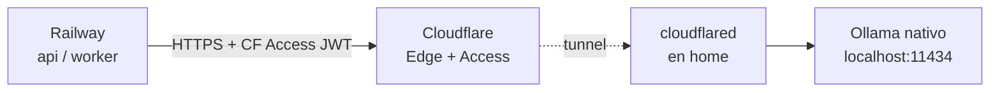

# Setup del modelo de IA local (Ollama)

**ID:** `DOC-AI-LOCAL`

Guía completa para instalar, configurar y operar el modelo local que genera minutas y reportes.

---

## 1. Comparativa de modelos

| Modelo | Parámetros | RAM (Q4) | VRAM GPU | Calidad ES | Calidad resumen | Recomendado para |
|---|---:|---:|---:|---|---|---|
| **Qwen 2.5 7B Instruct** | 7.6B | ~6 GB | 6 GB | ⭐⭐⭐⭐ | ⭐⭐⭐⭐ | **Default MVP** — mejor relación calidad/velocidad |
| Qwen 2.5 14B Instruct | 14B | ~10 GB | 10 GB | ⭐⭐⭐⭐⭐ | ⭐⭐⭐⭐⭐ | Servidores con GPU decente |
| Llama 3.1 8B Instruct | 8B | ~6 GB | 6 GB | ⭐⭐⭐ | ⭐⭐⭐⭐ | Alternativa Meta |
| Llama 3.3 70B (Q4) | 70B | ~42 GB | 42 GB | ⭐⭐⭐⭐⭐ | ⭐⭐⭐⭐⭐ | Solo si tienes H100 / A100 40G |
| Qwen 2.5-Coder 14B | 14B | ~10 GB | 10 GB | ⭐⭐⭐ | ⭐⭐⭐ | Si añadimos asistente de código (post-MVP) |
| Gemma 2 9B | 9B | ~6 GB | 6 GB | ⭐⭐⭐⭐ | ⭐⭐⭐ | Alternativa Google |
| Phi-3.5 Mini | 3.8B | ~3 GB | 3 GB | ⭐⭐ | ⭐⭐⭐ | Laptops sin GPU |

**Recomendación por escenario:**

| Hardware | Modelo | Cuantización |
|---|---|---|
| MacBook Air M2 8 GB (dev local) | `qwen2.5:3b-instruct-q4_K_M` o `phi3.5:mini` | Q4_K_M |
| MacBook Pro M2/M3 16-32 GB (dev) | `qwen2.5:7b-instruct-q4_K_M` | Q4_K_M |
| Mac Studio / workstation 64 GB | `qwen2.5:14b-instruct-q4_K_M` | Q4_K_M |
| Servidor Linux con GPU 8-12 GB | `qwen2.5:7b-instruct` | Q5_K_M |
| Servidor con GPU 24 GB+ | `qwen2.5:14b-instruct` | Q5_K_M |
| Servidor con GPU 40 GB+ | `qwen2.5:32b-instruct-q4_K_M` | Q4_K_M |

**Nuestra elección default**: **`qwen2.5:7b-instruct-q4_K_M`**
- 4.4 GB en disco, 6-8 GB RAM en uso.
- Excelente español, sigue instrucciones JSON bien.
- Latencia ~20 tok/s en M2, ~60 tok/s en RTX 4060+.

---

## 2. Instalación

### Desarrollo local (Mac)

```bash
# Instalar Ollama
brew install ollama
# O descargar la app .dmg desde https://ollama.com (recomendado, integra con launchd)

# Lanzar
ollama serve &

# Descargar modelo
ollama pull qwen2.5:7b-instruct-q4_K_M

# Probar
ollama run qwen2.5:7b-instruct-q4_K_M "Dame un resumen en JSON del siguiente texto: ..."
```

### Desarrollo local (Linux)

```bash
curl -fsSL https://ollama.com/install.sh | sh
sudo systemctl enable --now ollama
ollama pull qwen2.5:7b-instruct-q4_K_M
```

### Desarrollo local (Windows)

Descarga instalador de https://ollama.com/download/windows. Tras instalar, `ollama` disponible en PowerShell.

### Docker (para docker-compose del proyecto)

```yaml
# docker-compose.yml (fragmento)
services:
  ollama:
    image: ollama/ollama:latest
    ports:
      - "11434:11434"
    volumes:
      - ollama-models:/root/.ollama
    deploy:
      resources:
        reservations:
          devices:
            - driver: nvidia
              count: 1
              capabilities: [gpu]
    restart: unless-stopped

volumes:
  ollama-models:
```

Tras levantar, descarga el modelo:
```bash
docker exec -it pmoaas-ollama-1 ollama pull qwen2.5:7b-instruct-q4_K_M
```

---

## 3. Hosting en producción

> **TL;DR** — Para el MVP personal, arranca con **home-host + Cloudflare
> Tunnel**. Cuesta $0 y es lo más rápido de poner en marcha. Solo escalamos
> a VPS con GPU cuando haya ingresos. Si hay caídas, la cascada pasa auto a
> Gemini (ver ADR-007).

### Decision matrix

| Hardware disponible | Recomendación |
|---|---|
| Mac Studio M2 Ultra / Mac Mini M4 en casa | **Home-host** (opción C) — mejor costo/calidad |
| PC gamer con RTX 3060+ 24/7 | **Home-host** con Ollama Linux/Windows |
| Laptop que apagas de noche | **NO host producción** — usa solo Gemini (grátis) hasta tener infra dedicada |
| Nada propio | Gemini free tier en MVP, VPS cuando tenga ingresos |

### Opción A — Railway GPU (cuando esté disponible)

Railway está rolling out GPU compute. Si está accesible, crear servicio `ollama`:

```toml
# apps/ollama/railway.toml
[build]
builder = "DOCKERFILE"
dockerfilePath = "Dockerfile"

[deploy]
startCommand = "ollama serve"
healthcheckPath = "/api/tags"
numReplicas = 1
```

```dockerfile
# apps/ollama/Dockerfile
FROM ollama/ollama:latest
ENV OLLAMA_HOST=0.0.0.0:11434
EXPOSE 11434
CMD ["serve"]
```

Variables:
```
OLLAMA_MODELS=/data/ollama
OLLAMA_NUM_PARALLEL=2
OLLAMA_KEEP_ALIVE=10m
```

### Opción B — VPS externo con GPU (recomendado para MVP)

Proveedores económicos (abr 2026):
- **Hetzner GEX44** (con NVIDIA L4): ~€250/mes
- **OVH Advance-2** (con A4000): ~€220/mes
- **Paperspace Core** (con RTX 4000): ~$180/mes
- **Lambda Cloud 1×A10**: ~$0.60/h on-demand

Setup:
```bash
# En el servidor
curl -fsSL https://ollama.com/install.sh | sh
sudo systemctl enable --now ollama
ollama pull qwen2.5:7b-instruct-q4_K_M

# Exponer con nginx + TLS
# /etc/nginx/sites-available/ollama
server {
    listen 443 ssl http2;
    server_name ollama.pmoaas.com;
    ssl_certificate /etc/letsencrypt/live/ollama.pmoaas.com/fullchain.pem;
    ssl_certificate_key /etc/letsencrypt/live/ollama.pmoaas.com/privkey.pem;

    # Auth básico o mejor, mutual TLS
    auth_basic "Ollama";
    auth_basic_user_file /etc/nginx/.htpasswd;

    location / {
        proxy_pass http://127.0.0.1:11434;
        proxy_http_version 1.1;
        proxy_set_header Upgrade $http_upgrade;
        proxy_set_header Connection "";
        proxy_read_timeout 300s;   # importante para generación larga
    }
}
```

Railway se conecta con `OLLAMA_BASE_URL=https://ollama.pmoaas.com` + `OLLAMA_AUTH_USER/PASS`.

### Opción C — Home-host con Cloudflare Tunnel (recomendado MVP personal)

**Hardware apto:** Mac Studio / Mac Mini M2+ con 32-64GB, PC con GPU NVIDIA
12GB+ VRAM.

**Ventajas:**
- $0 mes a mes (sin contar electricidad y tu hardware ya comprado).
- Privacidad total — la data jamás sale a terceros.
- Puedes usar modelos más grandes (14B-32B en Mac Studio) que ningún free
  tier te da.

**Topología:**



**Setup paso a paso (una hora):**

1. **Instala Ollama nativo** en el Mac/PC de casa. No uses Docker (pierdes
   aceleración GPU fácilmente).
   ```bash
   # Mac
   brew install ollama
   ollama serve &    # se arranca a login vía launchd
   ollama pull qwen2.5:7b-instruct-q4_K_M
   ```

2. **Crea el túnel Cloudflare** (requiere dominio en Cloudflare):
   - Dashboard Cloudflare → **Zero Trust** → Networks → Tunnels → Create.
   - Nombre: `pmoaas-ollama`. Copia el token.
   - En tu máquina:
     ```bash
     brew install cloudflared  # o el instalador Windows/Linux
     cloudflared service install eyJh...   # token del paso anterior
     ```
   - En la config del túnel: **Public hostname** `ollama.pmoaas.com` →
     Service: `http://localhost:11434`.

3. **Protege con Cloudflare Access** (zero trust):
   - Zero Trust → Access → Applications → Add application → Self-hosted.
   - Domain: `ollama.pmoaas.com`.
   - Policy: `Include` → **Service Auth** → Service Token (crea uno: nombre
     `railway-api`, copia `CF-Access-Client-Id` y `CF-Access-Client-Secret`).

4. **Configura Railway** variables del servicio `api`:
   ```
   OLLAMA_BASE_URL=https://ollama.pmoaas.com
   CF_ACCESS_CLIENT_ID=<id del paso 3>
   CF_ACCESS_CLIENT_SECRET=<secret del paso 3>
   ```

5. **Cliente HTTP** con headers de Access:
   ```python
   # apps/api/app/ai/providers/ollama.py
   headers = {
       "CF-Access-Client-Id": settings.CF_ACCESS_CLIENT_ID,
       "CF-Access-Client-Secret": settings.CF_ACCESS_CLIENT_SECRET,
   }
   async with httpx.AsyncClient(headers=headers, timeout=180) as c:
       r = await c.post(f"{settings.OLLAMA_BASE_URL}/api/generate", json=payload)
   ```

6. **Healthcheck:** `GET /api/tags` vía Railway cada 60s. Si falla 3×,
   cascada pasa a Gemini (ADR-007).

**Buenas prácticas home-host:**

- Fuente de alimentación con UPS pequeño (evita shutdowns).
- Bloquea apagado por inactividad en macOS: `sudo pmset -a sleep 0 disksleep 0`.
- Monitor básico: `logrotate` + script cron que valide `ollama list` cada 5 min
  y reinicia si fallo (systemd en Linux, `launchd` en macOS).
- Backup incremental del volumen `~/.ollama` a un NAS/disco externo.
- Documenta en wiki interno: quién tiene acceso físico, qué hacer si se cae.

Esta opción es ideal si tienes hardware en casa/oficina y quieres cero coste
cloud.

---

## 4. Configuración fina

### Parámetros del modelo

En `tenants.settings.ai`:

```json
{
  "mode": "ollama",
  "ollama": {
    "base_url": "http://ollama:11434",
    "auth_user": null,
    "auth_password": null,
    "model": "qwen2.5:7b-instruct-q4_K_M",
    "timeout_sec": 180,
    "options": {
      "temperature": 0.3,
      "top_p": 0.9,
      "num_ctx": 8192,
      "num_predict": 2048,
      "repeat_penalty": 1.05
    }
  },
  "claude": {
    "model": "claude-sonnet-4-6",
    "max_tokens": 4096,
    "temperature": 0.4
  }
}
```

`temperature=0.3` para tareas de extracción/resumen (determinístico). `0.6+` solo para redacción creativa.

### Context window

Qwen 2.5 soporta 128k tokens de contexto, pero **Ollama** expone `num_ctx` (default 2048). Para minutas largas, subir a `8192` o `16384`:

```bash
# Crear modelfile custom
cat > Modelfile <<EOF
FROM qwen2.5:7b-instruct-q4_K_M
PARAMETER num_ctx 16384
PARAMETER temperature 0.3
EOF
ollama create pmo-minute-model -f Modelfile
```

En nuestro provider, usamos `pmo-minute-model` para minutas y `qwen2.5:7b-instruct-q4_K_M` base para reportes.

### Chunking

Si transcript excede context:
- Dividir en chunks de ~3000 tokens con overlap de 200.
- Por cada chunk: extracción parcial.
- Merge final: compactar resultados parciales en una sola llamada.

Pseudocódigo:

```python
def generate_minute_chunked(transcript: str):
    chunks = chunk_text(transcript, max_tokens=3000, overlap=200)
    partials = [extract_from_chunk(c) for c in chunks]
    merged = merge_minute_partials(partials)  # llama LLM 1× más para compactar
    return merged
```

---

## 5. Monitoreo y salud

### Healthcheck

Ollama expone `GET /api/tags` — debe retornar 200 y la lista de modelos.

Nuestro health en `api/app/ai/health.py`:

```python
async def check_ollama(base_url: str, timeout: int = 3) -> dict:
    async with httpx.AsyncClient(timeout=timeout) as c:
        try:
            r = await c.get(f"{base_url}/api/tags")
            r.raise_for_status()
            return {"status": "healthy", "latency_ms": int(r.elapsed.total_seconds()*1000),
                    "models": [m["name"] for m in r.json()["models"]]}
        except Exception as e:
            return {"status": "unhealthy", "error": str(e)}
```

### Métricas

Exportar a Prometheus/Sentry:
- `ollama_request_duration_seconds` (histogram, labels: model, kind)
- `ollama_tokens_total` (counter, labels: model, direction=in|out)
- `ollama_failures_total` (counter, labels: error_type)

### Alertas

- `ollama_failures_total` > 5 en 5 min → warning
- `ollama_request_duration_seconds p95` > 30s → warning
- `ollama_request_duration_seconds p95` > 120s → critical
- Healthcheck failing → critical, fallback automático a Claude activado

---

## 6. Costos y sizing

Para 10 tenants activos generando ~5 minutas/día y ~3 reportes/semana cada uno:

- Volumen: 50 minutas/día × 9000 tokens = 450k tokens/día
- Con Qwen 7B @ 60 tok/s en L4: ~7500 s/día = ~2 horas CPU GPU
- Latencia media: 50 tok/s usables → minuta de 1h en ~180 s

GPU L4 (24 GB VRAM, ~80W idle) en Hetzner: €250/mes.
Capacidad: hasta 50 tenants con mismo hardware.

**Costo por minuta generada**: ~€0.10 con infra propia vs ~$0.02 con Claude Sonnet (con cache).

---

## 7. Troubleshooting común

| Síntoma | Causa | Solución |
|---|---|---|
| `connection refused` al hit Ollama | servicio no arrancado | `systemctl status ollama` o `docker logs ollama` |
| Generación muy lenta (< 5 tok/s) | no hay GPU o modelo muy grande | verificar `nvidia-smi`, bajar a modelo más chico |
| `context window exceeded` | input muy largo | bajar chunk size o usar modelo con mayor contexto |
| Output roto (no parsea JSON) | temperature alta o prompt ambiguo | bajar temperature a 0.2, revisar prompt, agregar few-shot |
| Modelo no responde en español | modelo inglés puro | cambiar a Qwen (multilingüe) o Llama con fine-tune ES |
| Memoria se acumula | `OLLAMA_KEEP_ALIVE` muy alto | bajarlo a `5m` o `0` para liberar tras request |
| Race condition con requests concurrentes | `OLLAMA_NUM_PARALLEL=1` | subir a `2-4` según VRAM |

---

## 8. Checklist de deploy

- [ ] Servicio Ollama accesible desde API/Worker (intra-network o TLS externo).
- [ ] Modelo descargado y en caché (`ollama list`).
- [ ] `num_ctx` configurado a ≥ 8192 via Modelfile.
- [ ] Auth (basic o mTLS) si la API está en internet abierto.
- [ ] Health check integrado en `/admin/ai` con ping periódico.
- [ ] Fallback a Claude configurado y **probado con disconnect deliberado** en staging.
- [ ] Backup del volumen `/root/.ollama` (no crítico pero ahorra tiempo de re-pull).
- [ ] Rate limit por tenant configurado (max 5 jobs concurrentes).

---

## 9. Próximos pasos (post-MVP)

- **Fine-tuning**: con 500+ minutas corregidas por humanos, entrenar LoRA sobre Qwen 2.5 para mejorar calidad en dominio PMO.
- **Embeddings**: añadir búsqueda semántica cross-lecciones con `nomic-embed-text` o `mxbai-embed-large`.
- **Agentes**: permitir que la IA proponga riesgos/cambios basados en patrones de otros proyectos del tenant.
- **Speech-to-text local**: integrar **Whisper** (faster-whisper) para aceptar audio directo, no solo texto.
