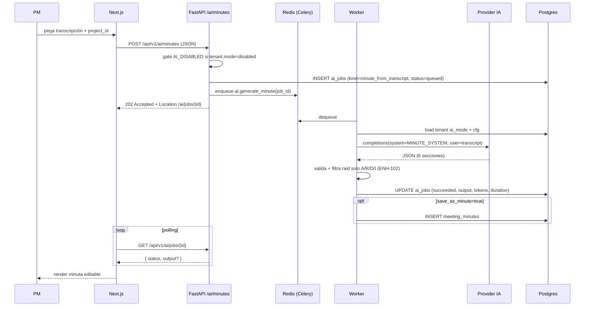

# EP008 — Inteligencia Artificial (Minutas y Reportes)

| Campo | Valor |
|---|---|
| **ID** | EP008 |
| **Prioridad** | Alta |
| **Dependencias** | EP005, EP006 |
| **Módulo backend** | `apps/api/app/services/ai/`, `apps/api/app/workers/tasks/ai.py`, `apps/api/app/api/v1/endpoints/{ai,admin_ai,superadmin_ai}.py` |
| **Módulo frontend** | `/admin/ai`, `/superadmin/ai`, `/pmo/projects/[id]/ai-minutes/new`, `/pmo/projects/[id]/reports/*`, `/pmo/projects/[id]/ai-context` |
| **Estado** | Vivo en producción |
| **Última verificación contra código** | 2026-07-09 (US-185, ENH-189) |

## Objetivo de negocio

Automatizar dos tareas que consumen horas de los PM:

1. **Redactar minutas** desde transcripciones de reuniones (Zoom/Teams/Meet copy-paste).
2. **Generar reportes de avance** periódicos con IA que luego el PM revisa y envía.

---

## Modo de IA por tenant (US-057 · DEC-017)

Desde Sprint 2 v1.1 cada tenant elige uno de tres modos en `/admin/ai`:

| Modo | Provider | Scope habilitado | Quién paga |
|---|---|---|---|
| `disabled` | — | Ninguno. Endpoints `/ai/*` devuelven `409 AI_DISABLED`. | — |
| `platform` | **Groq** (`llama-3.3-70b-versatile` por default) | **Solo minutas.** Reportes IA devuelven `409 AI_PLATFORM_SCOPE_LIMITED`. | Plataforma |
| `byo` | OpenAI / Claude / Gemini / Perplexity / Azure (Copilot M365) / Custom / Groq con key propia | Minutas **y** reportes IA. | Tenant |

Implementación: `apps/api/app/services/ai/`:
- `provider.py` — clases `GroqProvider`, `GeminiProvider`, `ClaudeProvider`, `OpenAIProvider`, `PerplexityProvider`, `AzureProvider`, `CustomProvider`, `DisabledProvider` y `resolve_provider(cfg)`.
- `byo_catalog.py` — catálogo de providers que ve el wizard de `/admin/ai`.
- `platform_config.py` — resuelve la key Groq para modo `platform` (env o `platform_ai_settings.groq_api_key_encrypted` desencriptado con Fernet).
- `tenant_ai.py` — carga el modo + config efectiva del tenant.
- `ai_secrets.py` — cifra/descifra API keys con Fernet (key en env `AI_SECRETS_FERNET_KEY`).

> **BUG-053 (2026-05-08):** se eliminó `OllamaProvider` y toda la cascada legacy `Ollama → Gemini → Claude`. Cualquier mención a Ollama en docs viejos es obsoleta. Setup actual: [`../runbooks/ai/groq-setup.md`](../runbooks/ai/groq-setup.md) y [`../runbooks/ai/byo-setup.md`](../runbooks/ai/byo-setup.md).

---

## US-043 — Generar minuta desde transcripción

**Como** PM
**Quiero** subir una transcripción y obtener una minuta estructurada
**Para** ahorrar el trabajo de redactar.

### Flujo real



### Criterios de aceptación (estado real)

- [x] Input: **JSON body** con `{ project_id, transcript: str, language: "es"|"en", save_as_minute: bool, title?: str }`. El texto plano (`.txt`/`.srt`/`.md`/`.vtt`) se parsea **en cliente** (`file.text()`); los `.docx` se extraen **server-side** vía `POST /api/v1/ai/extract-text` (BUG-083, ver abajo) antes de pegar el body.
- [x] **`POST /api/v1/ai/extract-text`** (BUG-083, 2026-06-29): multipart `file` → `{ text, filename, chars }`. Extrae texto de un `.docx` con `python-docx` (párrafos + celdas de tablas) o decodifica texto plano; `.doc`/formatos no soportados → `400 VALIDATION_ERROR`; vacío → `400`; > 5 MB → `413`. Reemplaza el `file.text()` del front sobre `.docx`, que mandaba el ZIP binario crudo y Groq lo rechazaba con `400`. Servicio: `app/services/document_text.py`. Hardening asociado: `GroqProvider` loguea el body del 4xx y `_call_ai_for_tenant` **no reintenta** en 4xx (≠429) — propaga la razón real del provider.
- [x] Tamaño máximo: **5 MB** del campo `transcript` (`MAX_TRANSCRIPT_BYTES` en `ai.py`). Excedido → `413 PAYLOAD_TOO_LARGE`.
- [x] Output estructurado (ENH-102 / ENH-105): 6 secciones — `header`, `participants` (attendees/absent_justified/absent_unjustified), `summary`, `topics` (con `bullets` factuales), `raid` (solo A/R/D/I, sin lecciones ni change requests), `free_notes`.
- [x] `ai_jobs` registra: `model_used`, `provider`, `tokens_in`, `tokens_out`, `duration_ms`, `error`.
- [x] UI: `/pmo/projects/[id]/ai-minutes/new` para upload + polling. Resultado va a `/pmo/projects/[id]/minutes/[minuteId]` para edición.
- [x] Si `tenant.ai_mode=disabled` → `409 AI_DISABLED`.
- [ ] **No implementado:** chunking automático. Transcripciones que excedan la context window del provider fallan con error nativo del provider. Diferido.
- [ ] **No implementado:** fallback automático entre providers (la cascada se eliminó con BUG-053).

### Cobertura de pruebas

- Tests en `apps/api/tests/test_ai_minutes*.py` cubren validación, gate `disabled`, persistencia, mocks de provider.

---

## US-185 — Memoria de proyecto para IA (2026-07-09, `9770161`)

**Como** PM
**Quiero** que la IA recuerde contexto propio del proyecto (glosario,
reglas, instrucciones permanentes) y acumule un resumen de lo tratado en
minutas anteriores
**Para** dejar de repetir contexto en cada minuta/reporte y que la
descripción del proyecto llegue realmente al LLM.

- **Tabla `project_ai_contexts`** (migración `20260708_0094_project_ai_context.py`,
  1:1 con `projects`), con 3 campos de texto libre:
  - `context_md` — glosario/reglas **curadas por el PM** (edición manual).
  - `instructions_md` — instrucciones permanentes de generación (edición
    manual; complementa al `instructions_md` de tenant de ENH-189, más
    abajo).
  - `auto_summary_md` — resumen acumulativo que **la IA actualiza sola**
    al guardar cada minuta (task Celery `ai.update_project_context`,
    disparada desde el worker de minutas IA y también desde el `POST`
    manual). Prompt nuevo `PROJECT_MEMORY_SYSTEM`: resumen incremental,
    máx. ~400 palabras, integra lo nuevo y poda lo viejo.
- `services/ai/project_context.py`: arma el bloque
  `<CONTEXTO_DEL_PROYECTO>` con presupuesto de caracteres (precedencia
  instrucciones > contexto > resumen) e lo **inyecta en cada chunk de
  minutas** (`_run_minute`) y en `/projects/{id}/reports/ai-generate` —
  con esto la descripción del proyecto **por fin llega al LLM** (antes no
  se inyectaba ningún contexto de proyecto en esos prompts).
- **Endpoints:** `GET /api/v1/projects/{id}/ai-context` /
  `PUT /api/v1/projects/{id}/ai-context` (con audit log).
- **UI:** página `/pmo/projects/[id]/ai-context` ("Memoria IA") con 3
  editores + contador de caracteres + fecha de última actualización IA;
  link con ícono Brain desde el detalle del proyecto.

**Test Cases:** 5 TC nuevos (`test_us185_project_memory.py`); suites
minutas/reportes/IA (243 TC) verdes tras el cambio.

**Estado de integración:** DONE (US-185).

---

## ENH-189 — Prompts composables: instrucciones permanentes por tenant (2026-07-09, `a440efa`)

**Como** Admin del tenant
**Quiero** definir instrucciones permanentes que se apliquen a **todas**
las generaciones de IA del tenant (minutas y reportes)
**Para** imponer un estilo/reglas corporativas sin depender de que cada
PM las repita.

**Arquitectura por capas** (menos hardcode de prompts):

```
system efectivo = prompt base (services/ai/prompts.py)
                + <INSTRUCCIONES_DEL_TENANT>   (tenants.settings.ai.instructions_md, ENH-189)
                + <CONTEXTO_DEL_PROYECTO>      (project_ai_contexts, US-185)
```

- `services/ai/prompt_builder.py` — compone las 3 capas. Las
  instrucciones del tenant tienen una **regla de precedencia** que
  protege el contrato de salida (no pueden romper el schema JSON
  esperado por `MINUTE_SYSTEM`/`REPORT_SYSTEM`).
- `TenantAIConfig.instructions_md` (`tenants.settings.ai.instructions_md`,
  **máx. 2000 caracteres**).
- Aplica a minutas (`_run_minute`) y a
  `/projects/{id}/reports/ai-generate`.
- **Admin:** `GET`/`PATCH /api/v1/admin/ai/provider` ahora exponen
  `instructions_md`; nueva sección "Instrucciones permanentes de IA"
  (textarea + contador) en `/admin/ai`.
- `docs/ai/prompts-catalog.md` corregido: afirmaba que no había
  chunking (sí existe) + documenta la arquitectura de capas nueva.

**Test Cases:** 5 TC nuevos; suites `admin_ai`/`byo` (29 TC) verdes.

**Estado de integración:** DONE (ENH-189).

---

## US-044 — Generar reporte de avance (IA)

**Como** PM
**Quiero** generar un reporte con datos actuales del proyecto y enviarlo por correo
**Para** mantener stakeholders informados.

### Endpoints reales

- `POST /api/v1/ai/projects/{project_id}/reports/draft` — async, dispatch a Celery (`ai.draft_report`). Solo modo `byo`; en `platform` devuelve `409 AI_PLATFORM_SCOPE_LIMITED`.
- `POST /api/v1/projects/{project_id}/reports/ai-generate` — síncrono, genera HTML completo en una sola llamada. También solo en modo `byo`.
- `POST /api/v1/ai/reports/{report_id}/send` — envía por email Resend.
- `POST /api/v1/ai/reports/tweak-html` — aplica un instruction string para modificar HTML existente (modo `byo`).

### Schema del draft estructurado (`REPORT_SYSTEM`)

```json
{
  "executive_summary": "...",
  "achievements": ["..."],
  "next_activities": ["..."],
  "top_risks": ["..."],
  "budget_status": "..."
}
```

**El modelo NO calcula cifras** (auditoría MCS 2026-08-03, requisito IA-05).

Antes recibía `budget_plan` y `budget_actual` y derivaba la desviación por su
cuenta: un número producido por un modelo de lenguaje que acababa en un informe
ejecutivo. Ahora el contexto llega con todo precalculado en Python y con
`Decimal` —nunca coma flotante—, y el prompt prohíbe explícitamente calcular,
estimar o redondear:

| Campo del contexto | Origen |
|---|---|
| `budget_plan`, `budget_actual` | `projects.budget` / `actual_budget`, como cadena |
| `budget_variance` | `actual − plan`, calculado en el worker |
| `budget_consumed_pct` | `actual / plan × 100`, o `null` si el plan es 0 |
| `progress` | Rollup WBS existente |

Si al modelo le falta una cifra para afirmar algo, debe describir la situación
en palabras y omitir el número.

**Límite de coste por ejecución** (IA-03): `AI_MAX_PROMPT_CHARS`, 120.000 por
defecto. Se comprueba **antes** de llamar al proveedor —después el gasto ya
ocurrió— y acota el contexto de proyectos con mucho histórico, que con los 3
reintentos de `_AI_CALL_MAX_RETRIES` se multiplicaría.

### Flujo del report builder visual

Además del draft IA, hay un **Report Builder** con catálogo de secciones atómicas (US-101+):

- `/pmo/projects/[id]/reports/builder` — wizard donde el PM compone un reporte agregando "secciones" (cards de un catálogo cerrado).
- Soporte de chat IA: `POST /api/v1/report-builder-chat/...` usa el `SYSTEM_PROMPT` que convierte instrucciones del usuario en acciones sobre el canvas (`add_section`, `remove_section`, `reorder_section`, `update_section_params`).

### Criterios de aceptación

- [x] Draft IA en modo `byo` (`/ai/projects/{id}/reports/draft`).
- [x] Reporte HTML directo (`/projects/{id}/reports/ai-generate`).
- [x] Envío por email (`/ai/reports/{id}/send`).
- [x] Persistencia en `reports` con `generated_by_ai`, `generator`, `period`, `cut_off_date`, `recipients`, `sent_at`.
- [x] Historial inmutable en `report_history`.
- [x] Programación de envíos recurrentes via `scheduled_reports` (cron tipo, recipients, template).
- [x] Modal de bloqueo si `tenant.ai_mode=platform`: la UI lo redirige a `/admin/ai` para conectar BYO.

---

## US-045 — Configuración del motor de IA (capa admin)

**Como** Admin del tenant
**Quiero** elegir si uso la IA de la plataforma o conecto mi proveedor
**Para** controlar privacidad, costo y modelo.

### Endpoints reales

- `GET /api/v1/admin/ai/provider` — lee config actual (modo, provider, modelo enmascarado).
- `PATCH /api/v1/admin/ai/provider` — actualiza modo + config. Requiere capability `ai.configure`.
- `POST /api/v1/admin/ai/provider/test` — ejecuta un prompt mínimo contra el provider configurado y devuelve latencia + ok/error.

### UI (`/admin/ai`)

- Selector de modo: 3 radios (`Sin IA` / `IA de la plataforma (Groq)` / `Conectar mi proveedor`).
- En modo `byo`: grid de cards por provider (`openai`, `claude`, `gemini`, `perplexity`, `azure`, `custom`, + `groq` BYO). Wizard de 4 pasos: intro → key + modelo + campos extra (Azure: deployment + api_version; custom: base_url + security ack) → test → save.
- Botón "Probar conexión" por provider configurado.
- Indicador de último test + latencia.
- API key enmascarada en GET (`••••w3xY`).
- Cifrado Fernet (`AI_SECRETS_FERNET_KEY`) antes de persistir.

> El doc viejo describía una **cascada drag-and-drop multi-provider** con fallback automático. **No existe.** El tenant elige UN provider activo por vez en modo `byo`. Cambiar de provider es un wizard, no un reorder.

---

## US-046 — Historial y observabilidad de IA

**Como** Admin / Superadmin
**Quiero** ver qué jobs corrieron, contra qué provider, cuánto consumieron
**Para** auditar uso y costos.

### Visibilidad real

- **Tenant admin**: hoy no hay listado plano de jobs IA en `/admin/ai`. El historial se ve indirectamente vía `/admin/audit-logs` (acciones IA emiten audit events).
- **Superadmin** (`/superadmin/ai`):
  - `GET /api/v1/superadmin/ai/defaults` — config Groq plataforma.
  - `GET /api/v1/superadmin/ai/tenants-status` — qué modo y provider tiene cada tenant; último test.
  - `GET /api/v1/superadmin/ai/groq-usage` — agregado de requests/tokens contra Groq (estimado vs free tier).
  - `POST /api/v1/superadmin/ai/groq/ping` — health check directo a Groq.

### Pendiente

- [ ] Listado de jobs por tenant en `/admin/ai` (filtros por kind / status / fecha).
- [ ] Costo estimado por job (requiere tabla de precios por modelo).

---

## Prompts

Catálogo completo en [`../ai/prompts-catalog.md`](../ai/prompts-catalog.md). Resumen:

- `MINUTE_SYSTEM` — formato JSON 6-section para minutas (ENH-102 / ENH-105).
- `REPORT_SYSTEM` — formato JSON 5-section para draft de reporte.
- `HTML_TWEAK_SYSTEM` — editor incremental de HTML.
- `_AI_REPORT_SYSTEM_PROMPT` (inline en `reports.py`) — generación HTML directa con foco hitos / críticos / retrasadas (ENH-064).
- `SYSTEM_PROMPT` (inline en `report_builder_chat.py`) — acciones sobre canvas del Report Builder.
- `_AI_SYSTEM_PROMPT` (inline en `import_mapping_suggest.py`) — mapeo de columnas en import.

Todas las respuestas se parsean JSON y validan contra schemas Pydantic. **Si falla parse, el job se marca `failed`** (no hay retry automático).

---

## Consideraciones

- **Privacidad:** datos van al provider que el tenant escoge. Modo `platform` (Groq) y modo `byo` (OpenAI, Anthropic, Google, Perplexity, Azure, custom) implican que la transcripción/datos de proyecto salen del perímetro. Modo `disabled` mantiene todo on-prem.
- **Rate limit:** depende del provider. Groq plataforma con tier free: 30 RPM / 14 400 RPD / 6k TPM / 1M TPD (ver `groq-setup.md`).
- **Concurrencia worker:** `--concurrency=2` (`worker.railway.toml`). Si dos tenants disparan minutas al mismo tiempo, se procesan en paralelo.
- **Costos típicos** (referencia):
  - Groq plataforma: $0 dentro de free tier.
  - Claude Sonnet 4.6: ~$0.02 por minuta de 1 h con prompt caching.
  - GPT-4o-mini: ~$0.001 por minuta.

---

## Endpoints (estado real)

```
# Minutas
POST   /api/v1/ai/minutes                                     (202 async)
GET    /api/v1/ai/jobs/{job_id}                              (status polling)
POST   /api/v1/ai/jobs/{job_id}/cancel

# Reportes IA (solo byo)
POST   /api/v1/ai/projects/{project_id}/reports/draft        (202 async, draft estructurado)
POST   /api/v1/projects/{project_id}/reports/ai-generate     (sync, HTML directo)
POST   /api/v1/ai/reports/tweak-html                         (instruction → HTML editado)
POST   /api/v1/ai/reports/{report_id}/send                   (Resend)

# Memoria de proyecto (US-185, 2026-07-09)
GET    /api/v1/projects/{project_id}/ai-context
PUT    /api/v1/projects/{project_id}/ai-context

# Admin tenant
GET    /api/v1/admin/ai/provider
PATCH  /api/v1/admin/ai/provider          # incluye instructions_md (ENH-189, 2026-07-09)
POST   /api/v1/admin/ai/provider/test

# Superadmin
GET    /api/v1/superadmin/ai/defaults
GET    /api/v1/superadmin/ai/tenants-status
GET    /api/v1/superadmin/ai/groq-usage
POST   /api/v1/superadmin/ai/groq/ping
```

Reports (no específicos de IA pero relacionados) viven en `endpoints/reports.py` y exponen ~20 endpoints adicionales (CRUD, render HTML, export PDF/XLSX, regeneración).

---

## Definition of Done

- [x] Modos `disabled / platform / byo` configurables por tenant.
- [x] Groq integrado como provider de plataforma.
- [x] BYO catalog: OpenAI, Claude, Gemini, Perplexity, Azure (Copilot M365), Custom, Groq.
- [x] API keys cifradas Fernet en BD.
- [x] Minutas estructuradas 6-section validadas con schema.
- [x] Reportes IA (draft JSON + HTML directo) en modo `byo`.
- [x] Report Builder con chat IA y acciones sobre canvas.
- [x] `TC-MT-008` verde: el worker no procesa archivos de otro tenant.
- [x] Catálogo de prompts documentado en `docs/ai/prompts-catalog.md`.
- [x] **Salida estructurada por proveedor (`json_mode`, ENH-147):** la
  abstracción `generate_for_tenant(..., json_mode=True)` fuerza JSON nativo
  (OpenAI/Groq/Perplexity/Azure/Custom → `response_format`; Gemini →
  `response_mime_type`; Claude → prefill `{`). Parser tolerante compartido
  (`services/ai/json_parse.parse_json_lenient`) + repair-retry: en minutas,
  si el parseo falla se re-pide SOLO JSON una vez antes de degradar, sin
  pérdida silenciosa de RAID.
- [x] **Asistente conversacional (US-165):** widget IA global (panel
  flotante, Ctrl/⌘-K) respaldado por endpoints `/api/v1/assistant/*`
  (chat sincrónico + persistencia en `assistant_conversations` /
  `assistant_messages`, mig. 0084). Recibe contexto de página y responde
  con `{message, actions}`; las acciones son de solo lectura/navegación
  (`navigate`). Gateado por el modo IA del tenant.
- [ ] Listado de jobs IA en `/admin/ai` con filtros (pendiente).
- [ ] Tool-calling nativo del provider + acciones de escritura en el
  asistente (diferido; v1 usa protocolo JSON-action de solo lectura).
- [x] **Memoria de proyecto (US-185, 2026-07-09):** contexto curado +
  instrucciones + resumen acumulativo por proyecto, inyectado en minutas
  y reportes IA.
- [x] **Prompts composables (ENH-189, 2026-07-09):** instrucciones
  permanentes por tenant (`prompt_builder.py`), capa entre el prompt base
  y el contexto de proyecto.
