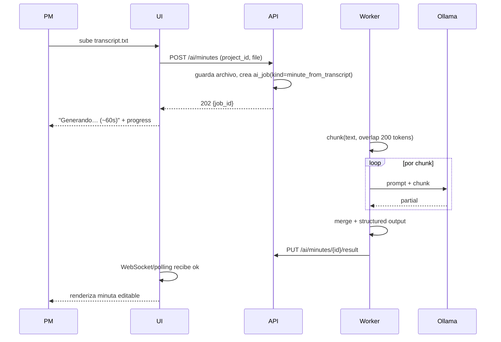

# EP008 — Inteligencia Artificial (Minutas y Reportes)

| Campo | Valor |
|---|---|
| **ID** | EP008 |
| **Prioridad** | Alta |
| **Dependencias** | EP005, EP006 |
| **Módulo** | `ai` |
| **Estado** | MVP |

## Objetivo de negocio

Automatizar dos tareas que consumen horas de los PM:
1. **Redactar minutas** desde transcripciones de reuniones (Zoom/Teams/Meet).
2. **Generar reportes de avance** periódicos con IA que luego el PM revisa y envía.

Modelo preferido: **Ollama local** (sin coste por token, privacidad). Fallback: **Claude**.

Ver setup técnico en [`../ai/`](../ai/).

---

## US-043 — Generar minuta desde transcripción

**Como** PM
**Quiero** subir una transcripción y obtener una minuta estructurada
**Para** ahorrar el trabajo de redactar.

**Flujo:**



**Criterios de aceptación:**
- [ ] Input: archivo `.txt`, `.docx`, `.srt` ≤ 5 MB.
- [ ] Idiomas soportados: ES y EN (autodetección por heurística + override).
- [ ] Output estructurado:
  ```json
  {
    "summary": "…",
    "participants": [{name, role?}],
    "topics": [{title, notes}],
    "agreements": [{description, owner, due_date}],
    "decisions": [{description, rationale}],
    "next_steps": [{action, owner, due_date}],
    "risks_blockers": [{description}]
  }
  ```
- [ ] Tiempo esperado: < 60 s para 1 h de transcripción (~9000 palabras) con Qwen 2.5 7B Q4.
- [ ] Chunking automático para > 3000 tokens con overlap de 200.
- [ ] Registrar `ai_jobs`: model, tokens_in, tokens_out, duration, error.
- [ ] UI: pantalla de edición con previewpost-generación; PM confirma y crea `meeting_minute`.
- [ ] Mensaje claro si modelo local down y se cambia a fallback.

**Test Cases:**
- `TC-112` (unit) — Chunking con overlap preserva continuidad.
- `TC-113` (integration) — Mock Ollama → output JSON válido con schema Zod.
- `TC-114` (integration) — Ollama timeout → fallback a Claude si configurado.
- `TC-115` (E2E) — Upload transcript → generación → editar → guardar minuta.
- `TC-116` (integration) — Archivo > 5 MB → 413.

---

## US-044 — Generar reporte de avance

**Como** PM
**Quiero** generar un reporte con datos actuales del proyecto y enviarlo por correo
**Para** mantener stakeholders informados.

**Flujo:**
1. PM abre `/projects/{id}/reports/new`.
2. Sistema recolecta automáticamente:
   - Avance actual, desviaciones plan vs real.
   - Presupuesto planeado vs ejecutado.
   - Top 5 riesgos, cambios en revisión, AIDs abiertas críticas.
   - Últimas 2 minutas.
3. IA redacta: resumen ejecutivo, logros, próximas actividades, riesgos.
4. PM revisa en editor tipo Notion (client-side), ajusta texto.
5. Selecciona destinatarios (team + stakeholders + emails manuales).
6. "Enviar" → email HTML + PDF adjunto opcional.
7. Reporte se guarda en `reports` para historial.

**Criterios de aceptación:**
- [ ] `POST /api/v1/projects/{id}/reports/draft` → genera draft con IA (job async).
- [ ] Secciones editables individualmente en UI.
- [ ] `POST /api/v1/reports/{id}/send` con `{recipients: [emails], include_pdf: bool, subject?: str}`.
- [ ] Email via **Resend** con tracking de apertura (post-MVP).
- [ ] Reporte queda en historial con estado `sent` + `sent_at` + `opened_by[]`.
- [ ] Duplicar de reporte anterior como base (speed-up semana a semana).

**Test Cases:**
- `TC-117` (integration) — Draft incluye top 5 riesgos ordenados por severidad.
- `TC-118` (integration) — Send sin destinatarios → 400.
- `TC-119` (E2E) — Enviar reporte → se ve en bandeja de entrada (test con mailcatcher).
- `TC-120` (integration) — Duplicar reporte previo → copia secciones editadas.

---

## US-045 — Configuración del motor de IA

**Como** Administrador
**Quiero** configurar qué motor de IA usa mi tenant
**Para** decidir entre privacidad (local) y potencia (cloud).

**Criterios de aceptación:**
- [ ] Panel en `/admin/ai` con opciones: `Ollama local` / `Claude API` / `Deshabilitado`.
- [ ] Para Ollama: campo `base_url` + `model` + `timeout_sec`.
- [ ] Para Claude: `api_key` (masked), `model` (default `claude-sonnet-4-6`), `max_tokens`, `temperature`.
- [ ] Botón "Probar conexión" → envía prompt de prueba y mide latencia.
- [ ] Indicador de estado en header: verde (online), amarillo (lento > 5 s), rojo (down).
- [ ] Guardar settings en `tenants.settings.ai` (JSONB, con API key cifrada en reposo).

**Test Cases:**
- `TC-121` (integration) — Probar conexión Ollama 200 → "online".
- `TC-122` (integration) — Guardar Claude key → cifrada en BD, response enmascara.
- `TC-123` (E2E) — Deshabilitar IA → UI oculta botones "Generar con IA".

---

## US-046 — Historial de jobs de IA

**Como** Admin
**Quiero** ver historial de jobs con métricas
**Para** auditar uso y costos.

**Criterios de aceptación:**
- [ ] `GET /api/v1/admin/ai-jobs?kind=&status=&date_range=&page=&limit=`.
- [ ] Columnas: fecha, usuario, proyecto, tipo, modelo, tokens_in/out, duration, status.
- [ ] Detalle: ver input/output completos (con permiso especial para privacidad).
- [ ] Agregados: tokens totales del mes, costo estimado (si usa Claude).

**Test Cases:**
- `TC-124` (integration) — Agregados calculados correctos.
- `TC-125` (integration) — Filtro status=failed muestra solo jobs fallidos con error visible.

---

## Prompts

Detalle completo en [`../ai/prompts-catalog.md`](../ai/prompts-catalog.md). Resumen:

- **Prompt de minuta**: system prompt con formato JSON estricto (Pydantic schema) + ejemplos few-shot en ES/EN.
- **Prompt de reporte**: instrucciones por sección (resumen/logros/próximos pasos), contexto del proyecto inyectado.

Todas las respuestas del LLM se validan contra schema Zod antes de guardarse. Si falla parse, reintentamos 1 vez con prompt corregido.

---

## Consideraciones

- **Privacidad**: datos sensibles (transcripciones, reportes) nunca se envían a Claude sin que el admin del tenant active explícitamente el modo cloud.
- **Límites**: max 5 jobs de IA concurrentes por tenant (queue).
- **Costos**: con Claude Sonnet 4.6 + prompt caching, 1 minuta de 1h ≈ $0.02. Con Ollama, $0.
- **Idioma**: el modelo responde en el idioma del texto fuente por default; override por user.

---

## Endpoints
```
POST /api/v1/projects/{id}/ai/minutes
GET  /api/v1/jobs/{job_id}                          (status + progress)
GET  /api/v1/ai-minutes/{id}                        (resultado)
POST /api/v1/ai-minutes/{id}/accept                 (convierte a meeting_minute)

POST /api/v1/projects/{id}/reports/draft
GET  /api/v1/reports/{id}
PATCH /api/v1/reports/{id}
POST /api/v1/reports/{id}/send

GET  /api/v1/admin/ai-jobs
GET  /api/v1/admin/ai-settings
PATCH /api/v1/admin/ai-settings
POST /api/v1/admin/ai-settings/test
```

---

## Definition of Done

- [ ] Ollama con Qwen 2.5 7B probado end-to-end.
- [ ] Fallback a Claude configurable por tenant.
- [ ] Schema validation de outputs garantizada.
- [ ] Métricas de tokens y duración guardadas por job.
- [ ] UI con editor tipo Notion para revisar y ajustar.
- [ ] `TC-MT-008` verde: un worker no procesa archivos de otro tenant.
- [ ] Documentación de prompts versionada en `docs/ai/`.
