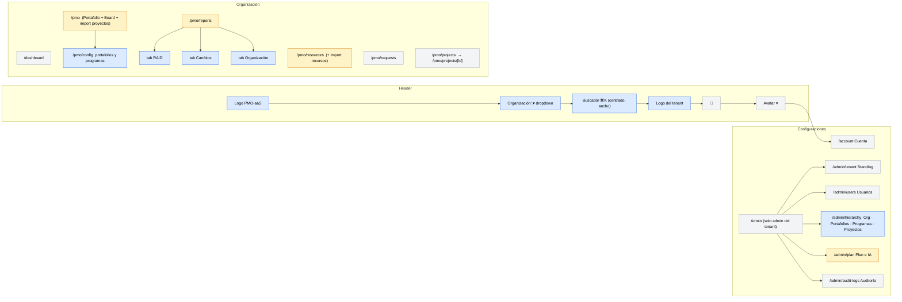
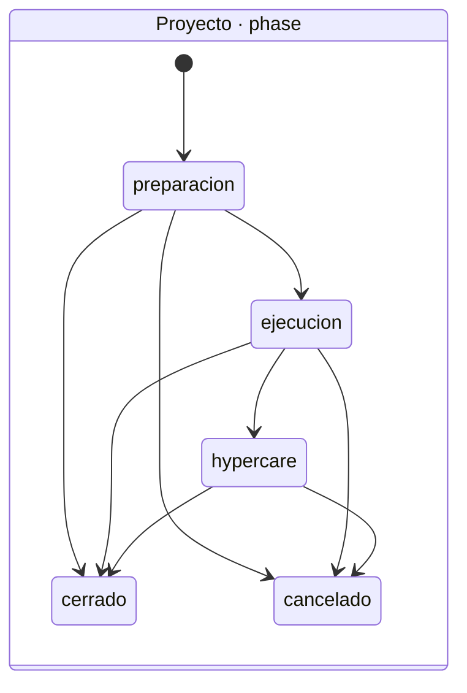
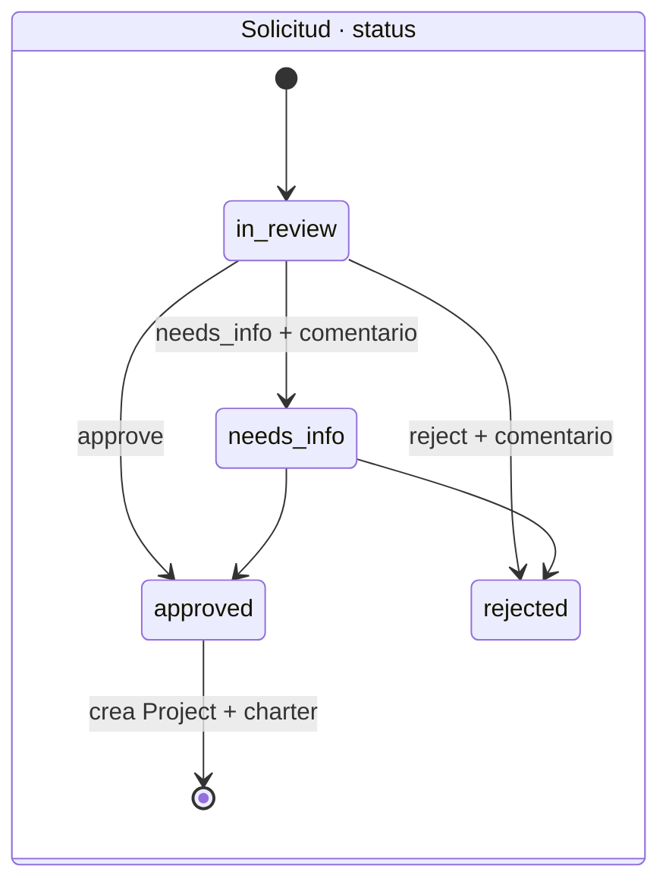
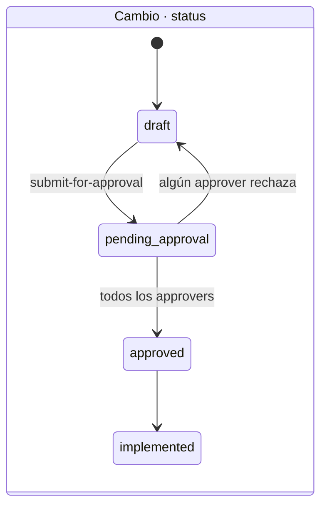
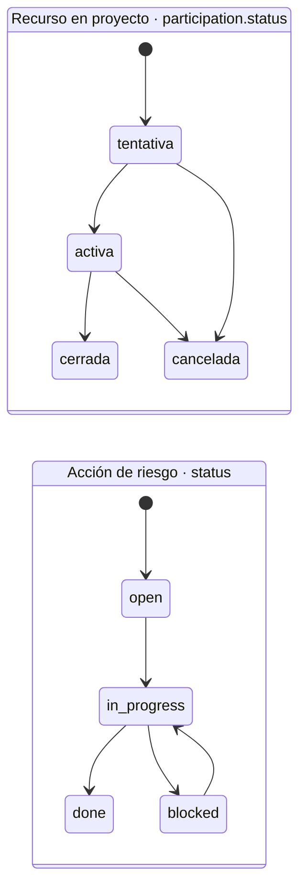
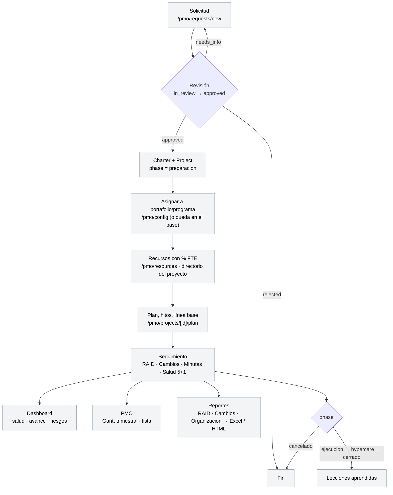

# REVAMP-V2-PLAN.md — plan de implementación de la ronda de limpieza

**Qué es.** El plan que sale de los 15 puntos de
[`REVAMP-V2-FEEDBACK.md`](REVAMP-V2-FEEDBACK.md). Trae los diagramas que
pidió el owner (navegación, estados, entidades, flujo operativo), los
hallazgos del inventario del código y las fases de desarrollo en orden.
Se ejecuta en sesiones nuevas: 1 sesión = 1 fase = 1 branch (CLAUDE.md §8).

**Qué hacer.** Leer §1–§4 para estar en la misma página. Aprobar los
wireframes de §5 antes de codificar las fases 3 a 8. Arrancar por la fase 0.

**Qué esperar.** Diez fases. Las dos primeras no necesitan wireframe. El
resto sí. Cada fase cierra con CI verde y merge antes de la siguiente.

**Qué falta.** Las decisiones del owner de §7. Ninguna bloquea la fase 0 ni
la 1.

**Fuentes.** Inventario del 2026-09-11 sobre `apps/api/app/models/*`,
`apps/web/app/**`, `apps/web/components/*`. Estado actual completo:
[`docs/architecture/navigation.md`](../architecture/navigation.md) y
[`er-generado.md`](../architecture/er-generado.md) (62 tablas). Aquí solo
va lo que cambia o lo que el owner pidió ver.

---

## 1. Navegación objetivo

**Término.** *Sidebar*: la barra lateral izquierda (`components/app-shell.tsx`).
*Header*: la barra superior con buscador, campana y avatar.

Lo que hoy son 3 grupos y 12 entradas queda en 2 grupos y 8 entradas. Las
rutas transversales (`/pmo/raid`, `/pmo/changes`) pasan a ser pestañas de
Reportes. `/pmo/board` e `/pmo/imports` se absorben en PMO.



Leyenda: azul = ruta o pieza nueva; ámbar = fusión de rutas existentes;
gris = sin cambio de ruta.

**Lo que desaparece del sidebar.** `Transversal` (RAID, Cambios, Minutas,
Notificaciones), `/pmo/board`, `/pmo/imports`, `/admin/permissions` (solo
lectura, DEC-024), `/admin/areas` (pasa dentro de la jerarquía o de
Recursos — decisión §7). Las notificaciones siguen en la campana del header.

**Tabs del detalle de proyecto.** No cambian de contenido. Hay un bug: 8 de
10 tabs nunca se marcan activos porque `components/project-tabs-bar.tsx:31-106`
compara contra `/admin/projects/...` y las rutas reales viven en
`/pmo/projects/...`. Es una corrección de regex, no de diseño (fase 0).

---

## 2. Estados

**Término.** *Máquina de estados*: el conjunto de valores que puede tomar
un campo `status`/`phase` y las transiciones permitidas entre ellos.

Las cinco máquinas que el sistema ya codifica. Ninguna cambia en esta ronda;
se dibujan para que los wireframes usen los mismos nombres.



Fuente: `dominio/proyecto.py` (`TRANSICIONES`), endpoint
`POST /projects/{id}/phase/change`. Los alias en inglés (`planning`,
`execution`, `support`, `closed`, `cancelled`) siguen aceptados a la entrada.



Fuente: `api/v1/endpoints/project_requests.py`.



Fuente: `api/v1/endpoints/change_approvals.py`. Cada aprobador lleva su propio
`pending | approved | rejected` en `change_approvers`.



Solo `activa` suma a la saturación de Recursos. Los estados de Risk, Issue,
Action y Decision son texto libre con soporte de `on_hold` — sin enum en DB;
el punto 14 los normaliza.

**Salud del proyecto** no es máquina de estados: `green | yellow | red`,
con `health_source = auto | manual`. La rueda del Dashboard (punto 3) la usa
como está.

---

## 3. Entidades, fases y campos

**Término.** *Actor*: la persona dentro de una organización (empleado o
proveedor). *Participación*: la asignación de un actor a un proyecto con su
% FTE. "Recurso", en la UI, es actor + participación.

Diagrama conceptual de lo que toca esta ronda. Las 62 tablas completas están
en `er-generado.md`.

```mermaid
erDiagram
    TENANT ||--o{ ORGANIZATION : tiene
    TENANT ||--o{ USER : "membresía (M2M)"
    ORGANIZATION ||--o{ PORTFOLIO : agrupa
    PORTFOLIO ||--o{ PROGRAM : agrupa
    ORGANIZATION ||--o{ PROJECT : pertenece
    PROGRAM |o--o{ PROJECT : "opcional"
    PORTFOLIO |o--o{ PROJECT : "opcional"
    ORGANIZATION ||--o{ ACTOR : "recurso de"
    ACTOR ||--o{ PARTICIPATION : asignado
    PROJECT ||--o{ PARTICIPATION : tiene
    PROJECT ||--o{ RISK : RAID
    PROJECT ||--o{ ISSUE : "RAID (action·issue·decision)"
    PROJECT ||--o{ CHANGE_REQUEST : cambios
    PROJECT ||--o{ MEETING_MINUTE : minutas
    PROJECT ||--o{ HEALTH_EVALUATION : "salud 5+1"
    PROJECT ||--o{ TASK : "plan (hito = is_milestone)"
    REQUEST }o--|| ORGANIZATION : "solicita para"
    REQUEST |o--|| PROJECT : "genera (lógico)"

    ORGANIZATION {
        string name
        string reason_social
        string industry
        string country
        string contact_email
        string logo_url
        bool is_active
    }
    PORTFOLIO {
        string name
        string code
        string description
        fk owner_actor_id
        bool is_active
    }
    PROGRAM {
        string name
        string description
        string strategic_alignment
        date start_date
        date end_date
    }
    PROJECT {
        string folio
        string name
        enum type "transformacion|operacion|innovacion|bau"
        int priority "1-5"
        enum phase "ver §2"
        fk pm_id
        string sponsor "texto libre"
        date start_date
        date end_date
        money budget
        money actual_budget
        pct progress
        enum health_status "green|yellow|red"
    }
    ACTOR {
        fk organization_id
        fk user_id "opcional"
        string email "clave de unicidad propuesta"
        fk area_id
        fk team_id
    }
    PARTICIPATION {
        pct allocation_pct "FTE"
        enum assignment_type
        enum status "ver §2"
        enum raci "A|R|C|I"
        money cost_rate_snapshot
    }
    RISK {
        int probability "1-5"
        int impact "1-5"
        int severity "p×i, 1-25"
        string category
        fk owner_actor_id
        date due_date
    }
    ISSUE {
        enum type "action|issue|decision"
        int priority
        date committed_date
        string resolution
    }
    CHANGE_REQUEST {
        enum type "scope|time|cost|resource"
        string impact
        enum status "ver §2"
    }
    REQUEST {
        string folio
        string title
        enum status "ver §2"
        money budget
        string sponsor
    }
```

**Fuentes.** `models/organization.py`, `models/project.py`,
`models/project_participation.py`, `models/modules.py`,
`models/project_request.py`, `models/user.py`.

**Dónde no hay formulario hoy.** Esto es lo que el punto 14 llama "campo
que ni se pide". Sale del cruce modelo ↔ formularios:

| Entidad | Campos del modelo | Formulario | Hueco |
|---|---|---|---|
| Portfolio | name, code, description, owner_actor_id, is_active | **ninguno** | No hay alta ni edición de portafolio en `apps/web` |
| Program | name, description, strategic_alignment, start/end_date | `program-modal.tsx` solo crea | No hay edición (`ProgramUpdateBody` existe sin UI) |
| Project | 20 campos | `project-form.tsx` create/edit + inline en vista maestra | Completo. `health_reason` se declara en la tarjeta de Salud, no en el form |
| Actor / Participación | email, area, team, allocation_pct, status, raci, tarifa | `/pmo/resources` es **solo lectura** | Sin alta, sin baja, sin import. El % se captura en el directorio del proyecto |
| Risk | category, closure_note | `raid-create-modal.tsx` no pide `category` | Solo se fija al editar |
| Change | title, description, type, impact | crea en `changes/page.tsx` | Sin edición localizada |
| User | role_type, excluded_organization_ids | `admin/users/*` | `deleteUser()` **desactiva**; no hay borrado real |
| Organization | 8 campos | `organization-form.tsx` | Completo |
| Request | 22 campos | `request-form.tsx` | Completo (punto 6: conforme) |

---

## 4. Flujo operativo

De la solicitud al reporte, con la pantalla donde ocurre cada paso en la
navegación objetivo.



**Regla transversal (punto 2.3).** Todo lo de este flujo se lee y escribe
para **una** organización: la del dropdown del header. Solo un rol
específico ve varias a la vez. Hoy `useOrganizacionActiva()` ya expone
`efectiva` y `agrega`; lo que falta es que **todas** las páginas la
respeten (hoy Recursos no).

---

## 5. Wireframes que faltan

Regla del punto 15: diagramas → wireframes → código. Las fases 0 y 1 no
necesitan wireframe (la navegación quedó escrita en el punto 2). Estas sí:

| # | Pantalla | Puntos que cubre | Qué debe mostrar el wireframe |
|---|---|---|---|
| W1 | Dashboard | 1, 3 | Hero de avance (% + tendencia), rueda salud + activos, KPI band de 5, distribuciones, tops, matriz RAID, semáforo |
| W2 | PMO | 2.2, 4 | Gantt con selector de año, lista ordenada org→portafolio→programa, botón a config, import de proyectos, paneles por portafolio "estilo carpetas" |
| W3 | PMO · config | 2.2 | Portafolio-programa base, alta/edición de portafolios y programas, mover proyectos |
| W4 | Recursos | 5 | Tabla actual + % asignado + quitar/poner + import con plantilla |
| W5 | Reportes | 7 | Tabs RAID / Cambios / Organización, one-page HTML, tabla agrupada, botón Excel |
| W6 | Proyectos | 8 | Columnas portafolio · programa · nombre · detalle; filtros dropdown multi-select |
| W7 | Admin · jerarquía | 10 | Árbol org → portafolio → programa → proyecto con mover/crear/borrar; baja de organización |
| W8 | Cuenta | 9 | Lo que hoy da el dropdown del avatar, como página |

Se hacen con la skill `design` (un canvas, un artboard por pantalla) sobre
los tokens de `globals.css` y el spec editorial del punto 1. Se aprueban en
el canvas antes de la fase que los usa.

---

## 6. Fases de desarrollo

**Tamaño** es relativo (S < M < L < XL), no horas. **Gate** es lo que tiene
que existir antes de arrancar. Cada fase = 1 branch `claude/revamp-v2-fN-*`,
1 sesión, CI verde y merge antes de la siguiente. Migraciones consecutivas,
nunca en paralelo (CLAUDE.md §8).

**Runbook por fase** (archivos, líneas, pasos, TC y commits, para ejecutar
sin interpretar): [`revamp-v2/README.md`](revamp-v2/README.md) →
`FASE-0.md` … `FASE-9.md`. Lo de abajo es el resumen; el runbook manda.

| Fase | Nombre | Puntos | Tamaño | Gate | Epics |
|---|---|---|---|---|---|
| 0 | Bugs visibles | 13 | S | ninguno | EP005, EP006 |
| 1 | Navegación y header | 2.1, 2.2, 2.4 | M | ninguno | EP013 (archivada → reabrir o nueva) |
| 2 | Filtro por organización | 2.3 | M | decisión D2 | EP002 |
| 3 | Dashboard | 1, 3 | L | W1 | EP004 |
| 4 | PMO y su config | 2.2, 4 | XL | W2, W3, decisión D3 | EP002, EP005 |
| 5 | Proyectos | 8 | S | W6 | EP005 |
| 6 | Recursos | 5 | L | W4, decisión D1 | EP017 |
| 7 | Admin y Cuenta | 9, 10 | L | W7, W8, decisión D4 | EP007 |
| 8 | Reportes | 7 | L | W5 | EP020, EP006 |
| 9 | Code review transversal | 14 | L | fases 1–8 mergeadas | todas |
| — | Plan e IA | 11 | — | decisión D5 (producto) | EP021 |

**Fase 0 — Bugs visibles.** Tres correcciones sin diseño:

1. Regex de tabs en `components/project-tabs-bar.tsx:31-106`: `/admin/` →
   `/pmo/`. Verificar los 10 tabs a mano.
2. Tablas RAID del detalle de proyecto (`pmo/projects/[id]/raid/page.tsx`):
   quitar el wrap; `white-space: nowrap` + `overflow-x: auto` en el
   contenedor, mismo patrón que `vista-maestra.tsx`.
3. Sidebar arranca pegado a la línea del header (`app-shell.tsx`, el
   `div h-12` de la línea 715 sobra en desktop una vez que el botón de
   colapsar vive al pie).

**Fase 1 — Navegación y header.** Reescribir `GRUPOS_NAV` y `buildAdminNav`
según §1. Header: logo PMO-aaS + "Organización:" + dropdown existente
(`useOrganizacionActiva`), buscador `flex-1` centrado, logo del tenant entre
buscador y campana. Redirects de `/pmo/board`, `/pmo/imports`, `/pmo/raid`,
`/pmo/changes` a sus nuevos destinos para no romper enlaces guardados.
`navigation.md` se actualiza en el mismo bloque (DOC-06).

**Fase 2 — Filtro por organización.** Auditar cada página de `(app)` contra
`useOrganizacionActiva().efectiva`. Recursos es el caso conocido. El rol que
ve "todas" se resuelve en D2. Incluye la limpieza de datos de las dos
organizaciones que se juntaron (script en `scripts/`, no migración).

**Fase 3 — Dashboard.** Implementar W1 sobre `app/(app)/dashboard/page.tsx`,
`components/dashboard-charts.tsx`, `tablero-ejecutivo.tsx`. Piezas:
hero de avance (fusiona KPI "Avance plan vs real" + card "Avance promedio"),
rueda de salud con activos al centro (fusiona KPI "Salud" + "Por salud" +
"Proyectos activos"), KPI band de 5, distribuciones con hairlines, tops,
matriz RAID (ya hecha, US-245), semáforo. El roadmap **sale** del Dashboard
si alguien lo puso ahí (hoy vive en `/pmo`, no hay que mover nada).

**Fase 4 — PMO y su config.** La fase más grande. Cuatro entregas en orden,
cada una un commit:

1. `RoadmapTrimestral` con selector de año (hoy solo el año en curso,
   `components/roadmap-trimestral.tsx`).
2. Lista debajo del Gantt ordenada portafolio → programa → nombre
   (reusa `VistaMaestra` con `siempreVisibles` y orden fijo).
3. Fusión de `/pmo/board` e `/pmo/imports` dentro de `/pmo` (tabs o
   secciones, según W2).
4. `/pmo/config`: alta/edición de portafolios y programas (hoy no existe
   UI de Portfolio; Program solo crea) y el portafolio-programa **base** por
   organización (D3: se siembra por migración o se calcula).

**Fase 5 — Proyectos.** `pmo/projects/page.tsx`: orden de columnas y un
componente `FiltroMultiple` (dropdown con checkmarks) reutilizable. Las
columnas de detalle las fija W6.

**Fase 6 — Recursos.** Modelo: unicidad de `Actor` por
`(organization_id, email)` — índice único + migración + `DB-CHANGES.md`
(D1 confirma que la clave es el correo). UI: quitar/poner recurso, % asignado
visible (`allocation_pct` de `PARTICIPATION`, ya existe), import con
plantilla XLSX que crea actores nuevos y valida existentes por esa clave.
El importador de recursos **ya existe** (`importacion.py`, `kind =
projects | resources`, UI en `/pmo/imports`): se reubica en Recursos y se
le cambia la plantilla de CSV a XLSX; no se construye de cero.

**Fase 7 — Admin y Cuenta.** `/admin/hierarchy` (W7): árbol con mover
proyecto entre programas, crear/borrar portafolio-programa-proyecto, dar de
baja organización. Usuarios: borrado real, distinto del `deleteUser()` actual que
solo desactiva; es irreversible, así que pide confirmación fuerte en la UI y
deja rastro en auditoría.
Cuenta (W8): `/account` con lo del dropdown. `/admin/permissions` y
`/admin/areas` salen del sidebar (D4 decide dónde queda `areas`).

**Fase 8 — Reportes.** `/pmo/reports` con tres tabs (W5). RAID: one-page
HTML + tabla agrupada riesgos/acciones/issues/decisiones + Excel de todos los
proyectos filtrados (extender `raid_export.py`, que hoy es por proyecto).
Cambios: mismo patrón con `change_export.py`. Organización: snapshot del
Dashboard + árbol portafolio → programa → proyecto.

**Fase 9 — Code review transversal.** Con todo mergeado, tres pasadas estilo
PR review (skill `code-review`, `--comment` sobre un PR de auditoría):

1. Descargas: los 4 CSV (`admin-panel.ts:83`, `imports/page.tsx:129`,
   `admin_panel.py:641`, `dashboard.py:1000`) pasan a XLSX con
   `tipografia.py` / `aplicarFuente`. Nombres reales en los 3 sin nombre
   (`project-charters.ts:136`, `documents/page.tsx:95`, `modules.ts:554`).
   Alineación del botón en las 12 páginas de la tabla del inventario.
2. Completitud: cerrar los huecos de la tabla de §3 (Portfolio sin form,
   Program sin edit, Risk sin `category` al crear, Change sin edit).
3. Consistencia: misma entidad, mismos campos en create/edit/inline
   (`excluded_organization_ids` se manda distinto en create y edit de User).

---

## 7. Decisiones que necesita el owner

Ninguna bloquea las fases 0 y 1. Cada una va a `DECISIONS.md` cuando se
cierre.

| # | Decisión | Bloquea | Opción recomendada |
|---|---|---|---|
| D1 | Clave de unicidad del recurso. Hoy ya existe `uq_actors_tenant_email` = `(tenant_id, email)`: un correo **no** puede estar en dos organizaciones del mismo tenant, lo contrario de lo que pide el punto 5 | Fase 6 | Cambiar a `(tenant_id, organization_id, email)` con migración (FASE-6, commit 1). Los actores sin correo piden uno al importar |
| D2 | Qué rol ve "todas las organizaciones" | Fase 2 | `role_type = admin` del tenant; el resto solo su organización |
| D3 | Portafolio-programa base: fila sembrada por organización, o "sin portafolio" calculado | Fase 4 | Sembrado (migración): así el Gantt y la lista siempre tienen dónde agrupar |
| D4 | Dónde queda `/admin/areas` (áreas, equipos, roles de proyecto) | Fase 7 | Dentro de Recursos, como pestaña |
| D5 | BYOK vs proveedor fijo, y cobro de excedente de tokens | Plan e IA | Sin recomendación: decisión de producto (punto 11) |
| D6 | Contenido del reporte de Cambios y columnas de detalle de Proyectos | Fases 5, 8 | Se cierran en W5 y W6 |
| D7 | Logo de PMO-aaS para el header: no existe ningún asset en `apps/web/public/` (solo `icons/`) | Fase 1 | El owner entrega SVG; mientras, la marca es texto `PMO · aaS` (FASE-1, commit 2) |

---

## 8. Cómo se arranca una sesión de esta ronda

1. `git fetch origin main && git checkout -b claude/revamp-v2-f<N>-<tema> origin/main`.
2. Leer `HANDOFF.md`, este plan (§6, la fase), el punto del feedback y el
   wireframe aprobado si la fase lo pide.
3. `python scripts/proximo_id.py` para los IDs de US.
4. Implementar por commits según la fase. Epic en el mismo bloque.
5. Skill `verificar` → skill `cerrar-item` → PR → CI verde → merge del owner.
6. Marcar el punto como `hecho` en `REVAMP-V2-FEEDBACK.md` con el commit.
