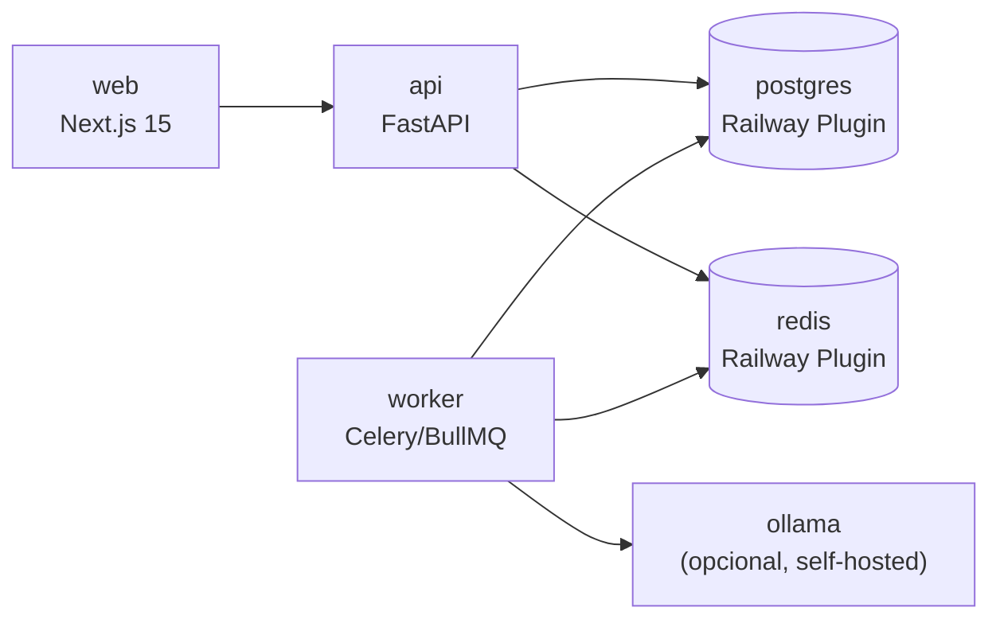

# Railway — Arquitectura, CI/CD y Migraciones

**ID:** `DOC-RAILWAY-DEPLOYMENT`

Referencia técnica de la arquitectura de despliegue en Railway,
CI/CD pipeline, y operaciones post-deploy.

---

## 1. Servicios Railway

El proyecto se despliega como **6 componentes** dentro de un mismo **Project**:



| Servicio | Root | Runtime | Auto-deploy | Estado |
|---|---|---|---|---|
| `web` | `apps/web` | Nixpacks (Node 20) | Sí (rolling) | ✅ |
| `api` | `apps/api` | Nixpacks (Python 3.12) | Sí (rolling) | ✅ |
| `worker` | `apps/api` (start command diferente) | Nixpacks (Python 3.12) | Sí | ✅ |
| `postgres` | Plugin | PostgreSQL 16 | No (persistente) | ✅ |
| `redis` | Plugin | Redis 7 | No | ✅ |

---

## 2. Archivos de configuración (railway.json y railway.toml)

### 2.1 railway.json (raíz)

```json
{
  "$schema": "https://railway.app/railway.schema.json",
  "build": { "builder": "NIXPACKS" },
  "deploy": {
    "startCommand": "pnpm start",
    "healthcheckPath": "/api/health",
    "healthcheckTimeout": 100,
    "restartPolicyType": "ON_FAILURE",
    "restartPolicyMaxRetries": 10
  }
}
```

### 2.2 apps/api/railway.toml

```toml
[build]
builder = "NIXPACKS"
buildCommand = "pip install -r requirements.txt && alembic upgrade head"

[deploy]
startCommand = "uvicorn app.main:app --host 0.0.0.0 --port $PORT --workers 2"
healthcheckPath = "/health"
healthcheckTimeout = 30
numReplicas = 2
```

### 2.3 apps/api/worker.railway.toml

```toml
[deploy]
startCommand = "bash start-worker.sh"
healthcheckPath = ""
numReplicas = 1
```

El wrapper `start-worker.sh` levanta:
1. Sidecar `tailscaled` (conecta al tailnet Tailscale).
2. Worker Celery para procesar tasks de IA.

### 2.4 apps/web/railway.toml

```toml
[build]
builder = "NIXPACKS"
buildCommand = "pnpm install --frozen-lockfile && pnpm turbo build --filter=web"

[deploy]
startCommand = "pnpm --filter web start -p $PORT"
healthcheckPath = "/api/health"
numReplicas = 2
```

---

## 3. Migraciones de base de datos

### 3.1 Alembic en build step

Alembic corre automático en el `buildCommand` del servicio `api`:

```bash
buildCommand = "pip install -r requirements.txt && alembic upgrade head"
```

**Flujo:**
1. Build job starts → `pip install`.
2. **Alembic runs** → aplica migraciones pending en `apps/api/alembic/versions/`.
3. Si success → servicio arranca.
4. Si error → build falla, deploy se cancela, versión anterior sigue live.

### 3.2 Crear una migración

```bash
cd apps/api
alembic revision --autogenerate -m "Add column X to table Y"
# Generates: alembic/versions/xxx_add_column_x_to_table_y.py
```

Edita el archivo generado para:
- Verificar que la migración es correcta.
- Agregar `down()` para rollback.

**Registra en [`docs/epics/DB-CHANGES.md`](../../epics/DB-CHANGES.md) si es un cambio material.**

### 3.3 Rollback

Si una migración rompe producción:

```bash
# En local (o vía Railway one-off job)
alembic downgrade -1

# Deployar hotfix branch
git push origin hotfix/revert-migration-xxx
# PR + merge a main
# Railway redeploya automático
```

**⚠️ Nota:** Rollback de datos (si la migración drop-ea columnas) no se revierte automático.
Considerar backup antes de migración destructiva.

### 3.4 Migraciones largas

Para migraciones que toman > 30s, no usar `buildCommand`:

```bash
# En cambio, ejecutar antes de release como one-off job
railway run --service api alembic upgrade head

# Luego: mergea la rama con .py de migración
# Railway detecta el cambio pero no re-runea Alembic (ya ejecutado)
```

---

## 4. Volúmenes y storage

Servicio `api` + `worker` comparten volume `pmo-uploads`:

```
/data/uploads/
├── tenants/
│   ├── tenant-slug-1/
│   │   ├── projects/proj-id-1.pdf
│   │   ├── reports/rpt-id-1.pdf
│   └── tenant-slug-2/
```

**Backup:**
- Railway snapshots diarios (automático, ver settings).
- Sync semanal a Backblaze B2 (script en `scripts/backup-to-b2.py`).

---

## 5. CI/CD Pipeline

### 5.1 GitHub Actions (.github/workflows/ci.yml)

```yaml
name: CI
on: [pull_request, push]

jobs:
  lint-test:
    runs-on: ubuntu-latest
    services:
      postgres:
        image: postgres:16
        env:
          POSTGRES_PASSWORD: test
        ports: [5432:5432]
      redis:
        image: redis:7
        ports: [6379:6379]
    steps:
      - uses: actions/checkout@v4
      - uses: pnpm/action-setup@v4
      - uses: actions/setup-node@v4
        with:
          node-version: 20
          cache: pnpm
      - uses: actions/setup-python@v5
        with:
          python-version: '3.12'
      - run: pnpm install --frozen-lockfile
      - run: pnpm turbo lint test build
      - run: cd apps/api && pip install -r requirements.txt && pytest
      - run: pnpm exec playwright install --with-deps
      - run: pnpm test:e2e
```

**Qué valida:**
- Lint (ESLint, Ruff).
- Unit tests (Jest, Pytest).
- Build (Next.js, FastAPI).
- E2E tests (Playwright).

**Status:** ✅ Si todo pasa → se puede mergear a `main`.

### 5.2 Auto-deploy desde Railway

Rama `main` → `production` (con aprobación manual en Railway UI si aplica).

**Watch paths** (ver `railway.toml` en cada app):
- Cambio en `apps/web/` → redeploya servicio `web`.
- Cambio en `apps/api/app/` → redeploya servicios `api` + `worker`.
- Cambio en `apps/api/alembic/` → corre migración al buildear `api`.

---

## 6. Dominios

| Entorno | Frontend | API |
|---|---|---|
| **Production** | `app.pmo-aas.com` | `api.pmo-aas.com` |
| **Staging** (si aplica) | `staging.pmo-aas.com` | `api-staging.pmo-aas.com` |

DNS en Cloudflare, TLS gestionado por Railway (Let's Encrypt auto).

Ver [`docs/runbooks/infra/dns-routing.md`](../infra/dns-routing.md) para setup.

---

## 7. Healthchecks y monitoreo

### 7.1 Endpoints de salud

- **API**: `GET /health` → `{"status": "ok", "version": "...", "time": "..."}`
- **Web**: `GET /api/health` → proxea al backend + retorna salud combinada.
- **Worker**: Sin healthcheck HTTP (servicio background).

Railway pinga c/60s. Si falla 3× → marca degraded o auto-redeploy (si enabled).

### 7.2 Logs

```bash
railway logs --service api --tail
railway logs --service worker --tail
railway logs --service web --tail
```

También disponibles en Railway UI → **Logs** tab.

### 7.3 Monitoreo externo (opcional)

Usar **UptimeRobot** para ping externo c/60s desde ubicación remota:
- Monitor: `https://app.pmo-aas.com/api/health`
- Alert Slack si status != 200.

---

## 8. Operaciones comunes

### Restart rolling

Railway UI → servicio → **Restart** (rolling si `numReplicas > 1`).

### Ejecutar script one-off

```bash
railway run --service api python scripts/seed_superadmin.py
```

### Conectarse a Postgres

```bash
railway run --service api psql $DATABASE_URL
```

### Backup Postgres

```bash
railway run --service api pg_dump $DATABASE_URL > backup.sql
```

---

## 9. Costes estimados

| Componente | Entorno | USD/mes |
|---|---|---|
| `web` (2 replicas) | Production | ~$20 |
| `api` (2 replicas) | Production | ~$20 |
| `worker` (1 replica) | Production | ~$7 |
| Postgres plugin | Shared | ~$15 |
| Redis plugin | Shared | ~$10 |
| **Total mínimo** | — | **~$72/mes** |

Agregale:
- Cloudflare DNS: $0 (free tier).
- Resend emails: $0–20 (free/pro).
- Ollama home-host: $0.
- Gemini fallback: $0 (free tier).
- Claude fallback: ~$0–5/mes (si se usa).

**Total estimado para MVP:** $75–100/mes.

---

## 10. Troubleshooting

| Síntoma | Causa | Solución |
|---|---|---|
| Servicio marked unhealthy | Healthcheck timeout | `railway logs --tail`, revisar logs. |
| Build falla (Alembic error) | Migración inválida | Revisar `alembic/versions/` última, fix y re-push. |
| CORS error en frontend | `ALLOWED_ORIGINS` no configurado | Update Railway `api` → redeploy. |
| Memory leak en worker | Celery task holding refs | Revisar `start-worker.sh`, ajustar `--concurrency`. |
| OOM en Postgres | Volumen full | `railway run --service api pg_reindex` o expand volumen. |

---

## 11. Escalado futuro (post-MVP)

- **Múltiples regiones**: Railway multi-region deployments.
- **Database read replicas**: Postgres read replica para queries pesadas.
- **S3 for storage**: Reemplazar volumen Railway con S3-compatible (Backblaze, R2).
- **Message queue**: Escalado de worker con separate Celery broker.

---

## Referencias

- Railway docs — https://docs.railway.app/
- Alembic docs — https://alembic.sqlalchemy.org/
- Next.js deployment — https://nextjs.org/docs/deployment
- FastAPI deployment — https://fastapi.tiangolo.com/deployment/
- Setup variables — [`docs/runbooks/railway/SETUP.md`](./SETUP.md)
- DNS — [`docs/runbooks/infra/dns-routing.md`](../infra/dns-routing.md)
